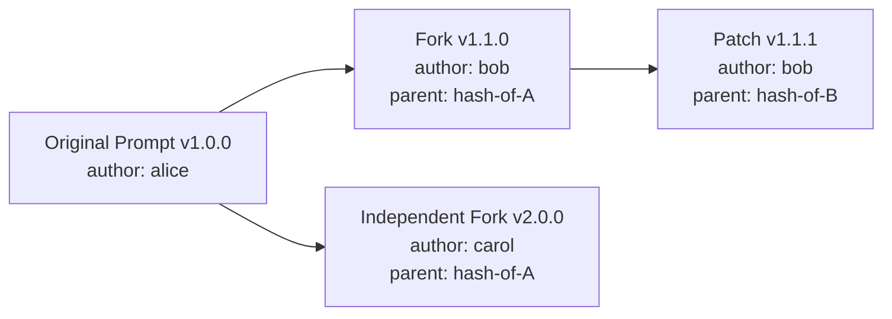
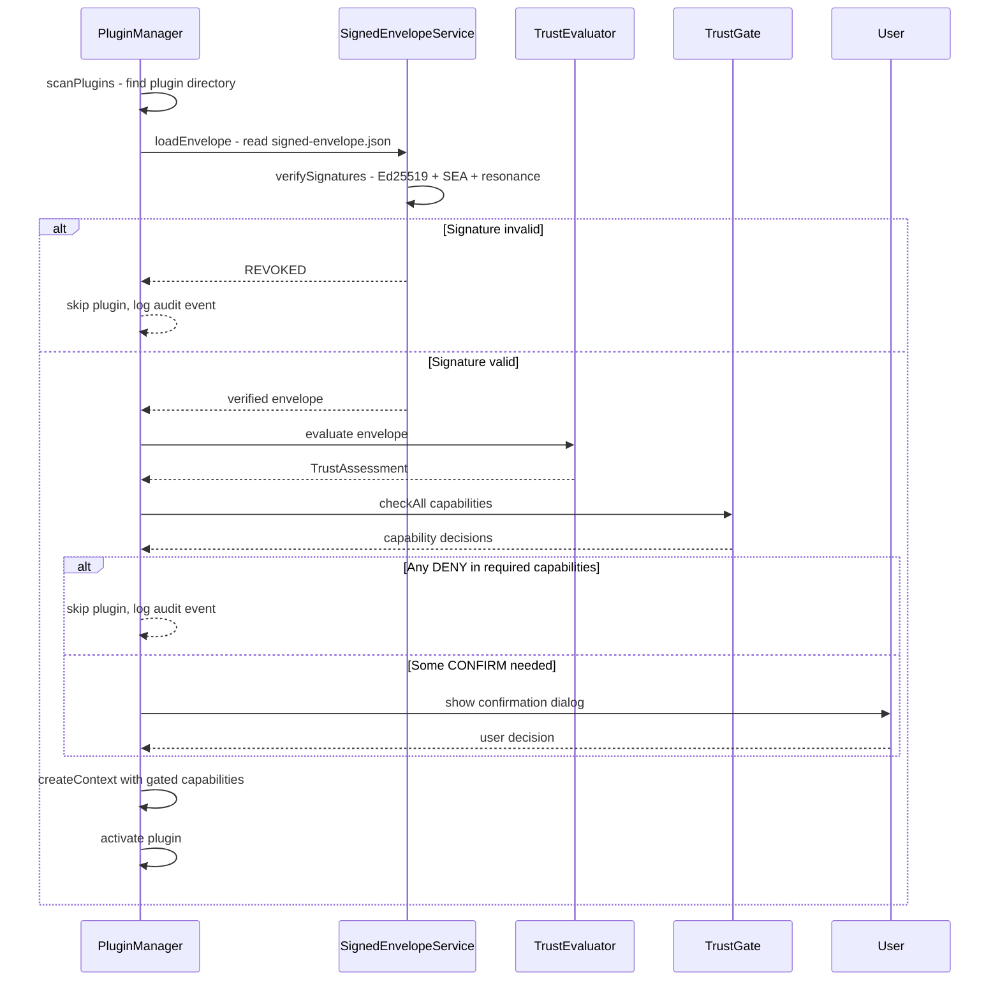
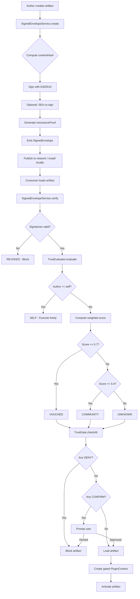

# Code Provenance & Web of Trust

This document defines the **Code Provenance and Web of Trust** system for the AlephNet-Integrated Durable Agent Mesh. Every executable artifact — prompts, plugins, skills, services, agent templates, processes — is wrapped in a cryptographically signed envelope that binds it to its author's identity. A trust evaluation engine computes a score from signature validity, social graph distance, reputation, staking tier, endorsements, and coherence network consensus. That score determines which capabilities the artifact may exercise at runtime.

## 1. Motivation

The AlephNet mesh is a decentralized system where any node can publish executable artifacts — plugins that register tools, skills that run on remote nodes, agent templates that autonomously perceive and act, prompts that shape LLM behavior. Without provenance, a single malicious artifact could exfiltrate keys, corrupt the Global Memory Field, or drain wallets.

**Problem**: The existing PluginManager (see [`PluginManager.ts`](client/src/main/services/PluginManager.ts)) loads manifests and activates code without verifying authorship or gating capabilities by trust. The `manifest.json` permission list is self-declared and unenforced at the cryptographic level.

**Solution**: Wrap every artifact in a `SignedEnvelope<T>` that leverages the dual-layer identity system (SEA + KeyTriplet) already defined in [`design/16-security.md`](design/16-security.md:8). Compute a trust score from multiple signals. Gate capabilities based on that score. The result: self-authored code flows freely; friend-endorsed code runs in a standard sandbox; unknown code requires explicit user confirmation for sensitive operations; revoked code is blocked entirely.

## 2. SignedEnvelope — Universal Provenance Wrapper

`SignedEnvelope<T>` is a generic wrapper that binds any executable payload to its author's cryptographic identity, forming an immutable provenance record.

```typescript
/**
 * Artifact types that can be wrapped in a SignedEnvelope.
 */
export type ArtifactType =
  | 'prompt'
  | 'plugin'
  | 'skill'
  | 'service'
  | 'agent-template'
  | 'process'
  | 'fence-handler'
  | 'model-config';

/**
 * Public portion of the author's identity, sufficient for verification
 * without exposing private key material.
 */
export interface AuthorIdentity {
  /** Ed25519 public key (base64) — from KeyTriplet.pub */
  pub: string;
  /** 16-char fingerprint — from KeyTriplet.fingerprint */
  fingerprint: string;
  /** 16-dimensional resonance field — from KeyTriplet.resonance */
  resonance: number[];
}

/**
 * An endorsement from a co-signer who vouches for an artifact.
 */
export interface Endorsement {
  /** Public identity of the endorser */
  endorser: AuthorIdentity;
  /** Ed25519 signature over the envelope's contentHash */
  signature: string;
  /** Optional SEA co-signature */
  seaSignature?: string;
  /** Timestamp of endorsement */
  timestamp: number;
  /** Free-text reason or review summary */
  comment?: string;
}

/**
 * Resonance proof: prime-based semantic verification tying the artifact
 * content to the author's key material.
 */
export interface ResonanceProof {
  /** Prime factors used in the proof computation */
  primes: number[];
  /** Hash of (contentHash + primes + author.resonance) */
  hash: string;
  /** When the proof was generated */
  timestamp: number;
}

/**
 * Capabilities the artifact requests at runtime.
 * Maps directly to PluginPermission plus extended capabilities.
 */
export type Capability =
  | 'network:http'
  | 'fs:read'
  | 'fs:write'
  | 'store:read'
  | 'store:write'
  | 'dsn:identity'
  | 'dsn:register-tool'
  | 'dsn:register-service'
  | 'dsn:publish-observation'
  | 'dsn:gmf-write'
  | 'crypto:sign'
  | 'crypto:encrypt'
  | 'wallet:read'
  | 'wallet:transfer'
  | 'system:shell'
  | 'ui:notification'
  | 'ui:overlay';

/**
 * SignedEnvelope<T> — the universal provenance wrapper.
 *
 * Every executable artifact in AlephNet is distributed inside one of these.
 * The envelope is immutable once signed; modifications produce a new envelope
 * with parentEnvelopeHash pointing to the original.
 */
export interface SignedEnvelope<T> {
  /** SHA-256 of the canonicalized JSON of `payload` */
  contentHash: string;

  /** The actual artifact content */
  payload: T;

  /** What kind of artifact this is */
  artifactType: ArtifactType;

  /** Public portion of the author's KeyTriplet */
  author: AuthorIdentity;

  /** ISO 8601 creation timestamp */
  createdAt: number;

  /** Semver version string */
  version: string;

  /** Ed25519 signature over contentHash by author's private key */
  signature: string;

  /** Optional Gun.js SEA co-signature for dual-layer verification */
  seaSignature?: string;

  /** Prime-based semantic verification binding content to author */
  resonanceProof: ResonanceProof;

  /**
   * For forks or modifications: the contentHash of the parent envelope.
   * Forms a Merkle-like provenance chain.
   */
  parentEnvelopeHash?: string;

  /** Co-signer endorsements from other identities */
  endorsements: Endorsement[];

  /** Capabilities the artifact needs to function */
  requestedCapabilities: Capability[];
}
```

### 2.1 Canonical Hashing

Content hashing must be deterministic. The canonicalization algorithm:

1. Serialize `payload` to JSON with sorted keys (`JSON.stringify(payload, Object.keys(payload).sort())`)
2. Encode as UTF-8 bytes
3. Compute SHA-256
4. Encode as lowercase hex

This ensures the same payload always produces the same `contentHash`, regardless of property insertion order.

### 2.2 Provenance Chains

When an artifact is forked or modified, the new envelope sets `parentEnvelopeHash` to the original's `contentHash`. This creates a directed acyclic graph of provenance:



Provenance chains enable:
- **Attribution**: Trace any artifact back to its original author
- **Audit**: See the full modification history
- **Trust inheritance**: A fork of a highly-trusted artifact starts with a baseline trust

## 3. Trust Levels

Trust levels map from a computed numeric score to a named tier that determines runtime behavior.

| Level | Score Range | Meaning | Runtime Behavior |
|:---|:---|:---|:---|
| **SELF** | `≥ 1.0` | User's own code | Execute freely, no sandbox restrictions |
| **VOUCHED** | `≥ 0.7` | Endorsed by friends | Standard sandbox, auto-allow most capabilities |
| **COMMUNITY** | `≥ 0.4` | Verified by the network | Sandbox + confirmation for sensitive operations |
| **UNKNOWN** | `≥ 0.0` | Unverified or external | Strict sandbox + explicit confirmation for all sensitive ops |
| **REVOKED** | `< 0.0` | Known-bad or revoked | **Blocked** — will not load |

```typescript
export type TrustLevel = 'SELF' | 'VOUCHED' | 'COMMUNITY' | 'UNKNOWN' | 'REVOKED';

export interface TrustAssessment {
  /** Computed numeric score */
  score: number;
  /** Mapped trust level */
  level: TrustLevel;
  /** Breakdown of contributing factors */
  factors: TrustFactors;
  /** When this assessment was computed */
  evaluatedAt: number;
  /** How long this assessment is valid (ms) */
  ttlMs: number;
}

export interface TrustFactors {
  signatureValid: boolean;
  socialDistance: number;
  authorReputation: number;
  stakingTier: number;
  endorsementQuality: number;
  coherenceScore: number;
}
```

## 4. Trust Evaluation

The `TrustEvaluator` computes a trust score by combining multiple weighted signals. Signature validity is a **binary gate** — if either signature check fails, the artifact is immediately classified as REVOKED.

### 4.1 Scoring Algorithm

```
IF NOT verifySignature(envelope) → REVOKED (score = -1.0)
IF author.pub === currentUser.pub → SELF (score = 1.0)

ELSE:
  score = socialDistance  × 0.30
        + authorReputation × 0.20
        + stakingTier      × 0.15
        + endorsementQuality × 0.20
        + coherenceScore   × 0.15
```

### 4.2 Factor Computation

```typescript
export interface TrustEvaluator {
  /**
   * Evaluate the trust level of a signed envelope.
   * Returns a TrustAssessment with score, level, and factor breakdown.
   */
  evaluate<T>(envelope: SignedEnvelope<T>): Promise<TrustAssessment>;
}
```

#### 4.2.1 Signature Validity (Binary Gate)

Both signature layers must pass — this is not weighted, it is a hard requirement.

1. **Ed25519 check**: Verify `envelope.signature` against `envelope.contentHash` using `envelope.author.pub`
2. **SEA check** (if `seaSignature` present): Verify via `Gun.SEA.verify`
3. **Resonance check**: Verify `resonanceProof` — the proof's primes must have ≥ 50% overlap with the author's `bodyPrimes` (derived from `resonance`), and the proof hash must match `SHA-256(contentHash + primes + resonance + timestamp)`

If any check fails → score = -1.0, level = REVOKED.

#### 4.2.2 Social Graph Distance (weight: 0.30)

Computed from the friend graph in the social layer (see [`Friend`](client/src/shared/alephnet-types.ts:293) type):

| Distance | Score |
|:---|:---|
| Self (distance 0) | 1.0 |
| Direct friend (distance 1) | 0.8 |
| Friend-of-friend (distance 2) | 0.5 |
| Distance 3 | 0.2 |
| Distance 4+ or unreachable | 0.0 |

Uses a breadth-first search over the local social graph, capped at depth 4 for performance.

#### 4.2.3 Author Reputation (weight: 0.20)

Derived from [`UserProfile.reputation`](client/src/shared/alephnet-types.ts:320):

```
authorReputation = clamp(profile.reputation / 100, 0.0, 1.0)
```

A reputation of 100+ saturates at 1.0. New users with reputation 0 contribute 0.0 on this factor.

#### 4.2.4 Staking Tier (weight: 0.15)

Maps from [`StakingTier`](client/src/shared/alephnet-types.ts:14):

| Tier | Score |
|:---|:---|
| Archon | 1.0 |
| Magus | 0.75 |
| Adept | 0.5 |
| Neophyte | 0.25 |
| Unknown/None | 0.0 |

Higher stake = more skin in the game = higher trust contribution.

#### 4.2.5 Endorsement Quality (weight: 0.20)

Computed from the `endorsements` array on the envelope:

```
endorsementQuality = min(1.0, sum(endorserScore(e) for e in endorsements) / 3)
```

Each endorser's score is computed recursively (using cached values):
- Friend endorser: 0.4
- Archon endorser: 0.3
- Endorser with reputation > 50: 0.2
- Any valid endorser: 0.1

The denominator of 3 means three strong endorsements saturate this factor.

#### 4.2.6 Coherence Score (weight: 0.15)

If the artifact (particularly prompts, skills, or agent templates) has been submitted as a [`Claim`](client/src/shared/alephnet-types.ts:421) to the Coherence Network:

```
coherenceScore = claim.consensusScore  (already 0.0–1.0)
```

If no claim exists, this factor defaults to 0.0. The Coherence Network effectively acts as decentralized code review — verified claims raise trust, refuted claims lower it.

### 4.3 Caching

Trust assessments are cached with a TTL:
- **SELF**: Infinite (until identity changes)
- **VOUCHED**: 1 hour
- **COMMUNITY**: 15 minutes
- **UNKNOWN**: 5 minutes
- **REVOKED**: 24 hours (prevents re-evaluation spam)

Cache key: `SHA-256(envelope.contentHash + currentUser.pub)`

## 5. Capability Gating Matrix

The `TrustGate` service decides whether a requested capability is **auto-allowed**, **requires confirmation**, or **denied** based on the artifact's trust level.

| Capability | SELF | VOUCHED | COMMUNITY | UNKNOWN | REVOKED |
|:---|:---:|:---:|:---:|:---:|:---:|
| `network:http` | ✅ | ✅ | ⚠️ | ⚠️ | ❌ |
| `fs:read` | ✅ | ✅ | ⚠️ | ❌ | ❌ |
| `fs:write` | ✅ | ⚠️ | ❌ | ❌ | ❌ |
| `store:read` | ✅ | ✅ | ✅ | ⚠️ | ❌ |
| `store:write` | ✅ | ✅ | ⚠️ | ⚠️ | ❌ |
| `dsn:identity` | ✅ | ⚠️ | ❌ | ❌ | ❌ |
| `dsn:register-tool` | ✅ | ✅ | ⚠️ | ⚠️ | ❌ |
| `dsn:register-service` | ✅ | ✅ | ⚠️ | ❌ | ❌ |
| `dsn:publish-observation` | ✅ | ✅ | ✅ | ⚠️ | ❌ |
| `dsn:gmf-write` | ✅ | ⚠️ | ❌ | ❌ | ❌ |
| `crypto:sign` | ✅ | ⚠️ | ❌ | ❌ | ❌ |
| `crypto:encrypt` | ✅ | ✅ | ⚠️ | ❌ | ❌ |
| `wallet:read` | ✅ | ✅ | ⚠️ | ❌ | ❌ |
| `wallet:transfer` | ✅ | ⚠️ | ❌ | ❌ | ❌ |
| `system:shell` | ✅ | ❌ | ❌ | ❌ | ❌ |
| `ui:notification` | ✅ | ✅ | ✅ | ⚠️ | ❌ |
| `ui:overlay` | ✅ | ✅ | ⚠️ | ❌ | ❌ |

**Legend**: ✅ = auto-allowed, ⚠️ = requires user confirmation, ❌ = denied

```typescript
export type CapabilityDecision = 'ALLOW' | 'CONFIRM' | 'DENY';

export interface TrustGate {
  /**
   * Check whether a capability is allowed for a given trust assessment.
   * Returns the decision and, for CONFIRM, a human-readable reason.
   */
  check(
    capability: Capability,
    trust: TrustAssessment
  ): { decision: CapabilityDecision; reason?: string };

  /**
   * Check all requested capabilities for an envelope.
   * Returns a map of capability → decision.
   */
  checkAll(
    envelope: SignedEnvelope<unknown>,
    trust: TrustAssessment
  ): Map<Capability, { decision: CapabilityDecision; reason?: string }>;
}
```

### 5.1 User Overrides

Users can override the default gating matrix per-author or per-artifact:

```typescript
export interface TrustOverride {
  /** Target: specific author fingerprint or envelope contentHash */
  target: { type: 'author'; fingerprint: string } | { type: 'artifact'; contentHash: string };
  /** Override trust level (bypasses computed score) */
  trustLevel?: TrustLevel;
  /** Per-capability overrides */
  capabilityOverrides?: Partial<Record<Capability, CapabilityDecision>>;
  /** When this override was set */
  createdAt: number;
  /** Optional expiry */
  expiresAt?: number;
}
```

Overrides are stored locally and never propagated to the network — they represent personal trust decisions.

## 6. Integration Points

### 6.1 PluginManager Integration

The [`PluginManager`](client/src/main/services/PluginManager.ts:19) currently loads plugins without signature verification. With provenance:



**Changes to plugin structure**:

```
my-plugin/
├── manifest.json
├── signed-envelope.json   ← NEW: SignedEnvelope wrapping the manifest + code hash
├── main/
│   └── index.js
├── renderer/
│   └── index.js
└── assets/
```

The `signed-envelope.json` wraps the `PluginManifest` as its payload and includes the SHA-256 hash of all code files. On load, the PluginManager:

1. Reads `signed-envelope.json`
2. Verifies signatures
3. Verifies that `SHA-256(manifest.json + main/index.js + renderer/index.js)` matches `contentHash`
4. Evaluates trust
5. Creates a capability-gated `PluginContext`

### 6.2 ToolCallIntent Wrapping

Every [`ToolCallIntent`](client/src/shared/alephnet-types.ts:96) can optionally carry a reference to the envelope that registered the tool:

```typescript
export interface ToolCallIntent {
  // ... existing fields ...

  /** Reference to the SignedEnvelope that registered this tool */
  sourceEnvelopeHash?: string;

  /** Trust assessment at the time the tool was registered */
  sourceTrust?: TrustLevel;
}
```

When executing a tool call, the runtime checks that the tool's source envelope still has sufficient trust. If the author has been revoked since registration, the tool call is blocked.

### 6.3 ServiceRegistry Integration

The [`ServiceRegistry`](client/src/main/services/ServiceRegistry.ts:4) stores service definitions in Gun.js. With provenance:

- Every [`ServiceDefinition`](client/src/shared/service-types.ts:4) must be wrapped in a `SignedEnvelope<ServiceDefinition>`
- The `register()` method verifies the envelope before storing
- Service consumers check the provider's trust level before calling
- Services from REVOKED authors are automatically de-indexed

### 6.4 Coherence Network as Decentralized Code Review

The Coherence Network (see [`Claim`](client/src/shared/alephnet-types.ts:421), [`VerificationTask`](client/src/shared/alephnet-types.ts:435)) already provides a mechanism for submitting statements and having them verified by the network. For provenance:

1. An author submits their artifact's `contentHash` as a Claim
2. Reviewers inspect the code and submit VERIFY or REFUTE results
3. The `consensusScore` feeds into the trust evaluation (§4.2.6)
4. CoherenceEdges of type SUPPORTS between artifact claims increase trust; CONTRADICTS edges decrease it

This creates an organic, decentralized code review process where the network collectively vouches for (or warns against) artifacts.

### 6.5 Provenance Chain Traversal

The `parentEnvelopeHash` field enables trust inheritance:

```typescript
export interface ProvenanceChainResolver {
  /**
   * Walk the provenance chain from an envelope back to its root.
   * Returns the chain in order [root, ..., current].
   */
  resolve(contentHash: string): Promise<SignedEnvelope<unknown>[]>;

  /**
   * Get all forks of an envelope (envelopes that reference it as parent).
   */
  getForks(contentHash: string): Promise<SignedEnvelope<unknown>[]>;
}
```

Trust for forked artifacts gets a baseline bonus from the parent chain:

```
forkBonus = parentTrustScore × 0.2 × (1 / chainDepth)
```

A fork of a highly-trusted artifact starts with a small trust advantage, but the bonus diminishes with chain depth to prevent trust laundering.

## 7. Practical Behavior — User Experience

### 7.1 SELF (Own Code)

The user writes a prompt, creates a plugin, or defines an agent template. The system automatically signs it with their KeyTriplet.

- **Visual**: Green shield icon, "By you" label
- **Behavior**: All capabilities auto-allowed. No confirmation dialogs. Instant activation.
- **Audit**: Logged as `PROVENANCE_SELF` event

### 7.2 VOUCHED (Friend-Endorsed)

A direct friend publishes a plugin and endorses it, or the user's friend-of-friend publishes with multiple endorsements.

- **Visual**: Blue shield icon, "Vouched by [friend name]" label, endorsement count
- **Behavior**: Most capabilities auto-allowed. Sensitive capabilities (fs:write, dsn:identity, crypto:sign, wallet:transfer, dsn:gmf-write) trigger a lightweight confirmation: "Plugin X by [author] wants to [capability]. Vouched by [friend]. Allow?"
- **Audit**: Logged as `PROVENANCE_VOUCHED` event with endorser details

### 7.3 COMMUNITY (Network-Verified)

An artifact has been verified through the Coherence Network or comes from a well-known author outside the immediate friend graph.

- **Visual**: Yellow shield icon, "Community verified" label, consensus score badge
- **Behavior**: Safe capabilities (store:read, dsn:publish-observation, ui:notification) auto-allowed. Network access requires confirmation. File system, identity, crypto, wallet, and GMF write are denied.
- **Audit**: Logged as `PROVENANCE_COMMUNITY` event with coherence claim reference

### 7.4 UNKNOWN (Unverified)

An artifact from an unknown author with valid signatures but no social or network verification.

- **Visual**: Gray shield icon, "Unverified author" warning label
- **Behavior**: Strict sandbox. Most capabilities require explicit confirmation. File system and identity/crypto/wallet capabilities are denied. A banner warns: "This artifact is from an unverified author. Proceed with caution."
- **Audit**: Logged as `PROVENANCE_UNKNOWN` event

### 7.5 REVOKED (Known-Bad)

An artifact with invalid signatures, or whose author has been flagged by the network.

- **Visual**: Red shield icon with X, "Blocked — signature invalid or author revoked"
- **Behavior**: Will not load. All capabilities denied. The artifact appears in the extensions panel grayed out with explanation.
- **Audit**: Logged as `PROVENANCE_REVOKED` event with revocation reason

### 7.6 Trust Indicator in UI

Every artifact-bearing UI surface (extensions panel, skill marketplace, agent template picker) displays a trust badge:

```
┌──────────────────────────────────────────────┐
│  🟢 My Weather Plugin          v1.2.0        │
│  By you · 3 capabilities                     │
├──────────────────────────────────────────────┤
│  🔵 Code Formatter              v2.0.1       │
│  By alice · Vouched by bob, carol · 2 caps   │
├──────────────────────────────────────────────┤
│  🟡 Data Analyzer                v0.9.0      │
│  Community verified · Score: 0.82 · 5 caps   │
├──────────────────────────────────────────────┤
│  ⚪ Unknown Script               v1.0.0      │
│  ⚠ Unverified author · 4 caps requested      │
├──────────────────────────────────────────────┤
│  🔴 Suspicious Tool              v3.1.0      │
│  ✕ BLOCKED — invalid signature               │
└──────────────────────────────────────────────┘
```

## 8. Audit Events

Provenance operations emit audit events compatible with the existing [`AuditEvent`](design/16-security.md:938) type:

```typescript
export type ProvenanceAuditEventType =
  | 'PROVENANCE_SIGNED'      // Artifact was signed by current user
  | 'PROVENANCE_VERIFIED'    // Envelope signature verified successfully
  | 'PROVENANCE_FAILED'      // Signature verification failed
  | 'PROVENANCE_SELF'        // Self-authored artifact loaded
  | 'PROVENANCE_VOUCHED'     // Vouched artifact loaded
  | 'PROVENANCE_COMMUNITY'   // Community-verified artifact loaded
  | 'PROVENANCE_UNKNOWN'     // Unknown artifact loaded (with user consent)
  | 'PROVENANCE_REVOKED'     // Revoked artifact blocked
  | 'PROVENANCE_ENDORSED'    // Current user endorsed an artifact
  | 'TRUST_OVERRIDE_SET'     // User set a trust override
  | 'CAPABILITY_CONFIRMED'   // User confirmed a capability prompt
  | 'CAPABILITY_DENIED'      // User denied a capability prompt
  | 'CAPABILITY_BLOCKED';    // Capability auto-denied by trust gate
```

## 9. Data Flow — End to End



## 10. Implementation Plan

### Phase 1: Types + SignedEnvelopeService

**Goal**: Define all types and implement creation/verification of signed envelopes.

- Define `SignedEnvelope<T>`, `AuthorIdentity`, `Endorsement`, `ResonanceProof`, `Capability` types in `client/src/shared/provenance-types.ts`
- Implement `SignedEnvelopeService` with:
  - `create<T>(payload, artifactType, capabilities): Promise<SignedEnvelope<T>>` — signs with current user's KeyTriplet
  - `verify<T>(envelope): Promise<VerificationResult>` — checks Ed25519 + SEA + resonance
  - `endorse<T>(envelope): Promise<SignedEnvelope<T>>` — adds current user's endorsement
  - `computeContentHash(payload): string` — deterministic canonical hash
- Unit tests for signing, verification, and tampering detection

### Phase 2: TrustEvaluator

**Goal**: Implement the trust scoring engine.

- Implement `TrustEvaluator` in `client/src/main/services/TrustEvaluator.ts`
- Factor computations: social distance (BFS over friends graph), author reputation lookup, staking tier mapping, endorsement quality, coherence score lookup
- Caching layer with TTL per trust level
- Integration with `IdentityManager` for current user identity
- Integration with social graph for friend distance
- Unit tests for each factor and edge cases (unknown author, no endorsements, etc.)

### Phase 3: TrustGate

**Goal**: Implement capability gating based on trust assessment.

- Implement `TrustGate` in `client/src/main/services/TrustGate.ts`
- Hardcoded gating matrix (§5) with `check()` and `checkAll()` methods
- `TrustOverride` storage and application
- User override CRUD via IPC channels
- Unit tests for every cell in the capability matrix

### Phase 4: PluginManager Integration

**Goal**: Wire provenance into the existing plugin lifecycle.

- Modify [`PluginManager.loadPlugin()`](client/src/main/services/PluginManager.ts:95) to:
  - Look for `signed-envelope.json` alongside `manifest.json`
  - Call `SignedEnvelopeService.verify()` before activation
  - Call `TrustEvaluator.evaluate()` to get trust assessment
  - Call `TrustGate.checkAll()` to get capability decisions
  - Create a capability-gated `PluginContext` that enforces decisions at runtime
- Backward compatibility: plugins without `signed-envelope.json` are treated as UNKNOWN trust level
- Extend `ServiceRegistry.register()` to require signed envelopes
- Add `sourceEnvelopeHash` and `sourceTrust` to `ToolCallIntent`

### Phase 5: UI Affordances

**Goal**: Surface trust information to users.

- Trust badge component: colored shield + label per trust level
- Confirmation dialog for CONFIRM-gated capabilities
- Extensions panel: show trust level, author, endorsements for each plugin
- Settings: trust override management (per-author, per-artifact)
- Audit log viewer: filter by provenance event types
- CLI tool: `alephnet sign <artifact-path>` for developers to sign artifacts locally
