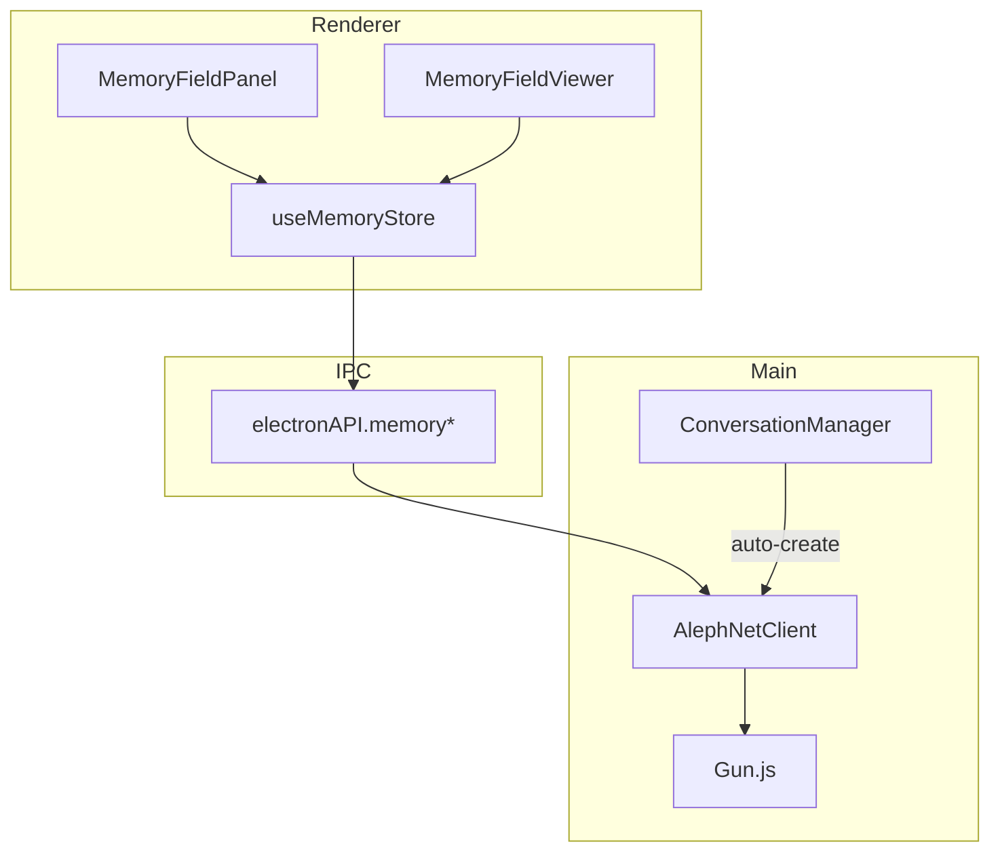

# Memory Field UI Architecture

**Status:** Draft  
**Date:** 2026-02-08  
**Author:** Architect Mode

---

## 1. Overview

This document describes the architecture for implementing Memory Field UI management features in Notaclaw. Memory Fields are semantic containers that store and organize information across different scopes (global, user, conversation, organization).

### 1.1 Goals

1. **Visibility** - Users can view all accessible memory fields (global, user, conversation, shared)
2. **Management** - Create, edit, delete, and merge memory fields
3. **Visualization** - Semantic perspective views and dependency graphs
4. **Conversation Integration** - Auto-create memory fields per conversation with fold capability

### 1.2 Current State

| Component | Status | Notes |
|-----------|--------|-------|
| Memory Field Types | ✅ Complete | [`alephnet-types.ts:256-329`](../client/src/shared/alephnet-types.ts) |
| Memory Field API | ✅ Complete | [`alephnet-api.ts:38-54`](../client/src/shared/alephnet-api.ts) |
| IPC Bridge | ✅ Complete | [`alephnet.ts:35-51`](../client/src/preload/alephnet.ts) |
| Backend Service | ⚠️ Partial | [`AlephNetClient.ts:239-403`](../client/src/main/services/AlephNetClient.ts) - in-memory only |
| Fold/Sync | ⚠️ Stub | [`AlephNetClient.ts:337`](../client/src/main/services/AlephNetClient.ts) - returns mock data |
| UI Components | ❌ Missing | ExtensionSlot placeholder only |
| Conversation Auto-Create | ❌ Missing | Not implemented |

---

## 2. Architecture

### 2.1 Component Hierarchy

```
┌─────────────────────────────────────────────────────────────────────────────┐
│                              SIDEBAR VIEW                                   │
│  ┌───────────────────────────────────────────────────────────────────────┐  │
│  │                     MemoryFieldPanel                                   │  │
│  │  ┌─────────────────────────────────────────────────────────────────┐  │  │
│  │  │  FieldCategoryAccordion: Global | User | Conversation | Shared  │  │  │
│  │  └─────────────────────────────────────────────────────────────────┘  │  │
│  │  ┌─────────────────────────────────────────────────────────────────┐  │  │
│  │  │  MemoryFieldListItem: Each memory field with actions            │  │  │
│  │  └─────────────────────────────────────────────────────────────────┘  │  │
│  └───────────────────────────────────────────────────────────────────────┘  │
└─────────────────────────────────────────────────────────────────────────────┘

┌─────────────────────────────────────────────────────────────────────────────┐
│                              STAGE VIEW                                      │
│  ┌───────────────────────────────────────────────────────────────────────┐  │
│  │                     MemoryFieldViewer                                   │  │
│  │  ┌─────────────────┐  ┌─────────────────────────────────────────────┐  │  │
│  │  │ ViewSelector    │  │  MemoryFieldDetail: Selected field metadata  │  │  │
│  │  │ - List View     │  └─────────────────────────────────────────────┘  │  │
│  │  │ - Semantic View │  ┌─────────────────────────────────────────────┐  │  │
│  │  │ - Graph View    │  │  FragmentBrowser: Query and explore content  │  │  │
│  │  └─────────────────┘  └─────────────────────────────────────────────┘  │  │
│  │  ┌─────────────────────────────────────────────────────────────────┐  │  │
│  │  │  MemoryFieldGraph: Semantic and dependency visualization        │  │  │
│  │  └─────────────────────────────────────────────────────────────────┘  │  │
│  └───────────────────────────────────────────────────────────────────────┘  │
└─────────────────────────────────────────────────────────────────────────────┘
```

### 2.2 Data Flow



### 2.3 State Management

New Zustand store: `useMemoryStore`

```typescript
interface MemoryStoreState {
  // Data
  fields: Record<string, MemoryField>;
  fragments: Record<string, MemoryFragment[]>;
  selectedFieldId: string | null;
  activeView: 'list' | 'semantic' | 'graph';
  
  // Loading states
  loading: boolean;
  error: string | null;
  
  // Actions
  loadFields: params => Promise<void>;
  createField: options => Promise<MemoryField>;
  deleteField: fieldId => Promise<void>;
  selectField: fieldId => void;
  queryField: options => Promise<MemoryFragment[]>;
  foldToUserField: conversationFieldId => Promise<void>;
  setActiveView: view => void;
}
```

---

## 3. Component Specifications

### 3.1 MemoryFieldPanel (Sidebar)

**Location:** `client/src/renderer/components/memory/MemoryFieldPanel.tsx`

**Responsibilities:**
- Display categorized list of memory fields
- Quick actions: Create, Open, Fold, Delete
- Show entropy and contribution count badges

**UI Structure:**
```
┌─────────────────────────────────────────┐
│ MEMORY FIELDS                    [+ New]│
├─────────────────────────────────────────┤
│ ▼ Global (2)                            │
│   ├─ shared-knowledge    [🔗] [⤵️]      │
│   └─ public-facts        [🔗]           │
├─────────────────────────────────────────┤
│ ▼ User (1)                              │
│   └─ my-memories         [📊 0.42]      │
├─────────────────────────────────────────┤
│ ▼ Conversations (5)                     │
│   ├─ chat_abc123         [📊 0.31] [⤵️] │
│   ├─ chat_def456         [📊 0.18] [⤵️] │
│   └─ ... more                           │
├─────────────────────────────────────────┤
│ ▼ Shared With Me (1)                    │
│   └─ team-project        [🔗] [⤵️]      │
└─────────────────────────────────────────┘

Legend:
[🔗] = Open in viewer
[📊 n] = Entropy indicator
[⤵️] = Fold into user field
```

### 3.2 MemoryFieldViewer (Stage)

**Location:** `client/src/renderer/components/memory/MemoryFieldViewer.tsx`

**Responsibilities:**
- Display selected memory field details
- Show fragments with search/filter
- Semantic visualization mode
- Dependency graph mode

**Tabs/Views:**
1. **List View** - Table of fragments with search
2. **Semantic View** - Radar chart of prime signatures, entropy graph
3. **Graph View** - Network visualization of field relationships

### 3.3 MemoryFieldGraph

**Location:** `client/src/renderer/components/memory/MemoryFieldGraph.tsx`

**Visualization Types:**

1. **Semantic Perspective** (Force-directed graph)
   - Nodes = Memory fields
   - Node size = contribution count
   - Node color = scope (global=green, user=blue, conversation=purple)
   - Edges = semantic similarity between fields
   - Edge thickness = similarity score

2. **Dependency View** (Hierarchical)
   - Root = User memory field
   - Children = Conversation fields that have been folded
   - Pending = Conversation fields not yet folded
   - Links show fold history

---

## 4. Backend Enhancements

### 4.1 ConversationManager Extension

Modify [`ConversationManager.ts`](../client/src/main/services/ConversationManager.ts) to auto-create memory fields:

```typescript
async createConversation(title?: string): Promise<AIConversation> {
    // ... existing code ...
    
    // Auto-create memory field for conversation
    const memoryField = await this.memoryClient.memoryCreate({
        name: `Conversation: ${conversationData.title}`,
        scope: 'conversation',
        description: `Memory field for conversation ${conversationData.id}`,
        visibility: 'private'
    });
    
    // Store association
    await new Promise<void>((resolve, reject) => {
        this.user.get('conversations').get(id)
            .get('memoryFieldId').put(memoryField.id, (ack: any) => {
                if (ack.err) reject(new Error(ack.err));
                else resolve();
            });
    });
    
    return {
        ...conversationData,
        messages: [],
        memoryFieldId: memoryField.id
    };
}
```

### 4.2 Memory Fold Implementation

Enhance [`AlephNetClient.ts`](../client/src/main/services/AlephNetClient.ts) `memorySync`:

```typescript
async memorySync(params: { 
    conversationId: string; 
    targetFieldId: string; 
    verifiedOnly?: boolean 
}): Promise<{ syncedCount: number; entropyDelta: number }> {
    // Get conversation's memory field
    const convField = await this.getConversationMemoryField(params.conversationId);
    if (!convField) throw new Error('Conversation has no memory field');
    
    // Get source fragments
    const sourceFrags = this.memoryFragments.get(convField.id) ?? [];
    const targetFrags = this.memoryFragments.get(params.targetFieldId) ?? [];
    
    // Filter by verification if needed
    const toSync = params.verifiedOnly 
        ? sourceFrags.filter(f => f.metadata?.verified)
        : sourceFrags;
    
    // Calculate entropy before
    const targetField = this.memoryFields.get(params.targetFieldId)!;
    const entropyBefore = targetField.entropy;
    
    // Merge fragments (dedupe by content hash)
    const existingHashes = new Set(targetFrags.map(f => this.hashContent(f.content)));
    let syncedCount = 0;
    
    for (const frag of toSync) {
        const hash = this.hashContent(frag.content);
        if (!existingHashes.has(hash)) {
            targetFrags.push({
                ...frag,
                id: generateId('frag'),
                fieldId: params.targetFieldId,
                metadata: { ...frag.metadata, syncedFrom: convField.id }
            });
            syncedCount++;
        }
    }
    
    // Update target field entropy
    targetField.entropy = this.calculateEntropy(targetFrags);
    targetField.contributionCount = targetFrags.length;
    targetField.updatedAt = Date.now();
    
    // Mark conversation field as folded
    convField.locked = true;
    convField.metadata = { ...convField.metadata, foldedInto: params.targetFieldId };
    
    return {
        syncedCount,
        entropyDelta: targetField.entropy - entropyBefore
    };
}
```

### 4.3 New IPC Channels

Add to type definitions:

```typescript
// New channels in AlephNetIPCMap
'memory:fold': { 
    params: { conversationFieldId: string; targetFieldId?: string }; 
    result: { syncedCount: number; entropyDelta: number } 
};
'memory:getConversationField': { 
    params: { conversationId: string }; 
    result: MemoryField | null 
};
'memory:getDependencies': { 
    params: { fieldId: string }; 
    result: { foldedFrom: MemoryField[]; sharedWith: string[] } 
};
```

---

## 5. UI Components Detail

### 5.1 File Structure

```
client/src/renderer/components/memory/
├── index.ts                    # Exports
├── MemoryFieldPanel.tsx        # Sidebar panel
├── MemoryFieldViewer.tsx       # Stage viewer
├── MemoryFieldDetail.tsx       # Field metadata display
├── MemoryFieldGraph.tsx        # Visualization component
├── FragmentBrowser.tsx         # Fragment list/search
├── CreateFieldDialog.tsx       # New field dialog
├── FoldFieldDialog.tsx         # Fold confirmation dialog
└── types.ts                    # Local types if needed
```

### 5.2 Integration Points

**Sidebar.tsx:**
```typescript
} : activeSidebarView === 'memory' ? (
    <div className="p-2 h-full"><MemoryFieldPanel /></div>
```

**LayoutManager.tsx / layout-config.ts:**
Add "memory-viewer" component factory for Stage:
```typescript
'memory-viewer': () => <MemoryFieldViewer />
```

**NavRail.tsx:**
Already has memory nav item - wire click to open stage:
```typescript
} else if (id === 'memory') {
    onClick = () => {
        setActiveSidebarView('memory');
        setLayoutAction({ type: 'open', component: 'memory-viewer', name: 'MEMORY', icon: 'database' });
    };
}
```

---

## 6. Visualization Specifications

### 6.1 Semantic View

Uses [`SMFRadarChart`](../client/src/renderer/components/visualizations/SMFRadarChart.tsx) adapted for prime signatures:

- 8 axes for `primeSignature[0..7]`
- Color by scope
- Overlay multiple fields for comparison

### 6.2 Entropy Graph

Uses [`FreeEnergyGraph`](../client/src/renderer/components/visualizations/FreeEnergyGraph.tsx) adapted:

- X-axis = Time
- Y-axis = Entropy
- Show entropy trajectory for selected field

### 6.3 Dependency Graph

Use `@visx/network` or `react-force-graph`:

```typescript
interface GraphNode {
    id: string;
    scope: MemoryScope;
    name: string;
    entropy: number;
    contributionCount: number;
    x?: number;
    y?: number;
}

interface GraphLink {
    source: string;
    target: string;
    type: 'folded' | 'shared' | 'similar';
    weight: number;
}
```

---

## 7. Implementation Phases

### Phase 1: Core UI (Priority: High)
1. Create `useMemoryStore.ts`
2. Implement `MemoryFieldPanel.tsx`
3. Integrate into `Sidebar.tsx`
4. Add stage registration for memory viewer

### Phase 2: Conversation Integration (Priority: High)
1. Extend `ConversationManager` to auto-create fields
2. Implement `memorySync` fold logic in `AlephNetClient`
3. Add fold action to conversation sidebar

### Phase 3: Visualization (Priority: Medium)
1. Implement `MemoryFieldGraph.tsx`
2. Semantic perspective view
3. Dependency visualization

### Phase 4: Polish (Priority: Low)
1. Search/filter in FragmentBrowser
2. Batch operations
3. Export/import memory fields

---

## 8. Type Definitions Summary

### Extended Types

```typescript
// Extend AIConversation to include memory field reference
interface AIConversation {
    id: string;
    title: string;
    messages: AIMessage[];
    createdAt: number;
    updatedAt: number;
    memoryFieldId?: string;  // NEW
}

// Memory field fold metadata
interface MemoryFieldFoldInfo {
    foldedFrom: string[];    // IDs of fields folded into this one
    foldedInto?: string;     // ID of field this was folded into
    foldedAt?: number;       // Timestamp of fold
}
```

---

## 9. Answers to User Questions

### Q: Is fold conversation memory field already implemented?

**A:** Partially. The `memory:sync` IPC channel exists but returns stub data:

```typescript
// AlephNetClient.ts:337
async memorySync(_params: { conversationId: string; targetFieldId: string; verifiedOnly?: boolean }): Promise<{ syncedCount: number; entropyDelta: number }> {
    return { syncedCount: 3, entropyDelta: 0.12 };  // STUB - needs real implementation
}
```

**Implementation Required:**
1. Map conversations to their memory fields
2. Copy fragments from conversation field to target field
3. Mark conversation field as "folded" (locked)
4. Track fold history for dependency visualization

### Q: Is memory field per conversation implemented?

**A:** No. [`ConversationManager.ts`](../client/src/main/services/ConversationManager.ts) creates conversations without associated memory fields. Extension required.

---

## 10. Risk Assessment

| Risk | Impact | Mitigation |
|------|--------|------------|
| Memory field accumulation | High | Implement cleanup policy, archive old fields |
| Fragment duplication on fold | Medium | Hash-based deduplication |
| Gun.js sync conflicts | Medium | Use CRDT patterns, last-write-wins for metadata |
| Performance with large fields | Medium | Pagination, virtualized lists |

---

## 11. Success Criteria

1. [ ] User can view all memory fields categorized by scope
2. [ ] Each conversation automatically gets a memory field
3. [ ] User can fold conversation fields into their user field
4. [ ] Semantic visualization shows field relationships
5. [ ] Dependency graph shows fold history
6. [ ] Shared fields from other nodes are visible
7. [ ] All operations are persisted to Gun.js

---

**Next Steps:** Switch to Code mode to implement Phase 1 components.
