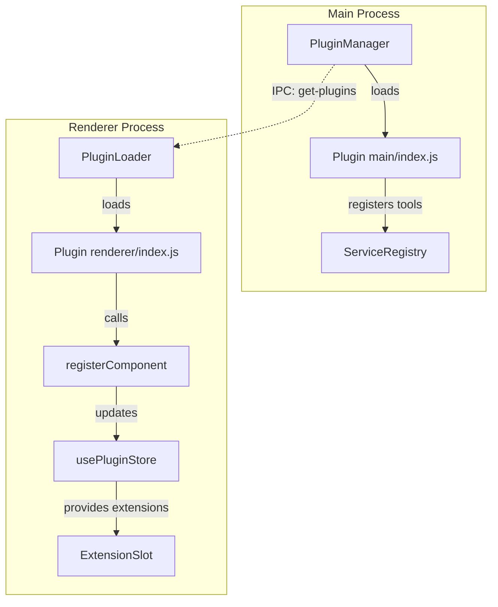
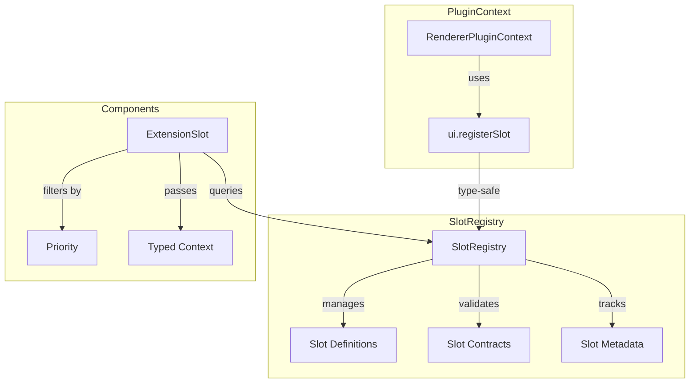

# UI Extensibility Improvement Plan

This document outlines a comprehensive plan to enhance the plugin system's UI extensibility capabilities, enabling plugins to inject components into more places with better slot management.

## 1. Current State Analysis

### 1.1 Existing Extension Slot System

The current architecture uses a simple [`ExtensionSlot`](client/src/renderer/components/ui/ExtensionSlot.tsx:10) component that renders plugins registered to named slots:

```
Current Slots Used:
├── sidebar:nav-item          → NavRail (plugin nav icons)
├── sidebar:view:memory       → Sidebar (view switch)
├── sidebar:view:coherence    → Sidebar (view switch)
├── sidebar:view:agents       → Sidebar (view switch)
├── sidebar:view:secrets      → Sidebar (view switch)
├── inspector:tab-button      → Inspector (custom tabs)
├── inspector:tab-content     → Inspector (tab content)
└── fence:renderer            → ChatView (code fence rendering)
```

### 1.2 Current Limitations

| Issue | Description | Impact |
|-------|-------------|--------|
| **Limited Slot Coverage** | Only ~8 slots defined across the app | Plugins cannot extend most UI areas |
| **No Slot Discovery** | Plugins must know slot names in advance | Poor DX, brittle integration |
| **No Slot Contracts** | No schema for what data slots receive | Type-unsafe component injection |
| **Static Registration** | Components registered once at load | No dynamic add/remove at runtime |
| **No Priority/Ordering** | Limited control over render order | Plugins compete unpredictably |
| **No Conditional Rendering** | Slots always render all extensions | No context-aware filtering |
| **No FlexLayout Integration** | Cannot add custom dockable panels | Limits advanced layouts |
| **No Message Decorators** | Cannot extend message rendering | Core chat is not extensible |

### 1.3 Current Architecture Flow



## 2. Proposed Architecture

### 2.1 Enhanced Extension Slot System

We propose a tiered slot architecture with explicit contracts:



### 2.2 Slot Categories

#### Tier 1: Layout Slots - Panel-level extension points
- `layout:panel` - Custom dockable panels in FlexLayout
- `layout:stage-view` - Full-screen views in the Stage area
- `layout:sidebar-view` - Full sidebar takeover views

#### Tier 2: Navigation Slots - Navigation and menus
- `nav:rail-item` - NavRail icons with navigation targets
- `nav:rail-footer` - Bottom of NavRail before settings
- `nav:menu-item` - AppMenuBar menu items
- `nav:context-menu` - Right-click context menu extensions

#### Tier 3: Inspector Slots - Inspector panel extensions
- `inspector:tab` - New inspector tabs with button + content
- `inspector:section` - Sections within existing tabs
- `inspector:overlay` - Floating overlays within inspector

#### Tier 4: Chat/Message Slots - Message stream extensions
- `chat:message-decorator` - Modify message rendering
- `chat:message-action` - Actions on message hover/menu
- `chat:input-action` - Actions above/below input deck
- `chat:input-decorator` - Enhance input area
- `chat:empty-state` - Replace empty conversation state

#### Tier 5: Overlay Slots - Floating UI elements
- `overlay:modal` - Modal dialogs triggered by plugins
- `overlay:toast` - Notification toasts
- `overlay:tooltip` - Custom tooltips
- `overlay:command-palette` - Command palette entries

#### Tier 6: Specialized Slots - Domain-specific extensions
- `fence:renderer` - Code fence rendering - already exists
- `settings:tab` - Settings modal tabs
- `onboarding:step` - Onboarding wizard steps

## 3. Implementation Plan

### Phase 1: Enhanced Slot Infrastructure

#### 3.1.1 Create SlotRegistry Service

```typescript
// client/src/renderer/services/SlotRegistry.ts

interface SlotDefinition {
  id: string;
  category: SlotCategory;
  description: string;
  contextType: string; // TypeScript type reference
  allowMultiple: boolean;
  maxExtensions?: number;
}

interface SlotRegistration {
  id: string;
  slotId: string;
  pluginId: string;
  component: React.ComponentType<any>;
  priority: number;
  filter?: (context: any) => boolean;
  metadata?: Record<string, any>;
}

class SlotRegistry {
  private definitions: Map<string, SlotDefinition>;
  private registrations: Map<string, SlotRegistration[]>;
  
  // Define a new slot - called by core app
  defineSlot(definition: SlotDefinition): void;
  
  // Register extension - called by plugins
  register(registration: Omit<SlotRegistration, 'id'>): string;
  
  // Unregister - for dynamic plugins
  unregister(registrationId: string): void;
  
  // Get extensions for a slot
  getExtensions(slotId: string, context?: any): SlotRegistration[];
  
  // List all defined slots - for plugin dev tools
  listSlots(): SlotDefinition[];
}
```

#### 3.1.2 Enhanced ExtensionSlot Component

```tsx
// client/src/renderer/components/ui/ExtensionSlot.tsx

interface ExtensionSlotProps<T> {
  name: string;
  context?: T;
  fallback?: React.ReactNode;
  wrapper?: React.ComponentType<{ children: React.ReactNode }>;
  renderEmpty?: boolean;
  maxItems?: number;
  layout?: 'stack' | 'inline' | 'grid';
  gap?: number;
}

export function ExtensionSlot<T>({ 
  name, 
  context, 
  fallback,
  wrapper: Wrapper,
  renderEmpty = false,
  maxItems,
  layout = 'stack',
  gap = 0
}: ExtensionSlotProps<T>) {
  const registry = useSlotRegistry();
  const extensions = registry.getExtensions(name, context);
  
  if (extensions.length === 0 && !renderEmpty) {
    return fallback ?? null;
  }
  
  const items = maxItems ? extensions.slice(0, maxItems) : extensions;
  
  const content = (
    <div className={cn(
      'extension-slot',
      layout === 'inline' && 'flex flex-row',
      layout === 'grid' && 'grid grid-cols-2',
      gap && `gap-${gap}`
    )} data-slot={name}>
      {items.map(ext => {
        const Component = ext.component;
        return (
          <ErrorBoundary key={ext.id} fallback={<SlotError extension={ext} />}>
            <Component context={context} metadata={ext.metadata} />
          </ErrorBoundary>
        );
      })}
    </div>
  );
  
  return Wrapper ? <Wrapper>{content}</Wrapper> : content;
}
```

### Phase 2: Layout Integration

#### 3.2.1 FlexLayout Plugin Panels

Enable plugins to register dockable panels:

```typescript
// Extended RendererPluginContext
interface RendererPluginContext {
  // ... existing methods ...
  
  ui: {
    // Register component to a slot
    registerSlot(slotId: string, options: SlotOptions): void;
    
    // Register a dockable panel - integrates with FlexLayout
    registerPanel(options: PanelOptions): void;
    
    // Register a stage view - full-screen component
    registerStageView(options: StageViewOptions): void;
    
    // Register navigation item with associated view
    registerNavigation(options: NavigationOptions): void;
    
    // Show modal
    showModal(options: ModalOptions): Promise<any>;
    
    // Show toast
    showToast(options: ToastOptions): void;
  };
}

interface PanelOptions {
  id: string;
  name: string;
  icon: string | React.ComponentType;
  component: React.ComponentType;
  defaultLocation?: 'left' | 'right' | 'bottom';
  defaultSize?: number; // percentage
}
```

#### 3.2.2 Dynamic Layout Factory

Update [`LayoutManager.tsx`](client/src/renderer/components/layout/LayoutManager.tsx:109) factory to support plugin panels:

```tsx
const factory = useCallback((node: TabNode) => {
  const component = node.getComponent();
  
  // Check built-in components first
  const builtIn = BUILT_IN_COMPONENTS[component];
  if (builtIn) return builtIn.render({ mode, ...builtIn.props });
  
  // Check plugin-registered panels
  const pluginPanel = slotRegistry.getPanel(component);
  if (pluginPanel) {
    const Component = pluginPanel.component;
    return (
      <ErrorBoundary fallback={<PanelError panel={pluginPanel} />}>
        <Component />
      </ErrorBoundary>
    );
  }
  
  return <UnknownPanel name={component} />;
}, [mode, slotRegistry]);
```

### Phase 3: Chat Message Extensions

#### 3.3.1 Message Decorator System

Enable plugins to enhance message rendering:

```typescript
interface MessageDecorator {
  id: string;
  pluginId: string;
  
  // When to apply this decorator
  match: (message: Message) => boolean;
  
  // Wrap the message content
  wrapper?: React.ComponentType<{ message: Message; children: React.ReactNode }>;
  
  // Add elements before message
  before?: React.ComponentType<{ message: Message }>;
  
  // Add elements after message
  after?: React.ComponentType<{ message: Message }>;
  
  // Add actions to message menu
  actions?: MessageAction[];
  
  // Priority for ordering
  priority: number;
}

interface MessageAction {
  id: string;
  label: string;
  icon: React.ComponentType;
  onClick: (message: Message) => void;
  visible?: (message: Message) => boolean;
}
```

#### 3.3.2 Enhanced MessageBubble

```tsx
// client/src/renderer/components/ui/MessageBubble.tsx

export const MessageBubble: React.FC<MessageBubbleProps> = (props) => {
  const decorators = useMessageDecorators(props.message);
  
  // Compose wrappers
  let content = <MessageContent {...props} />;
  for (const decorator of decorators) {
    if (decorator.wrapper) {
      const Wrapper = decorator.wrapper;
      content = <Wrapper message={props.message}>{content}</Wrapper>;
    }
  }
  
  // Collect actions
  const actions = decorators.flatMap(d => d.actions || []);
  
  return (
    <div className="message-bubble">
      {/* Before extensions */}
      <ExtensionSlot name="chat:message-before" context={props.message} />
      
      {decorators.map(d => d.before && <d.before key={d.id} message={props.message} />)}
      
      {/* Main content with wrappers */}
      {content}
      
      {/* After extensions */}
      {decorators.map(d => d.after && <d.after key={d.id} message={props.message} />)}
      
      <ExtensionSlot name="chat:message-after" context={props.message} />
      
      {/* Action menu */}
      <MessageActions actions={actions} message={props.message} />
    </div>
  );
};
```

### Phase 4: Navigation Extensions

#### 3.4.1 Dynamic NavRail

Update [`NavRail.tsx`](client/src/renderer/components/layout/NavRail.tsx:89) to integrate plugin nav items:

```tsx
export const NavRail: React.FC<NavRailProps> = (props) => {
  const { navOrder, setNavOrder } = useAppStore();
  const pluginNavItems = usePluginNavItems();
  
  // Merge core items with plugin items
  const allItems = useMemo(() => {
    const coreItems = navOrder.map(id => ({ id, ...NAV_ITEMS[id], isPlugin: false }));
    const pluginItems = pluginNavItems.map(p => ({ ...p, isPlugin: true }));
    return [...coreItems, ...pluginItems];
  }, [navOrder, pluginNavItems]);
  
  return (
    <div className="nav-rail">
      {/* Reorderable core items */}
      <Reorder.Group axis="y" values={navOrder} onReorder={setNavOrder}>
        {allItems.filter(i => !i.isPlugin).map(item => (
          <Reorder.Item key={item.id} value={item.id}>
            <RailButton {...item} />
          </Reorder.Item>
        ))}
      </Reorder.Group>
      
      {/* Plugin items - separate section */}
      <div className="plugin-nav-items">
        {allItems.filter(i => i.isPlugin).map(item => (
          <RailButton key={item.id} {...item} />
        ))}
      </div>
      
      {/* Extension slot for inline injection */}
      <ExtensionSlot 
        name="nav:rail-item" 
        layout="stack" 
        gap={2}
      />
    </div>
  );
};
```

### Phase 5: Inspector Extensions

#### 3.5.1 Inspector Tab System

Create a more sophisticated inspector extension system:

```typescript
interface InspectorTab {
  id: string;
  pluginId: string;
  label: string;
  icon: React.ComponentType;
  component: React.ComponentType<{ context: InspectorContext }>;
  priority: number;
  badge?: () => number | null;
}

interface InspectorSection {
  id: string;
  pluginId: string;
  targetTab: string; // which tab to inject into
  component: React.ComponentType<{ context: InspectorContext }>;
  location: 'top' | 'bottom' | 'replace';
  priority: number;
}
```

#### 3.5.2 Updated Inspector Component

```tsx
export const Inspector: React.FC = () => {
  const [activeTab, setActiveTab] = useState<string>('Cortex');
  const pluginTabs = useInspectorTabs();
  const pluginSections = useInspectorSections(activeTab);
  
  const allTabs = useMemo(() => [
    ...CORE_TABS,
    ...pluginTabs.map(t => ({ ...t, isPlugin: true }))
  ].sort((a, b) => (a.priority || 0) - (b.priority || 0)), [pluginTabs]);
  
  const topSections = pluginSections.filter(s => s.location === 'top');
  const bottomSections = pluginSections.filter(s => s.location === 'bottom');
  
  return (
    <div className="inspector">
      {/* Tab bar */}
      <div className="inspector-tabs">
        {allTabs.map(tab => (
          <TabButton
            key={tab.id}
            tab={tab}
            active={activeTab === tab.id}
            onClick={() => setActiveTab(tab.id)}
          />
        ))}
      </div>
      
      {/* Content */}
      <div className="inspector-content">
        {/* Top sections */}
        {topSections.map(s => <s.component key={s.id} context={{ activeTab }} />)}
        
        {/* Main tab content */}
        <TabContent tab={activeTab} allTabs={allTabs} />
        
        {/* Bottom sections */}
        {bottomSections.map(s => <s.component key={s.id} context={{ activeTab }} />)}
      </div>
    </div>
  );
};
```

## 4. New Type Definitions

### 4.1 Enhanced RendererPluginContext

```typescript
// client/src/shared/plugin-types.ts

export interface UIExtensionAPI {
  // Slot registration
  registerSlot(slotId: string, options: SlotRegistrationOptions): () => void;
  
  // Panel registration for FlexLayout
  registerPanel(options: PanelOptions): () => void;
  
  // Stage view registration
  registerStageView(options: StageViewOptions): () => void;
  
  // Navigation with associated view
  registerNavigation(options: NavigationOptions): () => void;
  
  // Inspector tab
  registerInspectorTab(options: InspectorTabOptions): () => void;
  
  // Message decorator
  registerMessageDecorator(options: MessageDecoratorOptions): () => void;
  
  // Settings tab
  registerSettingsTab(options: SettingsTabOptions): () => void;
  
  // Modals and toasts
  showModal<T>(options: ModalOptions): Promise<T>;
  showToast(options: ToastOptions): void;
  closeModal(id: string): void;
  
  // Command palette
  registerCommand(options: CommandOptions): () => void;
}

export interface RendererPluginContext extends PluginContext {
  ui: UIExtensionAPI;
  
  // Library access
  React: typeof React;
  useAppStore: typeof useAppStore;
  useAlephStore: typeof useAlephStore;
}

// Registration options
export interface SlotRegistrationOptions {
  component: React.ComponentType<any>;
  priority?: number;
  filter?: (context: any) => boolean;
  metadata?: Record<string, any>;
}

export interface PanelOptions {
  id: string;
  name: string;
  icon: React.ComponentType | string;
  component: React.ComponentType;
  defaultLocation?: 'left' | 'right' | 'bottom';
  defaultWeight?: number;
  enableClose?: boolean;
}

export interface StageViewOptions {
  id: string;
  name: string;
  icon: React.ComponentType | string;
  component: React.ComponentType;
}

export interface NavigationOptions {
  id: string;
  label: string;
  icon: React.ComponentType | string;
  view: StageViewOptions;
  badge?: () => number | null;
  order?: number;
}

export interface InspectorTabOptions {
  id: string;
  label: string;
  icon: React.ComponentType;
  component: React.ComponentType<{ context: any }>;
  priority?: number;
  badge?: () => number | null;
}

export interface MessageDecoratorOptions {
  id: string;
  match: (message: Message) => boolean;
  wrapper?: React.ComponentType<{ message: Message; children: React.ReactNode }>;
  before?: React.ComponentType<{ message: Message }>;
  after?: React.ComponentType<{ message: Message }>;
  actions?: MessageAction[];
  priority?: number;
}

export interface SettingsTabOptions {
  id: string;
  label: string;
  icon: React.ComponentType;
  component: React.ComponentType;
  order?: number;
}

export interface CommandOptions {
  id: string;
  label: string;
  shortcut?: string;
  icon?: React.ComponentType;
  action: () => void;
  category?: string;
}

export interface ModalOptions {
  id: string;
  title: string;
  component: React.ComponentType<{ close: (result?: any) => void }>;
  size?: 'sm' | 'md' | 'lg' | 'xl' | 'full';
}

export interface ToastOptions {
  id?: string;
  title: string;
  message?: string;
  type?: 'info' | 'success' | 'warning' | 'error';
  duration?: number;
  action?: { label: string; onClick: () => void };
}
```

## 5. Implementation Phases

### Phase 1: Foundation - 2 weeks
- [ ] Create `SlotRegistry` service with type-safe definitions
- [ ] Enhance `ExtensionSlot` component with filtering and layout
- [ ] Add error boundaries to all extension points
- [ ] Update `usePluginStore` to use new registry
- [ ] Migrate existing slot usage to new system

### Phase 2: Layout & Navigation - 2 weeks
- [ ] Integrate plugin panels with FlexLayout factory
- [ ] Create `registerPanel` API in PluginLoader
- [ ] Enhance NavRail with plugin navigation items
- [ ] Add `registerNavigation` with auto-view creation
- [ ] Update layout persistence for plugin panels

### Phase 3: Chat Extensions - 1.5 weeks
- [ ] Implement `MessageDecorator` system
- [ ] Add message action injection
- [ ] Create input deck extension slots
- [ ] Add empty state customization

### Phase 4: Inspector & Settings - 1 week
- [ ] Implement inspector tab registration
- [ ] Add inspector section injection
- [ ] Create settings tab registration
- [ ] Add command palette integration

### Phase 5: Overlays & Polish - 1 week
- [ ] Implement modal service with stacking
- [ ] Add toast notification system
- [ ] Create plugin dev tools panel
- [ ] Documentation and examples

## 6. Developer Experience

### 6.1 Slot Discovery

Add a developer tools panel for plugin authors:

```tsx
// Only in development mode
const SlotExplorer: React.FC = () => {
  const registry = useSlotRegistry();
  const slots = registry.listSlots();
  
  return (
    <div className="slot-explorer">
      <h2>Available Extension Slots</h2>
      {slots.map(slot => (
        <div key={slot.id}>
          <h3>{slot.id}</h3>
          <p>{slot.description}</p>
          <code>{slot.contextType}</code>
          <div>Extensions: {registry.getExtensions(slot.id).length}</div>
        </div>
      ))}
    </div>
  );
};
```

### 6.2 TypeScript Support

Generate type definitions for slot contexts:

```typescript
// Auto-generated slot context types
declare module '@alephnet/plugin-types' {
  interface SlotContextMap {
    'nav:rail-item': NavRailContext;
    'chat:message-decorator': Message;
    'inspector:tab': InspectorContext;
    // ... etc
  }
}

// Plugin code gets type checking
context.ui.registerSlot('chat:message-decorator', {
  component: (props: { context: Message }) => {
    // props.context is typed as Message
  }
});
```

## 7. Architecture Diagram

```mermaid
flowchart TB
    subgraph "Renderer Process"
        subgraph "Plugin Loader"
            PL[PluginLoader] --> PC[PluginContext]
            PC --> UIAPI[ui API]
        end
        
        subgraph "Slot Registry"
            SR[SlotRegistry]
            SD[Slot Definitions]
            REG[Registrations]
            SR --> SD
            SR --> REG
        end
        
        subgraph "UI Components"
            ES[ExtensionSlot]
            LM[LayoutManager]
            NR[NavRail]
            INS[Inspector]
            CV[ChatView]
            MB[MessageBubble]
        end
        
        UIAPI --> SR
        ES --> SR
        LM --> SR
        NR --> SR
        INS --> SR
        MB --> SR
    end
    
    subgraph "Plugin"
        Plugin[Plugin Code]
        Plugin --> |registerSlot| UIAPI
        Plugin --> |registerPanel| UIAPI
        Plugin --> |registerNavigation| UIAPI
        Plugin --> |registerMessageDecorator| UIAPI
    end
```

## 8. Example Plugin Using New APIs

```typescript
// plugins/weather-agent/renderer/index.ts

export function activate(context: RendererPluginContext) {
  const { React } = context;
  
  // Register navigation with associated view
  const cleanup1 = context.ui.registerNavigation({
    id: 'weather',
    label: 'Weather',
    icon: CloudIcon,
    order: 100,
    badge: () => weatherAlerts > 0 ? weatherAlerts : null,
    view: {
      id: 'weather-dashboard',
      name: 'Weather Dashboard',
      icon: CloudIcon,
      component: WeatherDashboard
    }
  });
  
  // Register a dockable panel
  const cleanup2 = context.ui.registerPanel({
    id: 'weather-radar',
    name: 'Weather Radar',
    icon: RadarIcon,
    component: WeatherRadarPanel,
    defaultLocation: 'right',
    defaultWeight: 30
  });
  
  // Register message decorator for weather mentions
  const cleanup3 = context.ui.registerMessageDecorator({
    id: 'weather-highlighter',
    match: (msg) => /weather|temperature|forecast/i.test(msg.content),
    after: ({ message }) => <WeatherPreview content={message.content} />,
    actions: [
      {
        id: 'check-weather',
        label: 'Check Weather',
        icon: CloudIcon,
        onClick: (msg) => fetchWeatherForMessage(msg)
      }
    ]
  });
  
  // Register inspector tab
  const cleanup4 = context.ui.registerInspectorTab({
    id: 'weather-details',
    label: 'Weather',
    icon: ThermometerIcon,
    component: WeatherInspectorTab,
    priority: 50
  });
  
  // Register command palette command
  const cleanup5 = context.ui.registerCommand({
    id: 'weather:check-current',
    label: 'Check Current Weather',
    shortcut: 'Cmd+Shift+W',
    icon: CloudIcon,
    category: 'Weather',
    action: () => context.ui.showModal({
      id: 'weather-modal',
      title: 'Current Weather',
      component: WeatherModal,
      size: 'md'
    })
  });
  
  // Cleanup on deactivate
  context.on('stop', () => {
    cleanup1();
    cleanup2();
    cleanup3();
    cleanup4();
    cleanup5();
  });
}
```

## 9. Success Metrics

| Metric | Current | Target |
|--------|---------|--------|
| Available extension slots | 8 | 30+ |
| Slots with typed contracts | 0 | 100% |
| Plugin panels in FlexLayout | 0 | Unlimited |
| Message extension points | 1 | 5+ |
| Developer documentation coverage | Minimal | Complete |

## 10. Next Steps

1. **Review this plan** with stakeholders
2. **Create implementation tickets** for each phase
3. **Start with Phase 1** foundation work
4. **Iterate based on plugin developer feedback**

---

*Document Version: 1.0*
*Last Updated: 2026-02-08*
*Author: Architecture Team*
