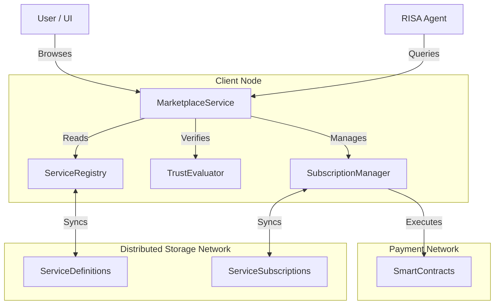

# Service Marketplace Design

## 1. Overview

The Service Marketplace is the economic and functional hub of the AlephNet ecosystem. It allows:
1.  **Developers** to publish services (APIs, tools, resources) and monetize them.
2.  **Users** to discover and subscribe to these services.
3.  **RISA Agents** to autonomously discover, negotiate, and utilize services to fulfill their objectives.

Unlike traditional marketplaces, the AlephNet Service Marketplace is **decentralized**, **agent-first**, and **trust-based**.

## 2. Architecture

The marketplace is built on top of the existing `ServiceRegistry` and `AlephGunBridge`.

### 2.1 Decentralized Indexing
Services are registered in the DSN (GunDB). To enable efficient discovery without a central server:
-   **Category Indices**: `indexes/services/categories/{category}/{serviceId}`
-   **Tag Indices**: `indexes/services/tags/{tag}/{serviceId}`
-   **Provider Indices**: `indexes/services/providers/{providerId}/{serviceId}`
-   **Reputation Index**: Services are indexed by their trust score tiers (e.g., `indexes/services/reputation/high/{serviceId}`).

### 2.2 Service Definition Extensions
The `ServiceDefinition` type is sufficient for technical registration but needs UI/Marketplace extensions:
-   **Rich Metadata**: Markdown descriptions, screenshots, demo URLs.
-   **Verification Proofs**: Cryptographic proofs of identity and code integrity.
-   **Interactive Examples**: JSON payloads that can be tested in the UI.

### 2.3 Component Diagram



## 3. User Experience (UX)

### 3.1 Discovery Interface
-   **Service Catalog**: Grid/List view of services with cards showing:
    -   Icon & Name
    -   Brief Description
    -   Trust Score (Color-coded shield)
    -   Cost (e.g., "0.01 ALEPH / call")
    -   Provider Identity
-   **Filtering**: By Category, Price, Trust Level, and "Agent Compatible".

### 3.2 Service Detail View
-   **Overview Tab**: Marketing copy, features, screenshots.
-   **Technical Tab**: API endpoints, input/output schemas (generated from `ServiceDefinition.interface`).
-   **Pricing Tab**: Subscription tiers and per-call costs.
-   **Reviews/Trust Tab**: Automated trust metrics (uptime, success rate) and user reviews (signed observations).

### 3.3 Subscription Flow
1.  User clicks "Subscribe" on a tier.
2.  System presents a **Service Agreement** (terms, cost, cancellation).
3.  User approves.
4.  `SubscriptionManager` creates a `ServiceSubscription` object, signs it, and publishes it to the DSN (encrypted for provider and consumer).
5.  Payment is locked/transferred via the underlying ledger.

## 4. RISA Agent Integration

This is the critical differentiator. Agents treat the marketplace as a **Tool Library**.

### 4.1 Semantic Discovery
Agents don't search by keywords; they search by **capabilities**.
-   **Query**: "I need a tool to generate images from text."
-   **Matching**: The `MarketplaceService` uses the `SemanticDomain` and `smfAxes` (Semantic Manifold) fields in `ServiceDefinition` to find vector-aligned services.

### 4.2 Autonomous Procurement
Agents operate under a **BudgetPolicy** defined by the user.
1.  **Trigger**: Agent encounters a task it cannot perform (e.g., "Generate Image").
2.  **Discovery**: Agent queries Marketplace for services with `outputSchema` matching the desired artifact.
3.  **Evaluation**:
    -   **Relevance**: Semantic similarity check.
    -   **Trust**: Checks `TrustEvaluator`.
    -   **Cost**: Checks against `BudgetPolicy` (e.g., "Max $0.05 per task").
4.  **Negotiation**:
    -   Agent sends `ServiceInquiry` to Provider.
    -   Provider returns `ServiceQuote` (dynamic pricing based on load).
    -   Agent signs `ServiceAcceptance`.
5.  **Execution**: Agent receives a temporary token and executes the task.

### 4.3 Agent-Service Negotiation Protocol
To standardize the interaction, we define a protocol:

```typescript
type NegotiationState = 'INQUIRY' | 'QUOTE' | 'ACCEPTED' | 'REJECTED' | 'ACTIVE';

interface ServiceNegotiation {
  id: string;
  agentId: string;
  serviceId: string;
  taskId: string;
  state: NegotiationState;
  quote?: {
    price: number;
    currency: string;
    validUntil: number;
    token: string;
  };
}
```

### 4.4 Service Composition
Agents can chain services. The Marketplace provides **Composed Service Definitions** (Recipes).
-   **Example**: "Summarize and Translate" = Summarizer Service -> Translator Service.
-   Agents can save these compositions as new private tools.

## 6. Resilience & Security

### 6.1 Dispute Resolution (Proof of Service)
To prevent fraud in a decentralized system:
1.  **Signed Results**: Every service response must be cryptographically signed by the Provider's `ServiceInstance` key.
2.  **Bad Service Proof**: If a response fails schema validation or is demonstrably false, the Consumer Agent publishes the signed bad response to the `TrustEvaluator`.
3.  **Reputation Slash**: Verified bad proofs result in a reduction of the Provider's Trust Score across the network.

### 6.2 Sandboxing & Isolation
Services procured from the marketplace are treated as **Untrusted** by default.
-   **Execution**: If the service requires local code execution (e.g., a downloaded plugin), it runs in a strictly isolated `PluginContext` with minimal permissions.
-   **Network**: If it's a remote API, the `MarketplaceService` acts as a proxy, stripping sensitive headers and ensuring only authorized data leaves the Agent's environment.

### 6.3 Offline & Async Services
For long-running tasks (e.g., "Train a model"):
-   **Job Pattern**: Agent submits task -> receives `JobId`.
-   **Notification**: Provider sends a `ServiceEvent` (via DSN/GunDB) when complete.
-   **Escrow**: Payment is held in a smart contract escrow until the result is delivered and verified.

## 7. Implementation Roadmap

### Phase 1: Foundation
-   [ ] Implement `MarketplaceService` with basic DSN indexing.
-   [ ] Create `ServiceCatalog` UI in the Renderer.
-   [ ] Update `ServiceDefinition` schema.

### Phase 2: Agent Integration
-   [ ] Implement `NegotiationEngine`.
-   [ ] Add `BudgetPolicy` to RISA Agents.
-   [ ] Build "Agent-Compatible" filter in Marketplace.

### Phase 3: Economics
-   [ ] Integrate `SubscriptionManager` with Wallet.
-   [ ] Implement "Test Drive" functionality.
-   [ ] Launch Reputation Slasher mechanism.
