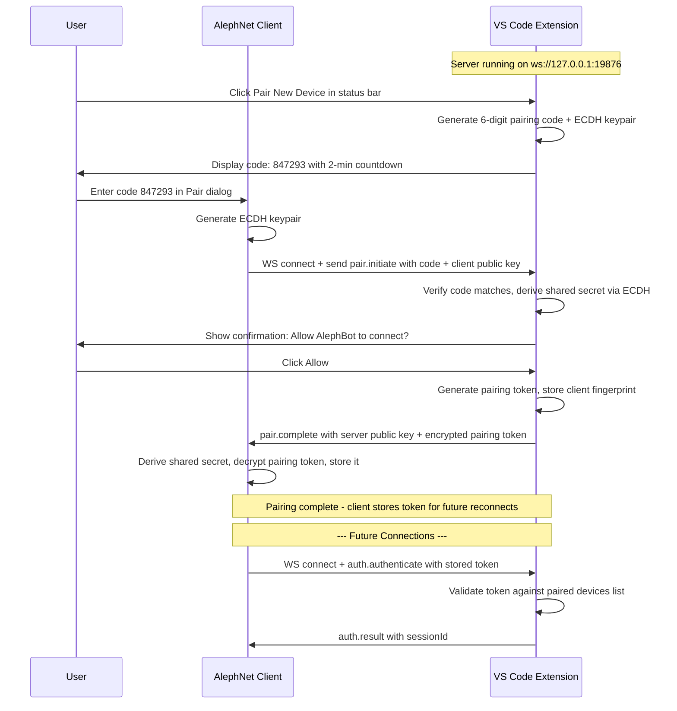

# Design: Device Pairing System for AlephNet ↔ VS Code Agent Control

## Problem Statement

The current authentication mechanism requires manually copying a 64-character hex token from VS Code settings into the AlephNet client. This is:
- **Error-prone**: Easy to mistype or truncate the token
- **Annoying**: Requires navigating VS Code settings, copying, switching windows, pasting
- **Not discoverable**: New users have no idea where to find the token
- **Single-device friction**: Must repeat for every VS Code instance

## Proposed Solution: Short-Code Pairing (Bluetooth-style)

A pairing system inspired by Bluetooth/Chromecast device pairing: the VS Code extension displays a short numeric code, the user types it into the AlephNet client, and both sides automatically negotiate a secure session.

## Architecture Overview



## Detailed Design

### 1. Pairing Code Generation (VS Code Side)

The extension generates a **6-digit numeric code** (100000-999999) when the user initiates pairing. This code:
- Expires after **2 minutes**
- Is single-use (consumed on first successful pairing)
- Is displayed prominently in a VS Code notification + status bar
- Uses `crypto.randomInt(100000, 999999)` for generation

### 2. Key Exchange (ECDH)

Both sides generate ephemeral ECDH key pairs (P-256 curve) during pairing:
- The client sends its public key with the pairing code
- The server responds with its public key after code verification
- Both derive a shared secret used to encrypt the pairing token in transit
- This prevents network eavesdroppers from capturing the token even on localhost

### 3. Pairing Token Storage

After successful pairing:

**VS Code side** stores in `globalState` (per-extension persistent storage):
```typescript
interface PairedDevice {
  id: string;           // Unique device identifier
  name: string;         // User-friendly name from client
  fingerprint: string;  // Client identity fingerprint
  tokenHash: string;    // bcrypt/scrypt hash of the pairing token
  pairedAt: number;     // Timestamp
  lastSeen: number;     // Last connection timestamp
}
```

**Client side** stores in its local config:
```typescript
interface PairedVSCodeInstance {
  id: string;           // Instance identifier
  name: string;         // e.g. workspace name from VS Code
  host: string;         // Connection host
  port: number;         // Connection port
  token: string;        // The pairing token (encrypted at rest)
  pairedAt: number;
  lastConnected: number;
}
```

### 4. New Protocol Messages

Add these to the JSON-RPC protocol:

| Method | Direction | Params | Description |
|--------|-----------|--------|-------------|
| `pair.initiate` | Client → Server | `{ code: string, clientPublicKey: string, clientName: string, clientFingerprint: string }` | Start pairing with the displayed code |
| `pair.complete` | Server → Client | `{ serverPublicKey: string, encryptedToken: string, instanceId: string, instanceName: string }` | Pairing succeeded, here is your token |
| `pair.rejected` | Server → Client | `{ reason: string }` | Code wrong or user denied |
| `pair.list` | Client → Server | `{}` | List paired devices (requires auth) |
| `pair.revoke` | Client → Server | `{ deviceId: string }` | Unpair a device (requires auth) |

### 5. VS Code Extension UI Changes

#### Status Bar Enhancement
Current: `$(broadcast) Agent: 2` or `$(circle-slash) Agent: Off`
Enhanced: Same, but right-click context menu adds **Pair New Device**

#### Pairing Flow UI
1. **Command**: `agentControl.pairDevice` — triggers pairing mode
2. **Notification**: Large notification with the 6-digit code, countdown timer, and Cancel button
3. **Confirmation Dialog**: When a client attempts to pair, show modal: *"AlephBot on [device-name] wants to connect. Allow? [Allow] [Deny]"*
4. **Paired Devices Panel**: New command `agentControl.managePairedDevices` showing a QuickPick list of paired devices with options to rename/revoke

#### Settings Changes
- Remove `agentControl.token` from settings (deprecated, still accepted for backward compat)
- Add `agentControl.pairing.autoApprove` (default: false) — skip confirmation for localhost connections
- Add `agentControl.pairing.maxDevices` (default: 10) — limit paired devices

### 6. AlephNet Client UI Changes

#### Settings Panel Addition
Add a **VS Code Instances** section in settings:
- **Pair New Instance** button → opens dialog with:
  - Host/port fields (defaulting to 127.0.0.1:19876)
  - 6-digit code input field (large, centered, numeric)
  - **Pair** button
- List of paired instances with status indicators (connected/disconnected)
- Ability to unpair/forget instances

### 7. Backward Compatibility

The existing token-based auth flow remains functional:
- If `agentControl.token` is set in VS Code settings, it still works
- `auth.authenticate` still accepts raw tokens
- Pairing just creates and stores tokens automatically
- Migration path: paired tokens take precedence over config tokens

### 8. Security Considerations

- **Localhost only by default**: Pairing codes should only work from localhost connections unless TLS is enabled
- **Rate limiting on code attempts**: Max 5 failed pairing attempts per minute to prevent brute-force
- **Code entropy**: 6 digits = ~20 bits of entropy. Combined with 2-minute expiry and single-use, this is sufficient for localhost pairing (attacker would need ~500K attempts in 2 minutes)
- **Token rotation**: Paired tokens can be rotated without re-pairing using `pair.rotate` (stretch goal)
- **ECDH prevents sniffing**: Even if someone intercepts the WebSocket traffic, they cannot recover the token without the ECDH private key

### 9. Discovery (Optional Enhancement)

For multi-instance scenarios, the client could discover VS Code instances via:
- **mDNS/Bonjour**: VS Code extension advertises `_agentcontrol._tcp` service
- **Fixed port scan**: Client scans localhost ports 19876-19886
- **Manual entry**: User types host:port

This is a stretch goal — initial implementation will use manual host:port entry.

## Implementation Plan

### Phase 1: Core Pairing Protocol
1. Add `PairingService` to VS Code extension (`vscode/src/services/PairingService.ts`)
2. Add ECDH key exchange utilities (`vscode/src/utils/crypto.ts`)
3. Add `pair.*` message handlers to `WebSocketServer.ts`
4. Add VS Code commands for pairing flow
5. Update `AuthService` to validate paired device tokens

### Phase 2: Client Integration
6. Add pairing UI to AlephNet client settings
7. Implement client-side ECDH + token storage
8. Auto-reconnect using stored pairing tokens

### Phase 3: Polish
9. Paired devices management UI (list, revoke, rename)
10. Backward compatibility testing
11. mDNS discovery (stretch goal)

## Files to Create/Modify

### New Files
- `vscode/src/services/PairingService.ts` — Core pairing logic, code generation, ECDH, device management
- `vscode/src/utils/crypto.ts` — ECDH key exchange helpers, token encryption/decryption

### Modified Files
- `vscode/src/server/WebSocketServer.ts` — Add `pair.*` method routing, handle unauthenticated pairing requests
- `vscode/src/services/AuthService.ts` — Accept paired device tokens, validate against paired devices store
- `vscode/src/extension.ts` — Register new commands (`pairDevice`, `managePairedDevices`), pass `ExtensionContext` for `globalState`
- `vscode/src/protocol/types.ts` — Add pairing-related type definitions
- `vscode/src/utils/config.ts` — Add pairing config options
- `vscode/package.json` — Add new commands, settings, menu contributions
- `client/src/main/services/AlephNetClient.ts` or new dedicated service — Client-side pairing logic
- Client settings UI components — Pairing UI in the Electron app
