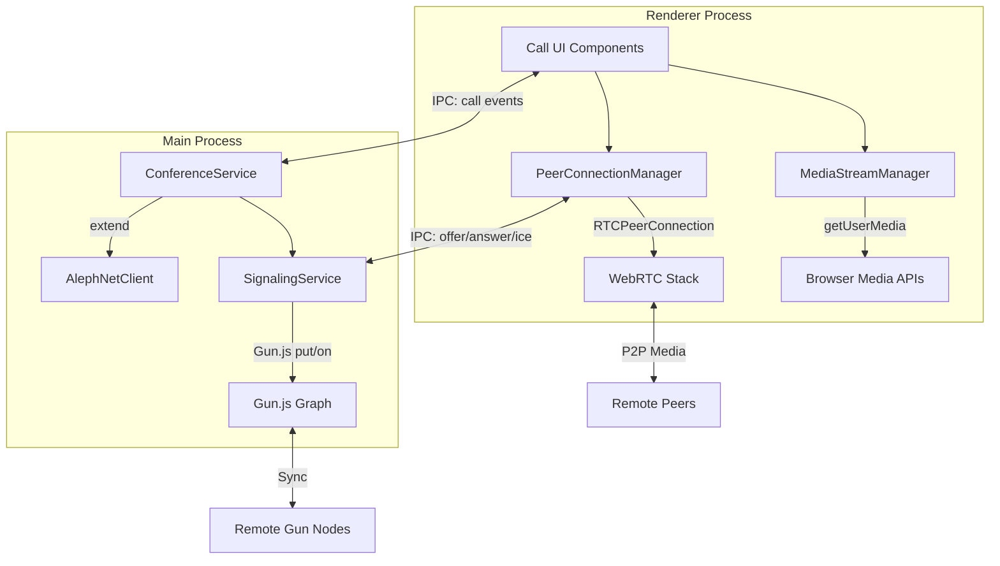
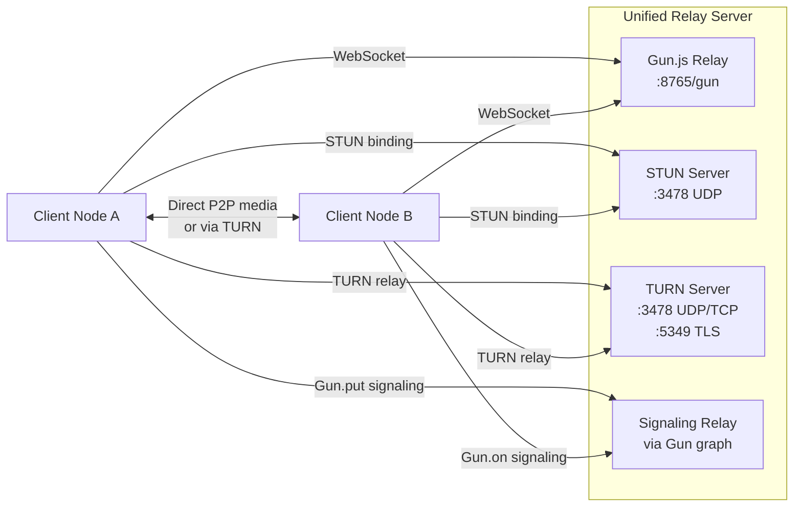

# Design 34: WebRTC Video/Audio Chat & Conferencing

## 1. Overview

This document describes the architecture for adding real-time video/audio chat and multi-party conferencing to the AlephNet network. The implementation leverages WebRTC for peer-to-peer media streams, Gun.js for signaling, and the existing plugin system for modularity.

**Key insight:** Since we already need Gun.js relay servers for the network, we co-locate TURN/STUN services on the same infrastructure. The headless node (`src/index.ts`) becomes a unified relay that handles Gun.js data sync, WebRTC signaling relay, and TURN/STUN for NAT traversal — all on one deployable server process.

### What We Already Have

| Capability | Location | Status |
|---|---|---|
| P2P mesh networking | `AlephGunBridge` / Gun.js | ✅ Active |
| Text messaging (DM + rooms) | `AlephNetClient` Tier 3 | ✅ Active |
| Chat rooms with members | `AlephNetClient.chatRoomsCreate/Send` | ✅ Active |
| Friends list + presence | `AlephNetClient` Tier 2 | ✅ Active |
| Voice TTS/STT | `@alephnet/voice-suite` plugin | ✅ Active |
| Browser speech recognition | `useSpeechToText` hook | ✅ Active |
| Encrypted P2P comms | `@alephnet/secure-comms` plugin | 🔨 Skeleton |
| Real-time events | `AlephNetEvents` push system | ✅ Active |
| Plugin UI extension slots | `SlotContextMap` / `UIExtensionAPI` | ✅ Active |
| Identity + crypto | `IdentityManager` / SEA / KeyTriplet | ✅ Active |

### What We Need to Build

1. **WebRTC Signaling Service** — Use Gun.js graph for SDP offer/answer/ICE exchange
2. **Media Stream Manager** — Capture, manage, and mix audio/video streams
3. **Conference Room Service** — Multi-party call coordination extending existing `ChatRoom`
4. **TURN/STUN Configuration** — NAT traversal for real-world connectivity
5. **Renderer UI Components** — Video grid, call controls, screen sharing
6. **IPC + Event Types** — New channels for call lifecycle management

## 2. Architecture



### 2.1 Signaling via Gun.js

WebRTC requires a signaling channel to exchange SDP offers/answers and ICE candidates. Gun.js is already our P2P data sync layer — we use it as the signaling transport.

**Signaling path in Gun graph:**

```
~user.calls.<callId>.offer   → SDP Offer
~user.calls.<callId>.answer  → SDP Answer
~user.calls.<callId>.ice.<n> → ICE Candidates
~user.calls.<callId>.state   → 'ringing' | 'active' | 'ended'
```

For multi-party calls, each participant pair has its own signaling sub-path:

```
~rooms.<roomId>.conference.participants.<peerId>.offer
~rooms.<roomId>.conference.participants.<peerId>.answer
~rooms.<roomId>.conference.participants.<peerId>.ice.<n>
```

### 2.2 Connection Topology

| Scenario | Topology | Rationale |
|---|---|---|
| 1:1 call | Direct P2P | Lowest latency, no server |
| 2-4 participants | Full mesh | Each peer connects to all others |
| 5-8 participants | Full mesh with quality reduction | Reduce video resolution per peer |
| 9+ participants | SFU required | Out of scope for Phase 1; note for future |

### 2.3 Unified Relay Server: Gun.js + TURN/STUN

Since we already deploy Gun.js relay servers for data sync, we co-locate TURN/STUN on the same process/server. This means:

- **One deployment** handles Gun.js relay, WebRTC signaling, and TURN/STUN
- **One hostname/IP** for clients to connect to
- **Shared identity** — the relay authenticates via the same KeyTriplet system
- **Config is unified** — the existing `NetworkConfig` in `ConfigManager` extends to include RTC relay settings

#### 2.3.1 Server Architecture

The headless node (`src/index.ts`) gains a `RelayServer` service:



#### 2.3.2 TURN Server Implementation

We use `node-turn` (lightweight TURN/STUN server for Node.js) bundled into the headless node:

```typescript
// src/services/TurnServer.ts
import Turn from 'node-turn';

export class TurnServer {
  private server: Turn;

  constructor(private config: TurnConfig) {
    this.server = new Turn({
      listeningPort: config.port || 3478,
      listeningIps: [config.listeningIp || '0.0.0.0'],
      relayIps: [config.relayIp || '0.0.0.0'],
      externalIps: config.externalIp ? [config.externalIp] : undefined,
      minPort: config.minPort || 49152,
      maxPort: config.maxPort || 65535,
      authMech: 'long-term',
      credentials: config.credentials, // { username: 'password' }
      debugLevel: 'ERROR',
    });
  }

  start(): void {
    this.server.start();
    console.log(`TURN/STUN server listening on port ${this.config.port || 3478}`);
  }

  stop(): void {
    this.server.stop();
  }

  // Generate time-limited TURN credentials for authenticated users
  generateCredentials(userId: string, ttlSeconds: number = 86400): { username: string; credential: string } {
    const timestamp = Math.floor(Date.now() / 1000) + ttlSeconds;
    const username = `${timestamp}:${userId}`;
    const hmac = createHmac('sha1', this.config.sharedSecret);
    hmac.update(username);
    const credential = hmac.digest('base64');
    return { username, credential };
  }
}
```

#### 2.3.3 Extended Config

```typescript
// Add to ConfigManager types:
export interface TurnConfig {
  enabled: boolean;
  port: number;         // Default: 3478
  tlsPort: number;      // Default: 5349
  listeningIp: string;
  relayIp: string;
  externalIp?: string;  // Required for servers behind NAT
  minPort: number;      // Default: 49152
  maxPort: number;      // Default: 65535
  sharedSecret: string; // For HMAC-based ephemeral credentials
  credentials?: Record<string, string>; // Static credentials fallback
}

export interface NetworkConfig {
  peers: string[];
  bootstrapUrl: string;
  heartbeatIntervalMs: number;
  // NEW:
  turn?: TurnConfig;
  iceServers?: ICEServerConfig[];  // Clients use these; auto-populated from own relay
}
```

#### 2.3.4 Client ICE Configuration

Clients auto-discover the TURN server from their Gun.js relay peer URL:

```typescript
// In client: derive TURN URL from Gun peer
function deriveIceServers(gunPeers: string[]): RTCIceServer[] {
  const servers: RTCIceServer[] = [];

  for (const peer of gunPeers) {
    const url = new URL(peer);
    const host = url.hostname;
    const isLocal = host === 'localhost' || host === '127.0.0.1';

    if (!isLocal) {
      // Same host runs TURN/STUN
      servers.push({ urls: `stun:${host}:3478` });
      // TURN credentials obtained via IPC call to main process
      // which requests ephemeral creds from the relay
    }
  }

  // Fallback public STUN
  if (servers.length === 0) {
    servers.push({ urls: 'stun:stun.l.google.com:19302' });
  }

  return servers;
}
```

#### 2.3.5 Updated `src/index.ts` Main Entry

```typescript
// In src/index.ts, after DSN Node start:
import { TurnServer } from './services/TurnServer';

// ... existing setup ...

// Start TURN/STUN server alongside Gun relay
const turnConfig = configManager.getConfig().network.turn;
let turnServer: TurnServer | null = null;

if (turnConfig?.enabled) {
  turnServer = new TurnServer(turnConfig);
  turnServer.start();
}

// Expose credential generation via Gun graph for authenticated peers
bridge.registerHandler('turn:get-credentials', async (params: { userId: string }) => {
  if (!turnServer) throw new Error('TURN server not enabled');
  return turnServer.generateCredentials(params.userId);
});

// Graceful shutdown
process.on('SIGINT', async () => {
  turnServer?.stop();
  // ... existing shutdown
});
```

## 3. Type Definitions

### 3.1 New Types in `alephnet-types.ts`

```typescript
// ─── Tier 7: Real-Time Communication ────────────────────────────────────

export type CallType = 'audio' | 'video';
export type CallState = 'initiating' | 'ringing' | 'connecting' | 'active' | 'on-hold' | 'ended' | 'failed';
export type ParticipantState = 'invited' | 'ringing' | 'connecting' | 'connected' | 'disconnected' | 'declined';
export type MediaTrackKind = 'audio' | 'video' | 'screen';

export interface CallParticipant {
  userId: string;
  displayName: string;
  state: ParticipantState;
  audioEnabled: boolean;
  videoEnabled: boolean;
  screenSharing: boolean;
  joinedAt?: number;
  leftAt?: number;
}

export interface CallSession {
  id: string;
  type: CallType;
  state: CallState;
  initiatorId: string;
  participants: CallParticipant[];
  roomId?: string;           // If associated with a ChatRoom
  domainId?: string;         // If scoped to a domain
  createdAt: number;
  startedAt?: number;        // When first peer connected
  endedAt?: number;
  maxParticipants: number;
  recording: boolean;
  metadata?: Record<string, unknown>;
}

export interface CallOffer {
  callId: string;
  fromUserId: string;
  fromDisplayName: string;
  type: CallType;
  roomId?: string;
  timestamp: number;
}

export interface ICEServerConfig {
  urls: string | string[];
  username?: string;
  credential?: string;
}

export interface CallSettings {
  defaultCallType: CallType;
  iceServers: ICEServerConfig[];
  videoBandwidthKbps: number;
  audioBandwidthKbps: number;
  enableNoiseSuppression: boolean;
  enableEchoCancellation: boolean;
  enableAutoGainControl: boolean;
  defaultVideoResolution: '360p' | '480p' | '720p' | '1080p';
  maxConferenceParticipants: number;
}
```

### 3.2 New IPC Channels

```typescript
// Add to AlephNetIPCMap:

// Call Management
'call:initiate': { params: { userId: string; type: CallType; roomId?: string }; result: CallSession };
'call:accept': { params: { callId: string }; result: CallSession };
'call:reject': { params: { callId: string; reason?: string }; result: { rejected: boolean } };
'call:end': { params: { callId: string }; result: { ended: boolean } };
'call:get': { params: { callId: string }; result: CallSession };
'call:list-active': { params: void; result: CallSession[] };

// Media Controls
'call:mute-audio': { params: { callId: string; muted: boolean }; result: { muted: boolean } };
'call:mute-video': { params: { callId: string; muted: boolean }; result: { muted: boolean } };
'call:share-screen': { params: { callId: string; enabled: boolean }; result: { sharing: boolean } };
'call:set-device': { params: { callId: string; kind: 'audioinput' | 'videoinput' | 'audiooutput'; deviceId: string }; result: { set: boolean } };

// Conferencing
'conference:create': { params: { roomId: string; type: CallType }; result: CallSession };
'conference:join': { params: { callId: string }; result: CallSession };
'conference:leave': { params: { callId: string }; result: { left: boolean } };
'conference:invite': { params: { callId: string; userId: string }; result: { invited: boolean } };

// WebRTC Signaling (main process relay)
'rtc:send-offer': { params: { callId: string; targetUserId: string; sdp: string }; result: void };
'rtc:send-answer': { params: { callId: string; targetUserId: string; sdp: string }; result: void };
'rtc:send-ice': { params: { callId: string; targetUserId: string; candidate: string }; result: void };

// Device Management
'media:get-devices': { params: void; result: MediaDeviceInfo[] };
'media:get-settings': { params: void; result: CallSettings };
'media:update-settings': { params: Partial<CallSettings>; result: CallSettings };
```

### 3.3 New Events

```typescript
// Add to AlephNetEvents:

'aleph:callOffer': CallOffer;
'aleph:callStateChange': { callId: string; state: CallState; participant?: CallParticipant };
'aleph:rtcOffer': { callId: string; fromUserId: string; sdp: string };
'aleph:rtcAnswer': { callId: string; fromUserId: string; sdp: string };
'aleph:rtcIceCandidate': { callId: string; fromUserId: string; candidate: string };
'aleph:participantJoined': { callId: string; participant: CallParticipant };
'aleph:participantLeft': { callId: string; userId: string };
'aleph:mediaStateChange': { callId: string; userId: string; audioEnabled: boolean; videoEnabled: boolean; screenSharing: boolean };
```

## 4. Implementation Plan

### Phase 1: Core WebRTC Plugin (`@alephnet/webrtc-conferencing`)

A new plugin following the existing plugin pattern:

```
plugins/webrtc-conferencing/
├── manifest.json
├── package.json
├── tsconfig.json
├── src/
│   ├── index.ts              # Plugin entry, activate/deactivate
│   ├── types.ts              # Local type defs
│   ├── SignalingService.ts   # Gun.js signaling channel
│   ├── ConferenceService.ts  # Call lifecycle management
│   └── ICEConfig.ts          # STUN/TURN configuration
├── renderer/
│   ├── index.tsx             # Renderer entry, registers UI
│   ├── hooks/
│   │   ├── useWebRTC.ts          # Core WebRTC hook
│   │   ├── useMediaDevices.ts    # Device enumeration
│   │   └── useCallState.ts       # Call state management
│   ├── components/
│   │   ├── VideoGrid.tsx         # Multi-party video layout
│   │   ├── CallControls.tsx      # Mute/unmute/hangup/screenshare
│   │   ├── IncomingCallDialog.tsx # Incoming call notification
│   │   ├── CallOverlay.tsx       # Floating call indicator
│   │   ├── DeviceSelector.tsx    # Camera/mic picker
│   │   └── ParticipantList.tsx   # Who is in the call
│   └── bundle.js
└── tests/
    └── signaling.test.ts
```

### Phase 2: Integration Points

#### 4.1 Signaling Service (Main Process)

The `SignalingService` runs in main process and uses the Gun.js bridge:

```typescript
class SignalingService {
  constructor(private bridge: AlephGunBridge, private identityManager: IdentityManager) {}

  // Publish SDP offer via Gun graph
  async sendOffer(callId: string, targetUserId: string, sdp: string): Promise<void> {
    const signed = await this.sign({ type: 'offer', callId, sdp, from: this.nodeId });
    this.bridge.put(`calls/${callId}/signals/${targetUserId}/offer`, signed);
  }

  // Listen for incoming offers
  listenForOffers(callback: (offer: SignaledMessage) => void): void {
    const gun = this.bridge.getGun();
    gun.user().get('calls').map().get('signals').get(this.nodeId).get('offer').on((data) => {
      if (data && this.verify(data)) callback(data);
    });
  }

  // Exchange ICE candidates
  async sendIceCandidate(callId: string, targetUserId: string, candidate: RTCIceCandidateInit): Promise<void> {
    const id = Date.now().toString(36);
    this.bridge.put(`calls/${callId}/signals/${targetUserId}/ice/${id}`, { candidate, from: this.nodeId });
  }

  listenForIceCandidates(callId: string, callback: (candidate: RTCIceCandidateInit) => void): void {
    const gun = this.bridge.getGun();
    gun.get(`calls/${callId}/signals/${this.nodeId}/ice`).map().on((data) => {
      if (data?.candidate) callback(data.candidate);
    });
  }
}
```

#### 4.2 useWebRTC Hook (Renderer)

The core renderer hook manages `RTCPeerConnection` instances:

```typescript
function useWebRTC(callId: string, localStream: MediaStream | null) {
  const [peerConnections, setPeerConnections] = useState<Map<string, RTCPeerConnection>>();
  const [remoteStreams, setRemoteStreams] = useState<Map<string, MediaStream>>();

  // Create peer connection for each participant
  const createPeerConnection = (peerId: string) => {
    const pc = new RTCPeerConnection({ iceServers: ICE_SERVERS });

    // Add local tracks
    localStream?.getTracks().forEach(track => pc.addTrack(track, localStream));

    // Handle remote tracks
    pc.ontrack = (event) => {
      setRemoteStreams(prev => new Map(prev).set(peerId, event.streams[0]));
    };

    // ICE candidate handling
    pc.onicecandidate = (event) => {
      if (event.candidate) {
        electronAPI.rtcSendIce({ callId, targetUserId: peerId, candidate: JSON.stringify(event.candidate) });
      }
    };

    return pc;
  };

  // ... offer/answer creation, negotiation
}
```

#### 4.3 Video Grid Component

```typescript
// Responsive grid layout for video participants
function VideoGrid({ localStream, remoteStreams, participants }: Props) {
  const gridClass = useMemo(() => {
    const count = remoteStreams.size + 1; // +1 for self
    if (count <= 1) return 'grid-cols-1';
    if (count <= 4) return 'grid-cols-2';
    if (count <= 9) return 'grid-cols-3';
    return 'grid-cols-4';
  }, [remoteStreams.size]);

  return (
    <div className={`grid ${gridClass} gap-2 h-full`}>
      <VideoTile stream={localStream} muted participant={self} isSelf />
      {Array.from(remoteStreams.entries()).map(([peerId, stream]) => (
        <VideoTile key={peerId} stream={stream} participant={participants.get(peerId)} />
      ))}
    </div>
  );
}
```

#### 4.4 UI Extension Registration

The plugin registers into existing slot infrastructure:

```typescript
// renderer/index.tsx
export const activate = (context: RendererPluginContext) => {
  // Register a navigation item for calls
  context.ui.registerNavigation({
    id: 'webrtc-calls',
    label: 'Calls',
    icon: PhoneIcon,
    view: {
      id: 'calls-view',
      name: 'Calls',
      icon: PhoneIcon,
      component: CallsView,
    },
    order: 35, // After messaging
  });

  // Register call overlay (floating PiP during active calls)
  context.ui.registerSlot('overlay:command-palette', {
    component: CallOverlay,
    priority: 10,
  });

  // Register call button in chat input area
  context.ui.registerSlot('chat:input-after', {
    component: CallButton,
    priority: 20,
  });

  // Register settings tab for call preferences
  context.ui.registerSettingsTab({
    id: 'call-settings',
    label: 'Calls & Video',
    icon: VideoIcon,
    component: CallSettingsPanel,
    order: 60,
  });

  // Register commands
  context.ui.registerCommand({
    id: 'start-video-call',
    label: 'Start Video Call',
    icon: VideoIcon,
    action: () => { /* open call dialog */ },
    category: 'Communication',
  });
};
```

### Phase 3: Screen Sharing

Electron provides `desktopCapturer` for screen/window sharing:

```typescript
// Main process: expose screen sources
ipcMain.handle('media:get-screen-sources', async () => {
  const { desktopCapturer } = require('electron');
  const sources = await desktopCapturer.getSources({
    types: ['window', 'screen'],
    thumbnailSize: { width: 320, height: 240 }
  });
  return sources.map(s => ({
    id: s.id,
    name: s.name,
    thumbnail: s.thumbnail.toDataURL(),
    appIcon: s.appIcon?.toDataURL()
  }));
});

// Renderer: capture screen
const screenStream = await navigator.mediaDevices.getUserMedia({
  audio: false,
  video: {
    mandatory: {
      chromeMediaSource: 'desktop',
      chromeMediaSourceId: selectedSourceId
    }
  }
});
```

### Phase 4: Integration with Existing Systems

#### 4.4.1 Chat Room → Conference Upgrade

Extend existing `ChatRoom` to support upgrading to a voice/video conference:

```typescript
// New IPC handler in AlephNetClient
async conferenceCreate(params: { roomId: string; type: CallType }): Promise<CallSession> {
  const room = this.rooms.get(params.roomId);
  if (!room) throw new Error('Room not found');

  const session: CallSession = {
    id: generateId('call'),
    type: params.type,
    state: 'initiating',
    initiatorId: this.nodeId,
    participants: room.members.map(userId => ({
      userId,
      displayName: userId === this.nodeId ? 'Me' : userId.substring(0, 8),
      state: userId === this.nodeId ? 'connected' : 'invited',
      audioEnabled: true,
      videoEnabled: params.type === 'video',
      screenSharing: false,
    })),
    roomId: params.roomId,
    createdAt: now(),
    maxParticipants: 8,
    recording: false,
  };

  // Signal all room members
  for (const member of room.members) {
    if (member !== this.nodeId) {
      this.emit('aleph:callOffer', {
        callId: session.id,
        fromUserId: this.nodeId,
        fromDisplayName: this.profile?.displayName ?? 'Unknown',
        type: params.type,
        roomId: params.roomId,
        timestamp: now(),
      });
    }
  }

  return session;
}
```

#### 4.4.2 Friends List → Direct Call

Add call buttons to friend entries in the social UI:

```typescript
// In friend list component
<button onClick={() => initiateCall(friend.id, 'audio')}>
  <PhoneIcon />
</button>
<button onClick={() => initiateCall(friend.id, 'video')}>
  <VideoIcon />
</button>
```

#### 4.4.3 Domain-Scoped Conferences

Calls can be scoped to AlephNet domains for access control:

```typescript
// Domain rules can gate conference access
interface DomainRules {
  // ... existing fields
  enableConferencing?: boolean;
  maxConferenceSize?: number;
}
```

## 5. Security Considerations

| Concern | Mitigation |
|---|---|
| Signaling tampering | All signaling messages wrapped in `SignedEnvelope` via `SignedEnvelopeService` |
| Unauthorized calls | Verify caller identity via `IdentityManager` + KeyTriplet before accepting |
| Media encryption | WebRTC DTLS-SRTP provides end-to-end media encryption by default |
| Spam calls | Rate limiting + block list integration via `friendsBlock` |
| Domain access | Check `DomainRules` and `TrustGate` before allowing domain calls |
| NAT traversal | STUN for most cases; deployable TURN for symmetric NAT environments |

## 6. New Permissions

```typescript
// Add to PluginPermission type:
| 'media:camera'       // Access camera
| 'media:microphone'   // Access microphone
| 'media:screen'       // Access screen capture
| 'network:webrtc'     // Create WebRTC connections
```

## 7. Implementation Phases

### Phase 1: 1:1 Audio Calls (MVP)
- [ ] Create `@alephnet/webrtc-conferencing` plugin scaffold
- [ ] Implement `SignalingService` using Gun.js
- [ ] Implement `useWebRTC` hook with single peer connection
- [ ] Build `CallControls` component with mute/unmute/hangup
- [ ] Add `IncomingCallDialog` for receiving calls
- [ ] Add IPC channels for call lifecycle
- [ ] Wire call initiation from friends list
- [ ] Add STUN server configuration

### Phase 2: 1:1 Video Calls
- [ ] Add video track management to `useWebRTC`
- [ ] Build `VideoGrid` component for 1:1 video
- [ ] Add camera device selection via `DeviceSelector`
- [ ] Add video quality settings
- [ ] Build `CallOverlay` floating PiP widget

### Phase 3: Multi-Party Conferencing
- [ ] Extend `useWebRTC` for mesh topology with multiple peers
- [ ] Build responsive `VideoGrid` for 2-8 participants
- [ ] Implement conference upgrade from `ChatRoom`
- [ ] Add `ParticipantList` panel
- [ ] Add conference invite mechanism

### Phase 4: Screen Sharing + Polish
- [ ] Implement Electron `desktopCapturer` integration
- [ ] Build source selection dialog
- [ ] Add screen share track replacement in `RTCPeerConnection`
- [ ] Add call recording capability
- [ ] Add call history to IPC
- [ ] Performance optimization and bandwidth management

## 8. Dependencies

| Package | Purpose | Notes |
|---|---|---|
| (none — WebRTC is browser-native) | Peer connections | Built into Electron/Chromium |
| Gun.js (existing) | Signaling transport | Already a project dependency |
| Electron desktopCapturer (existing) | Screen sharing | Part of Electron |
| `@alephnet/secure-comms` (existing) | Message encryption patterns | Can extend for signaling |
| `node-turn` | TURN/STUN server | **NEW** — co-located with Gun.js relay in headless node |

One new server-side dependency (`node-turn`) is added to the headless node `package.json`. The client-side requires zero new dependencies — WebRTC is native to Electron/Chromium.

### Server Deployment

The unified relay server runs all services in a single process:

| Service | Port | Protocol | Purpose |
|---|---|---|---|
| Gun.js relay | 8765 | WebSocket | Data sync + signaling |
| STUN | 3478 | UDP | Address discovery |
| TURN | 3478 | UDP/TCP | Media relay for NAT traversal |
| TURN TLS | 5349 | TLS | Secure media relay |

All services share the same host and deploy via `npm start` or as a single container.

## 9. Reusable Components from `pr-video`

We will adapt the following components from the `pr-video` project to accelerate development:

| Component | Source Path | Target Adaptation |
|---|---|---|
| **Signaling Client** | `webui/src/lib/webrtc/SignalingClient.ts` | Adapt to use `Gun.js` transport instead of WebSockets. Reuse peer selection logic. |
| **Media Manager** | `client/src/videochat/MediaManager.js` | Direct port to `useMediaDevices` hook with TypeScript types. |
| **Video Quality** | `webui/src/lib/videochat/PRVideoChat.ts` | Reuse `VideoQuality` presets for `CallSettings`. |
| **UI Components** | `webui/src/pages/VideoChat.tsx` | Adapt React components (VideoGrid, Controls) to AlephNet plugin slots. |
| **Peer Management** | `webui/src/lib/webrtc/PRGraphPeer.ts` | Reuse data channel management for control messages. |

## 10. Estimated Effort

| Phase | Effort | Deliverable |
|---|---|---|
| Phase 1: 1:1 Audio | 3-4 days | Audio calls between friends |
| Phase 2: 1:1 Video | 2-3 days | Video calls with device selection |
| Phase 3: Multi-party | 3-4 days | Conference calls for chat rooms |
| Phase 4: Screen Share | 2-3 days | Screen sharing + polish |
| **Total** | **~10-14 days** | Full conferencing system |
