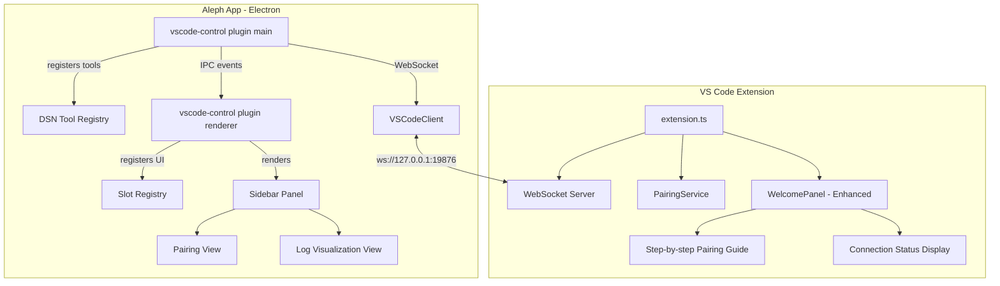

# VS Code Pairing UI & Log Visualization

## 1. Overview

Two components need UI enhancements to support initial pairing and ongoing log visualization between the Aleph app and VS Code:

1. **`plugins-extended/vscode-control`** — Aleph app plugin: add a sidebar panel with icon button for pairing initiation and connection log visualization
2. **`vscode/`** — VS Code extension: add a proper welcome/onboarding page with clear, step-by-step pairing instructions

## 2. Current State

### 2.1 vscode-control Plugin
- Pure backend: registers 40+ DSN tools via `context.dsn.registerTool()`
- Has `VSCodeClient` WebSocket client with auth, pairing, reconnect
- Has `PairingTokenStore` for persisted pairing tokens
- Has `vscode_pair` and `vscode_pairing_status` tools
- **No renderer entry point, no UI components**

### 2.2 VS Code Extension
- Has `WelcomePanel` webview but it focuses on feature overview, not pairing
- Quick Start section mentions tokens but not the pairing code flow
- Has `PairingService` with full ECDH pairing flow already implemented
- Commands: `agentControl.pairDevice`, `agentControl.managePairedDevices`
- **Welcome page does not explain pairing workflow clearly**

## 3. Architecture



## 4. Implementation Plan

### Part A: vscode-control Plugin — Sidebar Panel & Icon

#### A1. Add renderer entry point
- Create `plugins-extended/vscode-control/renderer/index.tsx`
- Update `manifest.json` to add `renderer` field
- Add React + renderer dependencies

#### A2. Register sidebar panel via UI slot API
- Use `context.ui.registerPanel()` to add a panel to the right sidebar
- Icon: a VS Code-style icon — use a plug/link icon
- Panel ID: `vscode-control-panel`

#### A3. Pairing View component
- **Unpaired state**: Show connection status, host:port config, input for 6-digit code, Pair button
- **Paired state**: Show paired device info, connected/disconnected status, Unpair button
- Use IPC to communicate between renderer and main process

#### A4. Log Visualization View
- Display a scrollable log of WebSocket events: connections, disconnections, auth results, tool invocations, errors
- Each log entry: timestamp, event type icon, message, optional details expandable
- Filter controls: by event type — connection, auth, tool-call, error, notification
- Auto-scroll with toggle
- Main process emits log events via IPC; renderer subscribes

#### A5. IPC bridge for pairing state & logs
- Main process exposes IPC channels:
  - `vscode-control:status` — get current status: paired, connected, authenticated
  - `vscode-control:pair` — initiate pairing with code
  - `vscode-control:unpair` — clear stored pairing token
  - `vscode-control:logs` — subscribe to log stream
  - `vscode-control:config` — get/set host, port

### Part B: VS Code Extension — Enhanced Welcome Page

#### B1. Redesign WelcomePanel with pairing-first flow
- Hero section: unchanged
- **New prominent Pairing section** right after hero, before features
- Clear numbered steps with visual indicators

#### B2. Pairing instructions content
Step-by-step with clear callouts:
1. Install the Aleph Agent Control extension — you are here!
2. The server starts automatically on port 19876
3. In Aleph app, open the VS Code Control panel from the sidebar
4. In VS Code, press Cmd+Shift+P and run Aleph Agent Control: Pair a Device
5. A 6-digit code appears in VS Code — type it into the Aleph app panel
6. VS Code will ask you to approve the connection — click Allow
7. Done! The connection is now established and secured

#### B3. Add Pair Device button to welcome page
- Add a prominent Pair a Device button alongside Start Server
- Clicking sends `pairDevice` command message to extension host

#### B4. Add dynamic connection status
- Show current server status: running/stopped, port, connected clients count
- Refresh via periodic webview message polling
- Show list of paired devices with last-seen timestamps

#### B5. Add sidebar webview for connection status
- Register a `WebviewViewProvider` for a VS Code sidebar view
- Shows: server status, paired devices, quick-pair button
- Contributes to `views` in `package.json` under a custom viewContainer

## 5. File Changes Summary

### New Files
| File | Purpose |
|------|---------|
| `plugins-extended/vscode-control/renderer/index.tsx` | Renderer entry point — registers panel UI |
| `plugins-extended/vscode-control/renderer/components/VSCodePanel.tsx` | Main panel component with tab switching |
| `plugins-extended/vscode-control/renderer/components/PairingView.tsx` | Pairing UI: code input, status, connect/disconnect |
| `plugins-extended/vscode-control/renderer/components/LogView.tsx` | Log visualization with filters and auto-scroll |
| `plugins-extended/vscode-control/renderer/components/StatusBadge.tsx` | Connection status indicator component |
| `vscode/src/panels/ConnectionSidebarProvider.ts` | VS Code sidebar webview provider |

### Modified Files
| File | Changes |
|------|---------|
| `plugins-extended/vscode-control/manifest.json` | Add `renderer` field, add `storage:local` permission |
| `plugins-extended/vscode-control/package.json` | Add React devDependencies for renderer |
| `plugins-extended/vscode-control/src/index.ts` | Add IPC event emitting for logs, pairing status channels, config channels |
| `vscode/src/panels/WelcomePanel.ts` | Redesign HTML: add pairing section, pair button, connection status, better instructions |
| `vscode/src/extension.ts` | Register sidebar view provider, add pairDevice handler in welcome panel |
| `vscode/package.json` | Add viewsContainers, views, view welcome content for sidebar |

## 6. Detailed Component Specs

### 6.1 VSCodePanel.tsx — Main Panel
```
+----------------------------------+
|  VS Code Control            [⟳] |
|  ● Connected to :19876          |
+--[Pairing]--[Logs]-------------+
|                                  |
|  ... tab content ...             |
|                                  |
+----------------------------------+
```

### 6.2 PairingView.tsx — Unpaired State
```
+----------------------------------+
|  Connection                      |
|  Host: [127.0.0.1] Port: [19876]|
|                                  |
|  Status: ○ Not paired            |
|                                  |
|  ┌──────────────────────────────┐|
|  │  Enter 6-digit pairing code  │|
|  │  from VS Code:               │|
|  │                               │|
|  │  [ _ _ _ ] [ _ _ _ ]         │|
|  │                               │|
|  │  [  Pair  ]                   │|
|  └──────────────────────────────┘|
|                                  |
|  How to get the code:            |
|  1. Open VS Code                 |
|  2. Cmd+Shift+P > Pair a Device  |
|  3. Enter the code above         |
+----------------------------------+
```

### 6.3 PairingView.tsx — Paired State
```
+----------------------------------+
|  Connection                      |
|  Host: 127.0.0.1  Port: 19876   |
|                                  |
|  Status: ● Connected             |
|  Device: AlephNet-user-12345     |
|  Paired: 2026-02-11              |
|                                  |
|  [ Disconnect ]  [ Unpair ]      |
+----------------------------------+
```

### 6.4 LogView.tsx
```
+----------------------------------+
|  Filters: [All▾] [Clear]        |
|  ☑ Connection ☑ Auth ☑ Tools    |
|  ☑ Errors ☑ Notifications       |
+----------------------------------+
|  08:23:01 🔌 Connected to :19876|
|  08:23:01 🔑 Auth challenge...  |
|  08:23:02 ✓ Authenticated       |
|  08:23:15 🔧 editor.openFile    |
|           path: ./src/index.ts   |
|  08:23:16 ✓ Result: success     |
|  08:24:01 🔧 fs.readFile        |
|           path: ./package.json   |
|  ...                             |
|  [auto-scroll ↓]                 |
+----------------------------------+
```

### 6.5 VS Code WelcomePanel — New Pairing Section
The welcome page gets a new prominent section between the hero and feature cards:

```
+----------------------------------+
|  🔗 Connect Your Aleph Agent    |
|                                  |
|  ① Server is running on :19876  |
|  ② Click Pair a Device below    |
|  ③ Enter the 6-digit code in    |
|     your Aleph apps VS Code     |
|     Control panel                |
|  ④ Approve the connection       |
|                                  |
|  [🔗 Pair a Device] [⚙ Settings]|
|                                  |
|  Paired Devices:                 |
|  • AlephNet-user  Last: 2m ago  |
+----------------------------------+
```

## 7. IPC Protocol

### Main → Renderer events
```typescript
// Status update event
interface VSCodeControlStatus {
  paired: boolean;
  connected: boolean;
  authenticated: boolean;
  host: string;
  port: number;
  deviceId?: string;
  deviceName?: string;
  pairedAt?: string;
}

// Log entry event
interface VSCodeControlLogEntry {
  id: string;
  timestamp: number;
  type: 'connection' | 'auth' | 'tool-call' | 'tool-result' | 'error' | 'notification';
  message: string;
  details?: Record<string, unknown>;
}
```

### Renderer → Main requests
```typescript
// Pair with code
{ channel: 'vscode-control:pair', data: { code: string, clientName?: string } }
// Response: { success: boolean, message: string }

// Unpair
{ channel: 'vscode-control:unpair', data: {} }

// Get status
{ channel: 'vscode-control:status', data: {} }
// Response: VSCodeControlStatus

// Update config
{ channel: 'vscode-control:config', data: { host?: string, port?: number } }
```
