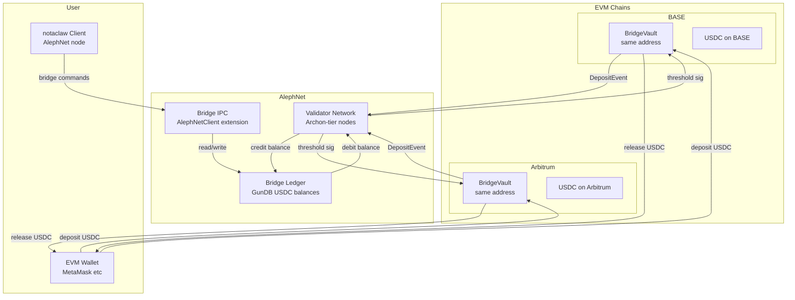
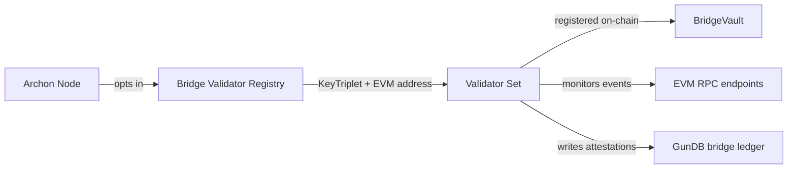
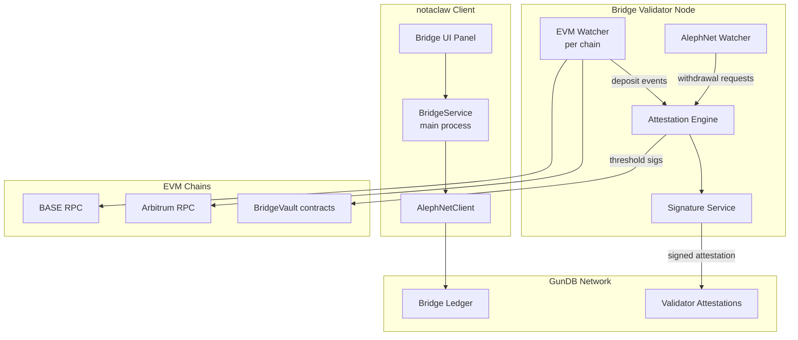

# AlephNet Multinetwork USDC Bridge

## 1. Overview

This document defines the architecture for a **multinetwork USDC bridge** between AlephNet and EVM-based blockchains, starting with **BASE** and **Arbitrum**. The bridge enables seamless cross-chain USDC transfers:

- **Inbound**: Lock USDC on an EVM chain → credit USDC balance on AlephNet ledger
- **Outbound**: Debit USDC on AlephNet ledger → release USDC from vault on target EVM chain
- **Cross-chain**: Transfer between EVM chains via AlephNet as the settlement layer

Since USDC is a fully-backed stablecoin and the bridge holds real USDC in vaults, the system is always fully collateralized — every USDC on AlephNet is backed 1:1 by USDC locked in a BridgeVault contract on some chain.

### Key Design Decisions

| Decision | Choice | Rationale |
|----------|--------|-----------|
| Contract deployment | CREATE2 deterministic | Same address on all EVM chains |
| AlephNet USDC | GunDB ledger representation | AlephNet is not an EVM chain |
| Validator set | Archon-tier stakers via existing trust system | Leverages AlephNet identity and staking |
| Attestation model | Threshold signature via validator quorum | Decentralized from day one |
| Fee model | Basis-point fee on transfers | Funds validator rewards and AlephNet treasury |

## 2. Architecture Overview



## 3. Smart Contracts

### 3.1 BridgeVault Contract

A single `BridgeVault` contract deployed at the same deterministic address on every supported EVM chain. It:

1. Accepts USDC deposits and emits events for validators
2. Releases USDC upon receiving a valid threshold-signed withdrawal authorization
3. Is managed by a set of validators whose public keys are registered on-chain
4. Supports pausing, fee adjustments, and validator rotation via governance

```solidity
// SPDX-License-Identifier: MIT
pragma solidity ^0.8.20;

import "@openzeppelin/contracts/token/ERC20/IERC20.sol";
import "@openzeppelin/contracts/token/ERC20/utils/SafeERC20.sol";
import "@openzeppelin/contracts/utils/ReentrancyGuard.sol";
import "@openzeppelin/contracts/utils/Pausable.sol";
import "@openzeppelin/contracts/utils/cryptography/ECDSA.sol";

contract BridgeVault is ReentrancyGuard, Pausable {
    using SafeERC20 for IERC20;
    using ECDSA for bytes32;

    // ═══════════════════════════════════════════
    // State
    // ═══════════════════════════════════════════

    IERC20 public immutable usdc;
    uint256 public immutable chainId;

    // Validator set: validator address => active flag
    mapping(address => bool) public validators;
    address[] public validatorList;
    uint256 public validatorThreshold; // e.g., 3 of 5

    // Nonce tracking to prevent replay
    mapping(bytes32 => bool) public processedNonces;

    // Fee: basis points, e.g., 10 = 0.10%
    uint256 public feeBps;
    address public feeRecipient;

    // Governance
    address public governance;
    address public pendingGovernance;

    // Deposit counter for unique IDs
    uint256 public depositCounter;

    // ═══════════════════════════════════════════
    // Events
    // ═══════════════════════════════════════════

    event Deposited(
        uint256 indexed depositId,
        address indexed depositor,
        address indexed alephRecipient,
        uint256 amount,
        uint256 fee,
        uint256 netAmount,
        uint256 timestamp
    );

    event Withdrawn(
        bytes32 indexed withdrawalNonce,
        address indexed recipient,
        uint256 amount,
        uint256 sourceChainId
    );

    event ValidatorAdded(address indexed validator);
    event ValidatorRemoved(address indexed validator);
    event ThresholdUpdated(uint256 newThreshold);
    event FeeUpdated(uint256 newFeeBps);
    event GovernanceTransferred(address indexed newGovernance);

    // ═══════════════════════════════════════════
    // Constructor
    // ═══════════════════════════════════════════

    constructor(
        address _usdc,
        address[] memory _validators,
        uint256 _threshold,
        uint256 _feeBps,
        address _feeRecipient,
        address _governance
    ) {
        require(_usdc != address(0), "Invalid USDC");
        require(_threshold <= _validators.length, "Threshold > validators");
        require(_threshold > 0, "Threshold must be > 0");
        require(_feeBps <= 100, "Fee too high"); // Max 1%

        usdc = IERC20(_usdc);
        chainId = block.chainid;
        validatorThreshold = _threshold;
        feeBps = _feeBps;
        feeRecipient = _feeRecipient;
        governance = _governance;

        for (uint256 i = 0; i < _validators.length; i++) {
            validators[_validators[i]] = true;
            validatorList.push(_validators[i]);
        }
    }

    // ═══════════════════════════════════════════
    // Deposit: EVM → AlephNet
    // ═══════════════════════════════════════════

    /// @notice Deposit USDC to bridge to AlephNet
    /// @param amount Amount of USDC to deposit (6 decimals)
    /// @param alephRecipient AlephNet address (KeyTriplet fingerprint)
    function deposit(
        uint256 amount,
        address alephRecipient
    ) external nonReentrant whenNotPaused {
        require(amount > 0, "Amount must be > 0");
        require(alephRecipient != address(0), "Invalid recipient");

        // Calculate fee
        uint256 fee = (amount * feeBps) / 10000;
        uint256 netAmount = amount - fee;

        // Transfer USDC from depositor
        usdc.safeTransferFrom(msg.sender, address(this), amount);

        // Send fee to recipient
        if (fee > 0) {
            usdc.safeTransfer(feeRecipient, fee);
        }

        uint256 depositId = depositCounter++;

        emit Deposited(
            depositId,
            msg.sender,
            alephRecipient,
            amount,
            fee,
            netAmount,
            block.timestamp
        );
    }

    // ═══════════════════════════════════════════
    // Withdraw: AlephNet → EVM
    // ═══════════════════════════════════════════

    /// @notice Withdraw USDC from bridge, authorized by validator threshold signatures
    /// @param recipient The EVM address to receive USDC
    /// @param amount The amount to withdraw
    /// @param nonce Unique nonce from AlephNet to prevent replay
    /// @param sourceChainId The chain where the USDC was originally deposited
    /// @param signatures Array of validator signatures
    function withdraw(
        address recipient,
        uint256 amount,
        bytes32 nonce,
        uint256 sourceChainId,
        bytes[] calldata signatures
    ) external nonReentrant whenNotPaused {
        require(!processedNonces[nonce], "Nonce already processed");
        require(signatures.length >= validatorThreshold, "Insufficient signatures");
        require(recipient != address(0), "Invalid recipient");

        // Construct the message hash
        bytes32 messageHash = keccak256(
            abi.encodePacked(
                "ALEPH_BRIDGE_WITHDRAW",
                chainId,
                recipient,
                amount,
                nonce,
                sourceChainId
            )
        );
        bytes32 ethSignedHash = messageHash.toEthSignedMessageHash();

        // Verify threshold signatures from distinct validators
        address lastSigner = address(0);
        uint256 validSigs = 0;

        for (uint256 i = 0; i < signatures.length; i++) {
            address signer = ethSignedHash.recover(signatures[i]);
            require(signer > lastSigner, "Signatures not sorted");
            require(validators[signer], "Not a validator");
            lastSigner = signer;
            validSigs++;
        }

        require(validSigs >= validatorThreshold, "Threshold not met");

        processedNonces[nonce] = true;

        // Transfer USDC to recipient
        usdc.safeTransfer(recipient, amount);

        emit Withdrawn(nonce, recipient, amount, sourceChainId);
    }

    // ═══════════════════════════════════════════
    // Governance
    // ═══════════════════════════════════════════

    modifier onlyGovernance() {
        require(msg.sender == governance, "Not governance");
        _;
    }

    function addValidator(address validator) external onlyGovernance {
        require(!validators[validator], "Already validator");
        validators[validator] = true;
        validatorList.push(validator);
        emit ValidatorAdded(validator);
    }

    function removeValidator(address validator) external onlyGovernance {
        require(validators[validator], "Not a validator");
        validators[validator] = false;
        // Remove from list
        for (uint256 i = 0; i < validatorList.length; i++) {
            if (validatorList[i] == validator) {
                validatorList[i] = validatorList[validatorList.length - 1];
                validatorList.pop();
                break;
            }
        }
        require(
            validatorList.length >= validatorThreshold,
            "Would drop below threshold"
        );
        emit ValidatorRemoved(validator);
    }

    function setThreshold(uint256 _threshold) external onlyGovernance {
        require(_threshold > 0, "Must be > 0");
        require(_threshold <= validatorList.length, "Exceeds validator count");
        validatorThreshold = _threshold;
        emit ThresholdUpdated(_threshold);
    }

    function setFee(uint256 _feeBps) external onlyGovernance {
        require(_feeBps <= 100, "Fee too high");
        feeBps = _feeBps;
        emit FeeUpdated(_feeBps);
    }

    function pause() external onlyGovernance {
        _pause();
    }

    function unpause() external onlyGovernance {
        _unpause();
    }

    function transferGovernance(address newGov) external onlyGovernance {
        pendingGovernance = newGov;
    }

    function acceptGovernance() external {
        require(msg.sender == pendingGovernance, "Not pending governance");
        governance = msg.sender;
        pendingGovernance = address(0);
        emit GovernanceTransferred(msg.sender);
    }

    // ═══════════════════════════════════════════
    // View
    // ═══════════════════════════════════════════

    function vaultBalance() external view returns (uint256) {
        return usdc.balanceOf(address(this));
    }

    function getValidators() external view returns (address[] memory) {
        return validatorList;
    }

    function validatorCount() external view returns (uint256) {
        return validatorList.length;
    }
}
```

### 3.2 CREATE2 Deterministic Deployment

To achieve the same contract address on all EVM chains, we use a `CREATE2` deployment via a deterministic deployer factory.

**Strategy**:
1. Use a well-known CREATE2 deployer (e.g., the Arachnid/deterministic-deployment-proxy at `0x4e59b44847b379578588920cA78FbF26c0B4956C`, deployed on 100+ chains)
2. Use the same `salt` and identical `initCode` (constructor args must be chain-specific but encoded identically via a proxy pattern)
3. The BridgeVault uses `block.chainid` for the chain ID rather than a constructor param, keeping initCode identical
4. Only the USDC address differs per chain — we solve this with a two-step deploy: deploy a proxy, then initialize

**Deployment Pattern**:

```solidity
// BridgeVaultFactory — deployed once per chain via CREATE2 deployer
contract BridgeVaultFactory {
    event VaultDeployed(address vault, uint256 chainId);

    function deploy(
        bytes32 salt,
        address usdc,
        address[] calldata validators,
        uint256 threshold,
        uint256 feeBps,
        address feeRecipient,
        address governance
    ) external returns (address vault) {
        bytes memory bytecode = abi.encodePacked(
            type(BridgeVault).creationCode,
            abi.encode(usdc, validators, threshold, feeBps, feeRecipient, governance)
        );
        assembly {
            vault := create2(0, add(bytecode, 0x20), mload(bytecode), salt)
            if iszero(extcodesize(vault)) {
                revert(0, 0)
            }
        }
        emit VaultDeployed(vault, block.chainid);
    }

    function computeAddress(
        bytes32 salt,
        address usdc,
        address[] calldata validators,
        uint256 threshold,
        uint256 feeBps,
        address feeRecipient,
        address governance
    ) external view returns (address) {
        bytes memory bytecode = abi.encodePacked(
            type(BridgeVault).creationCode,
            abi.encode(usdc, validators, threshold, feeBps, feeRecipient, governance)
        );
        bytes32 hash = keccak256(
            abi.encodePacked(
                bytes1(0xff),
                address(this),
                salt,
                keccak256(bytecode)
            )
        );
        return address(uint160(uint256(hash)));
    }
}
```

**Note on same-address constraint**: Since constructor args include the USDC contract address (which differs per chain: BASE USDC vs Arbitrum USDC), the raw CREATE2 hash will differ. To get an identical address, use the **upgradeable proxy pattern**:

1. Deploy an `ERC1967Proxy` via CREATE2 with identical initCode (no constructor args that vary)
2. Call `initialize(usdc, validators, ...)` after deployment
3. The proxy address is deterministic; the implementation can be chain-specific

This gives a single canonical bridge address across all chains.

### 3.3 USDC Contract Addresses

| Chain | USDC Address | Chain ID |
|-------|-------------|----------|
| BASE | `0x833589fCD6eDb6E08f4c7C32D4f71b54bdA02913` | 8453 |
| Arbitrum | `0xaf88d065e77c8cC2239327C5EDb3A432268e5831` | 42161 |

## 4. Validator Network

### 4.1 Validator Selection

Validators are AlephNet Archon-tier nodes (staking >= 10,000 ALEPH) that opt into bridge validation. The selection leverages the existing trust infrastructure:



**Validator requirements**:
- Archon-tier staking (10,000+ ALEPH)
- Ed25519 KeyTriplet for AlephNet identity
- Secp256k1 key for EVM signature generation
- Running a bridge validator node (monitors EVM chains + AlephNet)
- Minimum uptime SLA (95%+)

### 4.2 Attestation Protocol

When a deposit or withdrawal occurs, validators collectively attest:

**Inbound (EVM → AlephNet)**:
1. User calls `BridgeVault.deposit()` on BASE or Arbitrum
2. Validators monitor `Deposited` events via RPC
3. Each validator verifies the event on-chain (finality wait: ~2 min on L2s)
4. Each validator signs an attestation: `sign(DEPOSIT, chainId, depositId, recipient, amount)`
5. Once `threshold` attestations are collected in GunDB, the AlephNet ledger is credited
6. User sees USDC balance on AlephNet

**Outbound (AlephNet → EVM)**:
1. User requests withdrawal via AlephNet client
2. Request is published to GunDB bridge channel with signature
3. Validators verify the user has sufficient AlephNet USDC balance
4. Each validator signs a withdrawal message: `sign(ALEPH_BRIDGE_WITHDRAW, chainId, recipient, amount, nonce)`
5. Once `threshold` EVM-compatible signatures are collected, the user (or any relayer) submits them to `BridgeVault.withdraw()`
6. BridgeVault verifies signatures and releases USDC

### 4.3 Validator Reward Model

Validators earn:
- **Bridge fees**: Share of the basis-point fee on each transfer
- **ALEPH staking rewards**: Enhanced APY for bridge validators (Archon tier + bridge bonus)
- **Slashing risk**: Validators who sign invalid attestations lose a portion of their stake

## 5. AlephNet USDC Ledger

### 5.1 GunDB Schema

USDC balances on AlephNet are stored in GunDB under a dedicated namespace:

```javascript
// gun.get('bridge')
{
  // USDC balances per AlephNet user
  balances: {
    '<aleph_fingerprint_1>': {
      available: '1000000',     // USDC (6 decimals, stored as string)
      locked: '0',              // Locked for pending withdrawals
      totalDeposited: '5000000',
      totalWithdrawn: '4000000',
      updatedAt: 1707238800000
    }
  },

  // Deposit records (inbound)
  deposits: {
    '<deposit_nonce>': {
      chainId: 8453,
      depositId: 42,
      depositor: '0x1234...abcd',
      alephRecipient: '<fingerprint>',
      amount: '1000000',
      fee: '1000',
      netAmount: '999000',
      status: 'CONFIRMED',       // PENDING | CONFIRMED | FAILED
      attestations: {
        '<validator_1>': '<signature>',
        '<validator_2>': '<signature>',
        '<validator_3>': '<signature>'
      },
      confirmedAt: 1707238800000,
      evmTxHash: '0xabc...',
      evmBlockNumber: 12345678
    }
  },

  // Withdrawal records (outbound)
  withdrawals: {
    '<withdrawal_nonce>': {
      alephSender: '<fingerprint>',
      targetChainId: 42161,
      recipient: '0x5678...efgh',
      amount: '500000',
      status: 'COMPLETED',       // REQUESTED | ATTESTED | SUBMITTED | COMPLETED | FAILED
      attestations: {
        '<validator_1>': '<evm_signature>',
        '<validator_2>': '<evm_signature>',
        '<validator_3>': '<evm_signature>'
      },
      evmTxHash: '0xdef...',
      requestedAt: 1707238700000,
      completedAt: 1707238800000
    }
  },

  // Validator registry
  validators: {
    '<aleph_fingerprint>': {
      evmAddress: '0x...',
      alephPublicKey: '<base64>',
      status: 'ACTIVE',          // ACTIVE | INACTIVE | SLASHED
      joinedAt: 1707238800000,
      attestationCount: 1542,
      lastAttestation: 1707238800000
    }
  },

  // Transfer history between AlephNet users
  transfers: {
    '<transfer_id>': {
      from: '<fingerprint>',
      to: '<fingerprint>',
      amount: '100000',
      memo: 'Payment for services',
      timestamp: 1707238800000
    }
  },

  // Bridge configuration
  config: {
    supportedChains: {
      '8453': {
        name: 'BASE',
        vaultAddress: '0x...',
        usdcAddress: '0x833589fCD6eDb6E08f4c7C32D4f71b54bdA02913',
        rpcUrl: 'https://mainnet.base.org',
        confirmations: 12,
        active: true
      },
      '42161': {
        name: 'Arbitrum',
        vaultAddress: '0x...',
        usdcAddress: '0xaf88d065e77c8cC2239327C5EDb3A432268e5831',
        rpcUrl: 'https://arb1.arbitrum.io/rpc',
        confirmations: 12,
        active: true
      }
    },
    validatorThreshold: 3,
    feeBps: 10
  }
}
```

### 5.2 AlephNet-internal USDC Transfers

Users can transfer USDC to each other within AlephNet without touching any EVM chain:

```typescript
interface BridgeLedgerTransfer {
  from: string;       // AlephNet fingerprint
  to: string;         // AlephNet fingerprint
  amount: string;     // USDC amount (6 decimals)
  memo?: string;
  timestamp: number;
}
```

These are instant, fee-free (or minimal fee) transfers since they only update the GunDB ledger. The USDC backing stays in the vaults.

## 6. Bridge Service Architecture

### 6.1 Component Overview



### 6.2 BridgeService (Client-side)

This service runs in the main process of the notaclaw Electron client:

```typescript
// client/src/main/services/BridgeService.ts

export interface BridgeConfig {
  supportedChains: Map<number, ChainConfig>;
  validatorThreshold: number;
  feeBps: number;
}

export interface ChainConfig {
  chainId: number;
  name: string;
  vaultAddress: string;
  usdcAddress: string;
  rpcUrl: string;
  confirmations: number;
  active: boolean;
}

export interface BridgeBalance {
  available: string;    // USDC available (6 decimals)
  locked: string;       // USDC locked for pending withdrawals
  totalDeposited: string;
  totalWithdrawn: string;
}

export interface DepositRequest {
  chainId: number;
  amount: string;
  alephRecipient?: string; // defaults to self
}

export interface WithdrawalRequest {
  targetChainId: number;
  amount: string;
  evmRecipient: string;
}

export interface BridgeTransferRequest {
  to: string;           // AlephNet fingerprint
  amount: string;
  memo?: string;
}

export type DepositStatus = 'PENDING' | 'CONFIRMED' | 'FAILED';
export type WithdrawalStatus =
  'REQUESTED' | 'ATTESTED' | 'SUBMITTED' | 'COMPLETED' | 'FAILED';

export interface DepositRecord {
  nonce: string;
  chainId: number;
  depositId: number;
  depositor: string;
  alephRecipient: string;
  amount: string;
  fee: string;
  netAmount: string;
  status: DepositStatus;
  attestationCount: number;
  attestationThreshold: number;
  evmTxHash: string;
  confirmedAt?: number;
}

export interface WithdrawalRecord {
  nonce: string;
  targetChainId: number;
  recipient: string;
  amount: string;
  status: WithdrawalStatus;
  attestationCount: number;
  attestationThreshold: number;
  signatures: string[];
  evmTxHash?: string;
  requestedAt: number;
  completedAt?: number;
}
```

### 6.3 Bridge Validator Node

The validator node is a standalone service that can run on any AlephNet Archon node:

```typescript
// bridge-validator/src/types.ts

export interface ValidatorConfig {
  // AlephNet identity
  alephKeyTriplet: KeyTriplet;

  // EVM signing key (secp256k1)
  evmPrivateKey: string;
  evmAddress: string;

  // Chains to monitor
  chains: ChainMonitorConfig[];

  // AlephNet connection
  gunPeers: string[];

  // Attestation settings
  confirmationWait: number;   // blocks to wait for finality
  attestationInterval: number; // ms between attestation rounds
}

export interface ChainMonitorConfig {
  chainId: number;
  rpcUrl: string;
  wsUrl?: string;
  vaultAddress: string;
  startBlock: number;
  confirmations: number;
}
```

## 7. IPC & API Extensions

### 7.1 New AlephNet IPC Channels

Add to `AlephNetIPCMap`:

```typescript
// Bridge operations
'bridge:getBalance': {
  params: void;
  result: BridgeBalance;
};
'bridge:getConfig': {
  params: void;
  result: BridgeConfig;
};
'bridge:deposit': {
  params: DepositRequest;
  result: { depositNonce: string; estimatedConfirmation: number };
};
'bridge:withdraw': {
  params: WithdrawalRequest;
  result: { withdrawalNonce: string; status: WithdrawalStatus };
};
'bridge:transfer': {
  params: BridgeTransferRequest;
  result: { transferId: string; newBalance: string };
};
'bridge:getDeposits': {
  params: { limit?: number; status?: DepositStatus };
  result: DepositRecord[];
};
'bridge:getWithdrawals': {
  params: { limit?: number; status?: WithdrawalStatus };
  result: WithdrawalRecord[];
};
'bridge:getHistory': {
  params: { limit?: number };
  result: Array<DepositRecord | WithdrawalRecord>;
};
'bridge:getSupportedChains': {
  params: void;
  result: ChainConfig[];
};
```

### 7.2 Real-time Events

Add to `AlephNetEvents`:

```typescript
'aleph:bridgeDepositConfirmed': DepositRecord;
'aleph:bridgeWithdrawalUpdate': WithdrawalRecord;
'aleph:bridgeBalanceChange': BridgeBalance;
```

## 8. Security Considerations

### 8.1 Threat Model

| Threat | Mitigation |
|--------|-----------|
| Validator collusion | Threshold signatures require supermajority; slashing for invalid attestations |
| Replay attacks | Per-chain nonces tracked in contract state; AlephNet nonces tracked in GunDB |
| Double-spend on AlephNet | Atomic balance updates with optimistic locking in GunDB; validator consensus required |
| Bridge insolvency | 1:1 USDC backing guaranteed by design; on-chain vault balance is auditable |
| Front-running withdrawals | Withdrawal messages are signed by the user and include a nonce |
| RPC manipulation | Validators use multiple RPC endpoints; finality wait period for L2 chains |
| Key compromise | Multisig governance for contract admin; validator key rotation supported |

### 8.2 Finality Requirements

| Chain | Block Time | Recommended Confirmations | Finality Wait |
|-------|-----------|--------------------------|---------------|
| BASE | ~2s | 12 blocks | ~24s |
| Arbitrum | ~0.25s | 64 blocks | ~16s |

### 8.3 Rate Limits

- **Per-user deposit limit**: 100,000 USDC per 24h (configurable)
- **Per-user withdrawal limit**: 50,000 USDC per 24h (configurable)
- **Global daily volume cap**: 1,000,000 USDC (configurable, adjustable by governance)

## 9. Fee Structure

| Operation | Fee | Recipient |
|-----------|-----|-----------|
| Deposit (EVM → AlephNet) | 10 bps (0.10%) | 70% validators, 20% AlephNet treasury, 10% fee recipient |
| Withdrawal (AlephNet → EVM) | 10 bps (0.10%) | Same split |
| AlephNet internal transfer | 0 bps | Free |
| Cross-chain via AlephNet | 20 bps (0.20%) | Deposit fee + withdrawal fee |

## 10. Plugin Integration

The bridge will be implemented as an AlephNet plugin following the existing plugin architecture:

```
plugins/usdc-bridge/
├── manifest.json
├── main/
│   └── index.ts          # BridgeService, EVM watchers
├── renderer/
│   └── index.tsx         # Bridge UI components
├── contracts/
│   ├── BridgeVault.sol
│   ├── BridgeVaultFactory.sol
│   └── deploy/
│       └── deploy.ts     # CREATE2 deployment scripts
└── validator/
    ├── index.ts          # Standalone validator node
    ├── watcher.ts        # EVM event monitoring
    ├── attestor.ts       # Attestation signing
    └── config.ts         # Validator configuration
```

### manifest.json

```json
{
  "id": "@alephnet/usdc-bridge",
  "version": "0.1.0",
  "name": "USDC Bridge",
  "description": "Multinetwork USDC bridge between AlephNet and EVM chains",
  "main": "dist/main/index.js",
  "renderer": "renderer/index.js",
  "permissions": [
    "dsn:identity",
    "store:read",
    "store:write",
    "network:http",
    "dsn:register-tool"
  ],
  "semanticDomain": "cognitive"
}
```

## 11. Implementation Phases

### Phase 1: Core Infrastructure
- [ ] BridgeVault Solidity contract with tests
- [ ] CREATE2 deployment scripts for BASE and Arbitrum testnets
- [ ] GunDB bridge ledger schema
- [ ] Basic BridgeService in notaclaw client

### Phase 2: Validator Network
- [ ] Validator registration and key management
- [ ] EVM event watcher service
- [ ] Attestation protocol implementation
- [ ] Threshold signature collection

### Phase 3: Client Integration
- [ ] Bridge IPC channels in AlephNetClient
- [ ] Bridge UI panel (deposit, withdraw, balance, history)
- [ ] EVM wallet connection (MetaMask/WalletConnect)
- [ ] Real-time status updates

### Phase 4: Mainnet & Hardening
- [ ] Security audit of BridgeVault contract
- [ ] Mainnet deployment via CREATE2
- [ ] Rate limiting and monitoring
- [ ] Governance multisig setup
- [ ] Validator slashing implementation

### Phase 5: Expansion
- [ ] Add more chains (Optimism, Polygon, Ethereum mainnet)
- [ ] Cross-chain routing (BASE → Arbitrum via AlephNet)
- [ ] USDC yield strategies for vault reserves
- [ ] Bridge analytics dashboard
