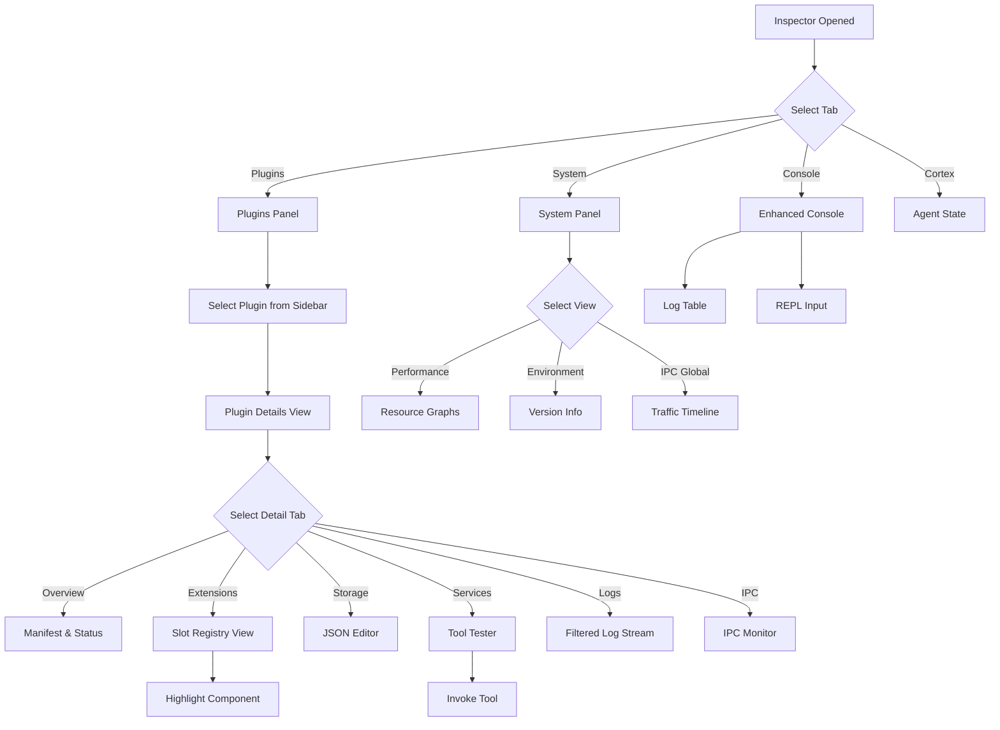

# App & Plugin Inspector Design

## Overview
This document outlines the design for a new "App & Plugin Inspector" to be integrated into the existing `Inspector` component. The goal is to provide developers with deep visibility into the runtime state of the application and its plugins, facilitating debugging and performance analysis.

## Current State Analysis
- **Inspector Component:** Existing tabbed interface (`Cortex`, `Mesh`, `Session`, `Ledger`, `Console`).
- **Plugin Architecture:** Split between Main (`PluginManager`) and Renderer (`PluginLoader`).
- **Communication:** Heavy reliance on IPC.
- **State:** Managed via `usePluginStore` and `SlotRegistry`.

## Proposed Architecture

We will add two new tabs to the Inspector:
1.  **Plugins:** dedicated to plugin management and inspection.
2.  **System:** (Optional/Future) for global app health, resource usage, and raw IPC monitoring.

### 1. Plugins Panel (`PluginsPanel.tsx`)

This panel will be the primary interface for debugging plugins.

#### Layout
A master-detail view:
- **Left Sidebar:** List of all loaded plugins.
- **Main Area:** Detailed view of the selected plugin.

#### UI Components

**Sidebar Item:**
- Icon (from manifest)
- Name
- Status Indicator (Green dot for Active, Red for Error, Grey for Disabled)
- "Dev" badge if running from source/watch mode.
- Search/Filter bar at the top (Active, Disabled, Error).

**Main Area - Header:**
- Large Icon & Title
- Version & Author
- Toggle Switch (Enable/Disable)
- "Reload" Button (Hot-reload plugin)
- "Uninstall" Button (if applicable)
- "Highlight" Button (Visual debugging of UI elements) - *New in Iteration 2*

**Main Area - Tabs:**
1.  **Overview:**
    - Description
    - Permissions (Capabilities requested/granted)
    - Trust Score & Verification Status
    - Path on disk (Click to open in OS file explorer)
    - Dependencies graph (Visual node link diagram) - *New in Iteration 2*
2.  **Extensions (Slots):**
    - List of all UI extensions registered by this plugin.
    - Grouped by type (Panel, View, Command, etc.)
    - **Actions:**
        - "Highlight": Draws a border around the rendered component in the app.
        - "Go to Source": Opens the file (if source maps available).
3.  **State & Storage:**
    - View/Edit `pluginStorage` (JSON tree view).
    - View `secrets` (keys only, values masked).
    - **Sandbox Inspector:** (If applicable) - *New in Iteration 2*
        - View memory usage of the sandbox.
        - **REPL:** Evaluate code *within* the plugin's sandbox context.
4.  **Services & Tools:** - *New in Iteration 2*
    - List of registered DSN Tools and Services.
    - **Test Harness:** UI to manually invoke a tool with JSON arguments and see the result.
5.  **Logs:**
    - Filtered view of the global log stream, showing only logs from this plugin's ID.
    - Log levels (Debug, Info, Warn, Error).
6.  **IPC:**
    - Real-time monitor of IPC messages sent/received by this plugin.
    - Payload inspection.
    - **Capture Mode:** Start/Stop recording. - *New in Iteration 2*

### 2. System Panel (`SystemPanel.tsx`) - *New in Iteration 1*

A high-level view of the application's health and internals.

#### Sections:
- **Performance:**
    - Real-time graphs for CPU Usage (Main vs Renderer).
    - Memory Usage (Heap, RSS).
    - Event Loop Lag metrics.
- **Environment:**
    - Versions: App, Electron, Chrome, Node, V8.
    - Paths: User Data, Logs, Plugins, Temp.
    - OS Info.
- **IPC Traffic (Global):**
    - Timeline view of all IPC messages.
    - Filter by channel/plugin.
    - "Record/Pause" functionality.
- **Active Handles:**
    - Open files, sockets, timers (if exposed by Node/Electron).

### 3. Console Panel Enhancements (`ConsolePanel.tsx`)

- **Structured Logging:**
    - Integrate with `LoggerService`.
    - Display logs in a table/list with columns: Time, Level, Category, Message.
    - Color-coded levels.
- **Filtering:**
    - Search bar (regex support).
    - Dropdown filters for Level (Debug, Info, Warn, Error).
    - Dropdown filter for Category (System, Plugin:ID, etc.).
- **REPL:**
    - Maintain existing JavaScript execution capability at the bottom.
    - Auto-complete for common globals (`window.electronAPI`, `useAppStore`).

## UX Flow



## Technical Integration

### Data Sources
- **Plugin List:** `usePluginStore.plugins`
- **Extensions:** `useSlotRegistry.registrations` (filtered by `pluginId`)
- **Storage:** `window.electronAPI.pluginStorageGet(id)`
- **Logs:** `LoggerService.getLogs()` (filtered by `category=plugin:{id}`)
- **IPC:** Need to hook into `window.electronAPI.onMessage` or create a debug listener in the main process that broadcasts all IPC traffic to the inspector.
- **Performance:** Need new IPC channels to request `process.getCPUUsage()`, `process.memoryUsage()` from main process.
- **Sandbox:** Need `SandboxService` to expose debug hooks (eval, memory).

### New Components Needed
- `PluginsPanel.tsx`: Main container.
- `SystemPanel.tsx`: System overview.
- `PluginList.tsx`: Sidebar list.
- `PluginDetail.tsx`: Right pane container.
- `ExtensionViewer.tsx`: Component to visualize registered slots.
- `StorageViewer.tsx`: JSON tree viewer for plugin storage.
- `LogViewer.tsx`: Reusable log table component.
- `IPCGraph.tsx`: Timeline view of IPC events.
- `ToolTester.tsx`: Form to invoke plugin tools.

## Mockup (Text-based)

```
+---------------------------------------------------------------+
|  [Cortex] [System] [Plugins] [Console] ...                    |
+----------------------+----------------------------------------+
| Search...            |  [Icon] **Weather Plugin** v1.2.0      |
|                      |  by AlephNet • [Active] [Reload]       |
| [o] Weather Plugin   |                                        |
|     v1.2.0           +----------------------------------------+
|                      | [Overview] [Extensions] [Storage] [Log]|
| [x] Broken Plugin    |                                        |
|     v0.0.1           | **Extensions**                         |
|                      | - Panel: "Weather Forecast" [Highlight]|
| [ ] Disabled Tool    | - Command: "Get Weather"               |
|     v1.0.0           |                                        |
|                      | **Services & Tools**                   |
|                      | - Tool: weather_get_current            |
|                      |   [ { "city": "London" } ] [Invoke]    |
|                      |   Result: { temp: 15, cond: "Rain" }   |
|                      |                                        |
+----------------------+----------------------------------------+
```
