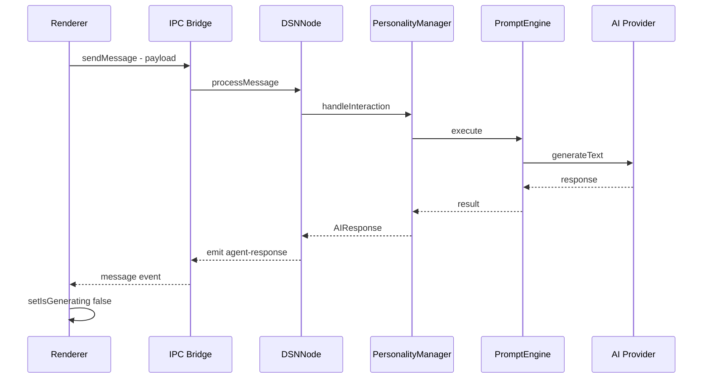
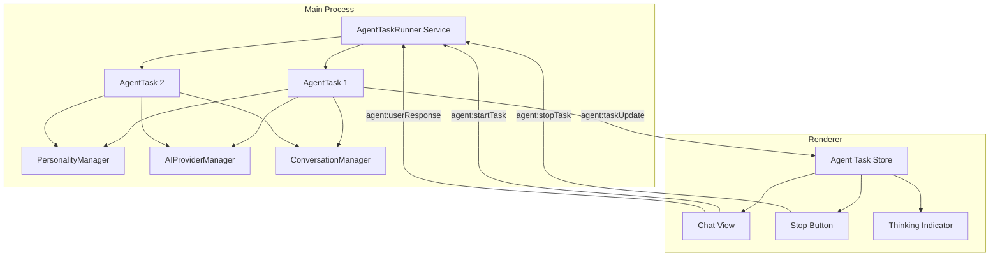
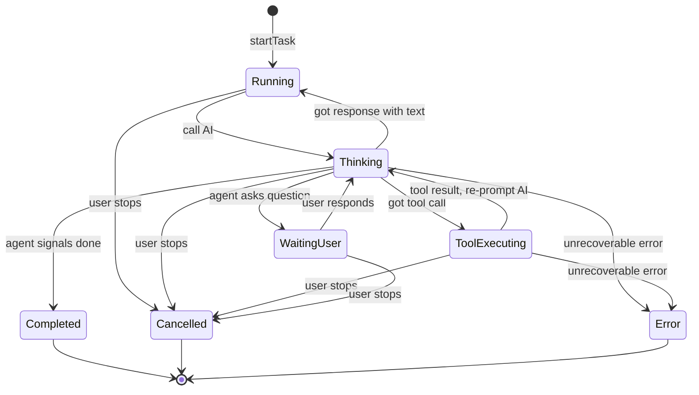

# Agentic Architecture Design

## Problem Statement

The current application uses a strict request-response model: one user message yields one AI response, then the interaction terminates. We need the agent to behave autonomously — sending multiple messages over time, executing tools, asking clarifying questions, and deciding when its task is complete. The user should be able to navigate away and return to find new responses, and should have a stop button to halt the agent at any time.

## Current Architecture Analysis

### Current Message Flow



**Key limitation**: The flow is synchronous from the renderer's perspective. One request → one response → done.

### What Must Change

| Aspect | Current | Target |
|--------|---------|--------|
| Interaction model | Request-response | Persistent agentic loop |
| Agent autonomy | None — always waits for user | Agent decides when done |
| Message count per request | Exactly 1 | Unlimited — agent sends as needed |
| Tool execution | Single loop max 5 iterations | Unlimited until task complete |
| User can navigate away | Loses context | Returns to see new messages |
| Cancellation | None | Stop button halts agent |
| Agent questions | Not supported | Agent can ask and wait for answers |

---

## Proposed Architecture

### Core Concept: AgentTask

An **AgentTask** is a long-running, persistent task object in the main process that represents an autonomous agent working on a user request. It has its own lifecycle, sends incremental messages to the conversation, and only terminates when the agent decides the task is complete or the user cancels.

### New Components



---

## 1. AgentTask — Data Model

```typescript
// New type in shared/agent-types.ts

type AgentTaskStatus =
  | 'running'       // Agent is actively working
  | 'thinking'      // AI call in progress
  | 'tool_executing' // Tool being executed
  | 'waiting_user'  // Agent asked a question, waiting for user response
  | 'completed'     // Agent decided task is done
  | 'cancelled'     // User cancelled
  | 'error';        // Unrecoverable error

interface AgentTask {
  id: string;
  conversationId: string;
  status: AgentTaskStatus;
  /** The original user message that started this task */
  originalPrompt: string;
  /** Accumulating context the agent builds internally */
  scratchpad: string[];
  /** Number of AI calls made */
  stepCount: number;
  /** Timestamp when task started */
  startedAt: number;
  /** Timestamp when task completed/cancelled/errored */
  endedAt?: number;
  /** If status is waiting_user, this is the question */
  pendingQuestion?: string;
  /** Error message if status is error */
  errorMessage?: string;
  /** Current tool being executed */
  currentTool?: string;
}
```

## 2. AgentTaskRunner — Main Process Service

This is the core new service. It lives in the main process and manages the agentic loop.

### Lifecycle



### Key Design Decisions

**How does the agent know it is done?**

The system prompt instructs the agent to use a structured signal. Two approaches, in order of preference:

1. **Tool-based**: Register a `task_complete` tool. When the agent calls it, the loop terminates. This is the cleanest approach because every LLM that supports tool calling can emit it deterministically.

2. **Sentinel in text**: The agent includes `[TASK_COMPLETE]` in its response. The runner strips it before displaying. Less reliable.

We will use approach 1 — a `task_complete` tool.

**How does the agent ask questions?**

Same pattern: a `ask_user` tool. When called, the agent loop pauses, the question is sent to the renderer, and the loop resumes when the user responds.

**How does cancellation work?**

The `AgentTaskRunner` maintains an `AbortController` per task. When the user clicks stop:
- The abort signal is set
- Any in-flight AI request is cancelled via AbortSignal
- Any in-flight tool execution checks the signal
- The task is marked cancelled
- A system message is added to the conversation

**How do incremental messages work?**

After each AI response that contains text for the user, the runner:
1. Creates a new message in the conversation via ConversationManager
2. Sends an IPC event to the renderer with the new message
3. The renderer appends it to the conversation view regardless of which tab is active

### Pseudocode

```typescript
class AgentTaskRunner {
  private activeTasks: Map<string, AgentTask> = new Map();
  private abortControllers: Map<string, AbortController> = new Map();

  async startTask(conversationId: string, userMessage: string, metadata: any): Promise<string> {
    const taskId = randomUUID();
    const abortController = new AbortController();
    
    const task: AgentTask = {
      id: taskId,
      conversationId,
      status: 'running',
      originalPrompt: userMessage,
      scratchpad: [],
      stepCount: 0,
      startedAt: Date.now(),
    };

    this.activeTasks.set(taskId, task);
    this.abortControllers.set(taskId, abortController);
    
    // Emit initial status
    this.emitTaskUpdate(task);

    // Run the loop asynchronously — don't await
    this.runAgentLoop(task, metadata, abortController.signal)
      .catch(err => this.handleTaskError(task, err));

    return taskId;
  }

  private async runAgentLoop(
    task: AgentTask, 
    metadata: any, 
    signal: AbortSignal
  ): Promise<void> {
    const MAX_STEPS = 50; // Safety limit
    
    while (task.stepCount < MAX_STEPS) {
      if (signal.aborted) {
        task.status = 'cancelled';
        this.emitTaskUpdate(task);
        return;
      }

      // 1. Build full context from conversation history + scratchpad
      task.status = 'thinking';
      task.stepCount++;
      this.emitTaskUpdate(task);

      // 2. Call AI with agentic system prompt + tools
      const response = await this.callAI(task, metadata, signal);
      
      if (signal.aborted) return;

      // 3. Process response
      if (response.toolCalls) {
        for (const toolCall of response.toolCalls) {
          // Check for control tools
          if (toolCall.name === 'task_complete') {
            // Send final message if any
            if (response.text) {
              await this.sendAgentMessage(task, response.text);
            }
            task.status = 'completed';
            task.endedAt = Date.now();
            this.emitTaskUpdate(task);
            return;
          }
          
          if (toolCall.name === 'ask_user') {
            // Send any text first
            if (response.text) {
              await this.sendAgentMessage(task, response.text);
            }
            // Pause for user response
            task.status = 'waiting_user';
            task.pendingQuestion = toolCall.args.question;
            this.emitTaskUpdate(task);
            
            // Wait for user response (resolved externally)
            const userAnswer = await this.waitForUserResponse(task.id);
            if (signal.aborted) return;
            
            // Add to scratchpad
            task.scratchpad.push(`User answered: ${userAnswer}`);
            continue;
          }

          // Regular tool execution
          task.status = 'tool_executing';
          task.currentTool = toolCall.name;
          this.emitTaskUpdate(task);

          const result = await this.executeTool(toolCall, signal);
          task.scratchpad.push(
            `Tool ${toolCall.name}: ${JSON.stringify(result)}`
          );
        }
        // Continue loop to re-prompt with tool results
        continue;
      }

      // 4. Text-only response — send to user and continue
      if (response.text) {
        await this.sendAgentMessage(task, response.text);
      }

      // If the AI produced no tool calls and no further action needed,
      // it might just be thinking out loud. The loop continues
      // and the AI must explicitly call task_complete to finish.
    }

    // Safety limit reached
    await this.sendAgentMessage(task, 
      'I have reached the maximum number of steps. Stopping here.');
    task.status = 'completed';
    task.endedAt = Date.now();
    this.emitTaskUpdate(task);
  }
}
```

### Agentic System Prompt Additions

The agent receives extra instructions appended to its personality:

```
## Agentic Mode

You are operating in agentic mode. You have the autonomy to work through multi-step tasks independently.

### Behavior Rules
- Work step by step. After each meaningful step, send a message to the user explaining what you did and what you plan to do next.
- Use available tools to accomplish your task. Execute tools as needed without asking for permission unless the action is destructive or irreversible.
- If you need information from the user, use the ask_user tool. Do not guess.
- When your task is fully complete, call the task_complete tool with a summary. Do NOT call task_complete prematurely — only when the work is actually done.
- If you encounter an error, explain it and attempt to recover. Only give up if the error is truly unrecoverable.

### Available Control Tools
- task_complete: Call this when the task is finished. Include a summary of what was accomplished.
- ask_user: Call this when you need input from the user. Include a clear question.
- send_update: Call this to send a progress message without stopping work.
```

---

## 3. IPC Protocol Changes

### New IPC Channels

| Channel | Direction | Purpose |
|---------|-----------|---------|
| `agent:startTask` | renderer → main | Start a new agentic task |
| `agent:stopTask` | renderer → main | Cancel a running task |
| `agent:userResponse` | renderer → main | Respond to an agent question |
| `agent:taskUpdate` | main → renderer | Task status change notification |
| `agent:taskMessage` | main → renderer | New agent message in conversation |

### IPC Registration (additions to `ipc-setup.ts`)

```typescript
// Agent Task IPC
ipcMain.handle('agent:startTask', async (_, { conversationId, message, metadata }) => {
  return agentTaskRunner.startTask(conversationId, message, metadata);
});

ipcMain.handle('agent:stopTask', async (_, { taskId }) => {
  agentTaskRunner.stopTask(taskId);
});

ipcMain.handle('agent:userResponse', async (_, { taskId, response }) => {
  agentTaskRunner.resolveUserResponse(taskId, response);
});
```

### Event Forwarding (additions to `services-setup.ts`)

```typescript
agentTaskRunner.on('taskUpdate', (update) => {
  const mainWindow = getMainWindow();
  if (mainWindow && !mainWindow.isDestroyed()) {
    mainWindow.webContents.send('agent:taskUpdate', update);
  }
});

agentTaskRunner.on('taskMessage', (payload) => {
  const mainWindow = getMainWindow();
  if (mainWindow && !mainWindow.isDestroyed()) {
    mainWindow.webContents.send('agent:taskMessage', payload);
  }
});
```

### Preload Additions

```typescript
// In preload/index.ts
agentStartTask: (params) => ipcRenderer.invoke('agent:startTask', params),
agentStopTask: (params) => ipcRenderer.invoke('agent:stopTask', params),
agentUserResponse: (params) => ipcRenderer.invoke('agent:userResponse', params),
onAgentTaskUpdate: (callback) => {
  const sub = (_event, data) => callback(data);
  ipcRenderer.on('agent:taskUpdate', sub);
  return () => ipcRenderer.removeListener('agent:taskUpdate', sub);
},
onAgentTaskMessage: (callback) => {
  const sub = (_event, data) => callback(data);
  ipcRenderer.on('agent:taskMessage', sub);
  return () => ipcRenderer.removeListener('agent:taskMessage', sub);
},
```

---

## 4. Renderer State Management

### New Agent Slice (additions to `useAppStore` or new store)

```typescript
// store/app/agentSlice.ts

interface AgentTaskState {
  /** Currently active agentic task per conversation */
  activeTaskByConversation: Record<string, AgentTask>;
  
  /** Start a new agentic task */
  startAgentTask: (conversationId: string, message: string) => Promise<string>;
  
  /** Stop a running task */
  stopAgentTask: (taskId: string) => void;
  
  /** Respond to agent question */
  respondToAgent: (taskId: string, response: string) => void;
  
  /** Handle task update from main process */
  handleTaskUpdate: (update: AgentTask) => void;
}
```

### Changes to Existing State

The existing `isGenerating` boolean becomes insufficient. Instead:

- `isGenerating` continues to indicate if any AI work is happening (for simple backward compat)
- The `AgentTask` object per conversation provides detailed status
- The `abortController` in `aiSlice` is replaced by the task-level cancellation

### Message Handling

When `agent:taskMessage` arrives via IPC:
1. The message is added to the conversation via `addMessage()`
2. If the conversation is currently active, it auto-scrolls
3. If the conversation is not visible, a badge/notification appears on the tab

---

## 5. UI Changes

### Chat Input Behavior

When an agentic task is running for the current conversation:

1. **Stop Button**: Replaces the send button. Clicking it calls `stopAgentTask()`.
2. **Input Disabled**: The text input is disabled while the agent is working, UNLESS the agent asked a question (`waiting_user` status), in which case the input shows the question as a placeholder and the send button becomes a reply button.
3. **Thinking Indicator**: A persistent indicator below the last message shows the agent's current activity (thinking, executing tool X, etc.)

### Navigation Persistence

When the user navigates away from a conversation with an active task:
- The task continues running in the main process
- A small indicator on the conversation tab shows the agent is still working
- When the user returns, all messages sent during their absence are visible
- The thinking indicator resumes

### Message Rendering

Agent messages during an agentic task are rendered with:
- A subtle visual distinction (e.g., step number badge)
- Tool execution results can be collapsed/expanded
- The final completion message has a "task complete" badge

---

## 6. Integration with Existing Systems

### PersonalityManager

`PersonalityManager.handleInteraction()` currently handles the full AI call cycle including tool loops. For agentic mode, this responsibility shifts to `AgentTaskRunner`, which:

1. Uses `PersonalityManager` to get the system prompt and personality context
2. Uses `PersonalityManager`'s tools list 
3. Manages its own loop rather than delegating to PersonalityManager's tool loop
4. Calls `AIProviderManager.processChatRequest()` directly for each step

The existing `PersonalityManager.handleInteraction()` remains for simple, non-agentic chat mode (backward compatible).

### ConversationManager

No changes needed. The `AgentTaskRunner` uses `conversationManager.addMessage()` for each incremental message, just as the current system does for single responses.

### DSNNode

The current `DSNNode.processMessage()` pathway is modified:
- If the user's message is identified as a task (or agentic mode is enabled for the conversation), route to `AgentTaskRunner.startTask()` instead of `personalityManager.handleInteraction()`
- Simple chat messages continue through the existing path

### Mode Selection

How does the system know whether a message should be agentic vs simple chat?

Options (implement all, in order of priority):
1. **Explicit mode toggle**: A UI toggle on the chat input for "agentic mode"
2. **Message mode**: The existing `MessagePayload.mode` field — `'Task'` mode triggers agentic behavior
3. **Auto-detection**: The AI's first response can determine if the request requires agentic behavior (adds latency, lower priority)

---

## 7. File Changes Summary

### New Files

| File | Purpose |
|------|---------|
| `client/src/shared/agent-types.ts` | AgentTask types and IPC payload types |
| `client/src/main/services/AgentTaskRunner.ts` | Core agentic loop service |
| `client/src/renderer/store/app/agentSlice.ts` | Agent task state for renderer |

### Modified Files

| File | Changes |
|------|---------|
| `client/src/main/ipc-setup.ts` | Add agent IPC handlers |
| `client/src/main/services-setup.ts` | Instantiate AgentTaskRunner, wire events |
| `client/src/main/services/DSNNode.ts` | Route task-mode messages to AgentTaskRunner |
| `client/src/preload/index.ts` | Expose agent IPC methods |
| `client/src/shared/types.ts` | Add agent methods to IElectronAPI |
| `client/src/renderer/store/app/types.ts` | Add agent state to AppState |
| `client/src/renderer/store/useAppStore.ts` | Integrate agent slice |
| `client/src/renderer/App.tsx` | Subscribe to agent IPC events |
| `client/src/renderer/components/session/*` | Chat input stop button, thinking indicator |

---

## 8. Implementation Order

1. **Types**: Define `agent-types.ts` with all shared types
2. **AgentTaskRunner**: Build the main process service with the agentic loop
3. **IPC**: Wire up new IPC channels in ipc-setup, preload, types
4. **State**: Add agent slice to renderer store
5. **Event Subscription**: Subscribe to agent events in App.tsx
6. **DSNNode routing**: Add task routing logic
7. **UI**: Chat input modifications (stop button, thinking indicator, question handling)
8. **Testing**: End-to-end test of agentic flow

---

## 9. Safety Considerations

- **Max steps**: Hard limit of 50 steps per task to prevent infinite loops
- **Max duration**: Optional time limit (e.g., 30 minutes) after which the agent auto-completes
- **Tool approval**: Destructive tools (shell, file write) can be gated behind user approval even in agentic mode
- **Rate limiting**: Prevent rapid-fire AI calls by adding a small delay between steps
- **Cost awareness**: Track token usage across the entire task and optionally alert the user
