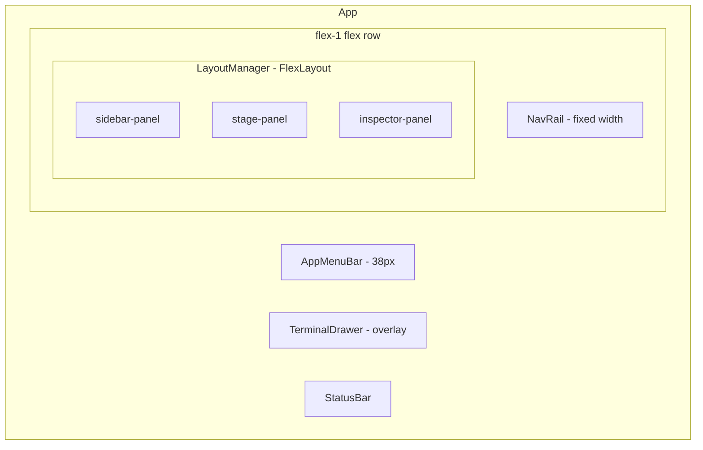
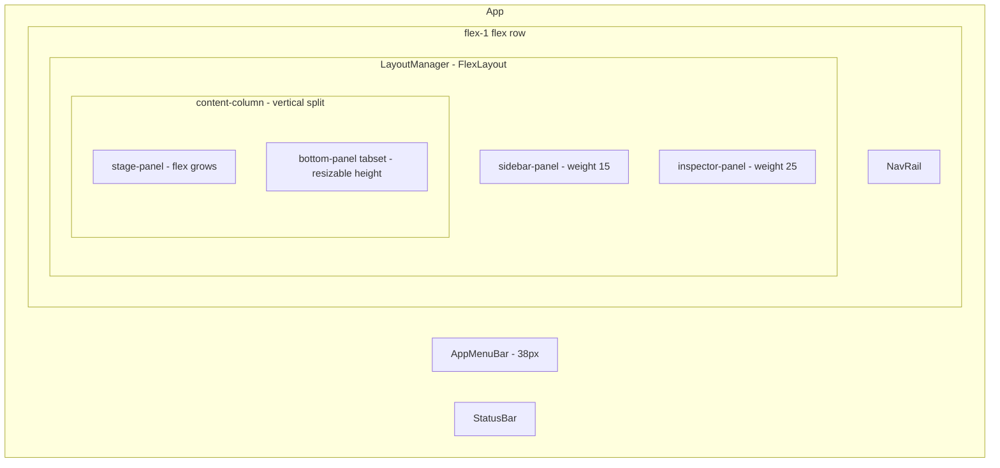

# Bottom Panel Design — Tabbed Panel with Plugin Extensibility

## Overview

Add a VS Code-style bottom panel to the application that:
- Spans from the right edge of the left sidebar to the right edge of the window
- Contains tabbed content (chat input as default first tab)
- Is vertically resizable via a drag handle between it and the main content area
- Is addressable by the plugin system so plugins can register new tabs
- Replaces the existing `TerminalDrawer` overlay approach

## Current Architecture



**Key observations:**
- [`LayoutManager.tsx`](client/src/renderer/components/layout/LayoutManager.tsx) uses FlexLayout-react with a horizontal `row` layout containing sidebar, stage, and inspector tabsets
- [`ChatView.tsx`](client/src/renderer/components/layout/ChatView.tsx:277) renders `InputDeck` as a `shrink-0` div at the bottom of the chat content area
- [`TerminalDrawer.tsx`](client/src/renderer/components/layout/TerminalDrawer.tsx) is a separate animated overlay positioned outside FlexLayout in `App.tsx`
- The plugin system uses [`SlotRegistry.ts`](client/src/renderer/services/SlotRegistry.ts) with zustand for registering panels, stage views, navigation, inspector tabs, etc.
- [`UIExtensionAPI`](client/src/shared/slot-types.ts:409) defines the plugin-facing API surface

## Target Architecture



The core change is wrapping `stage-panel` and a new `bottom-panel` tabset inside a vertical `row` column within the FlexLayout model. This gives us:
- Native FlexLayout splitter between stage and bottom panel (resizable)
- Bottom panel spans from sidebar right edge to inspector left edge (or window right edge if inspector is closed)
- Tab management handled by FlexLayout natively
- Plugin tabs injected into the bottom-panel tabset dynamically

## Detailed Changes

### 1. Layout Config (`layout-config.ts`)

Transform the flat row into a nested structure:

```
Root Row
├── sidebar-panel (tabset, weight 15)
├── content-column (row, weight 60, vertical)
│   ├── stage-panel (tabset, weight 75)
│   └── bottom-panel (tabset, weight 25, min height 120px)
│       └── Chat Input (tab, default, enableClose: false)
└── inspector-panel (tabset, weight 25)
```

The `content-column` is a nested `row` with `"type": "row"` in FlexLayout (which renders vertically when nested inside a horizontal row parent). The splitter between `stage-panel` and `bottom-panel` provides the resize handle.

**Key properties for bottom-panel:**
- `id: "bottom-panel"` — addressable by plugins and the layout manager
- `enableClose: false` — always present (but can be minimized)
- `tabSetMinHeight: 120` — prevent collapsing too small
- Default tab: Chat Input with `enableClose: false`

### 2. New Component: `BottomPanelChatTab` 

**File:** `client/src/renderer/components/layout/BottomPanelChatTab.tsx`

A wrapper component that extracts the `InputDeck` from `ChatView` and makes it a standalone bottom panel tab. This component needs:
- Access to `useAppStore` for active conversation context
- The `InputDeck` component with its `onMessageSent` callback
- Scroll-to-bottom signaling via store (since `bottomRef` is in `ChatView`)

```typescript
// Renders InputDeck in standalone mode for the bottom panel
export const BottomPanelChatTab: React.FC = () => {
  const scrollToBottom = useAppStore(s => s.scrollToBottom);
  return (
    <div className="h-full flex flex-col">
      <InputDeck onMessageSent={() => scrollToBottom?.()} />
    </div>
  );
};
```

### 3. ChatView Changes

**File:** `client/src/renderer/components/layout/ChatView.tsx`

- Remove the `<InputDeck />` rendering from the bottom of `ChatView`
- Remove the `shrink-0 z-20` wrapper div
- Add a `scrollToBottom` function to the app store that `ChatView` subscribes to
- `ChatView` becomes purely a message display area

### 4. Scroll-to-Bottom Store Signal

**File:** `client/src/renderer/store/app/uiSlice.ts`

Add a scroll signal mechanism:

```typescript
scrollSignal: number; // incremented to trigger scroll
triggerScrollToBottom: () => void; // increments scrollSignal
```

`ChatView` uses `useEffect` to watch `scrollSignal` and scroll when it changes.
`BottomPanelChatTab` calls `triggerScrollToBottom()` after sending a message.

### 5. LayoutManager Updates

**File:** `client/src/renderer/components/layout/LayoutManager.tsx`

Add to the `factory` function:

```typescript
case "bottom-panel-chat":
  return <BottomPanelChatTab />;
case "bottom-panel-terminal":
  return <ConsolePanel />;
```

Also handle dynamic plugin bottom tabs (same pattern as existing `pluginPanels`):

```typescript
// Check for bottom panel tabs registered by plugins
const bottomTab = bottomPanelTabs.find(t => t.id === component);
if (bottomTab) {
  return <SlotErrorBoundary ...><bottomTab.component /></SlotErrorBoundary>;
}
```

Add logic to dynamically inject plugin-registered bottom panel tabs into the `bottom-panel` tabset using `model.doAction(Actions.addNode(...))`.

### 6. Plugin System Types

**File:** `client/src/shared/slot-types.ts`

Add new types:

```typescript
// Bottom Panel Tab Registration
export interface BottomPanelTabDefinition {
  id: string;
  pluginId: string;
  name: string;
  icon: React.ComponentType<{ size?: number; className?: string }> | string;
  component: React.ComponentType;
  priority: number;
  enableClose: boolean;
}

export interface BottomPanelTabOptions {
  id: string;
  name: string;
  icon: React.ComponentType<{ size?: number; className?: string }> | string;
  component: React.ComponentType;
  priority?: number;
  enableClose?: boolean;
}
```

Add to `SlotContextMap`:
```typescript
'layout:bottom-panel-tab': undefined;
```

Add to `UIExtensionAPI`:
```typescript
registerBottomPanelTab(options: BottomPanelTabOptions): () => void;
```

### 7. SlotRegistry Updates

**File:** `client/src/renderer/services/SlotRegistry.ts`

Add to state interface:
```typescript
bottomPanelTabs: Record<string, BottomPanelTabDefinition>;
registerBottomPanelTab: (pluginId: string, options: BottomPanelTabOptions) => () => void;
unregisterBottomPanelTab: (tabId: string) => void;
getBottomPanelTabs: () => BottomPanelTabDefinition[];
```

Add implementation following the same pattern as `registerPanel`, `registerInspectorTab`, etc.

Add hook:
```typescript
export function useBottomPanelTabs(): BottomPanelTabDefinition[] {
  return useSlotRegistry(state => 
    Object.values(state.bottomPanelTabs).sort((a, b) => a.priority - b.priority)
  );
}
```

Add to `unregisterAllForPlugin`:
```typescript
bottomPanelTabs: filterByPlugin(state.bottomPanelTabs),
```

Add default slot definition:
```typescript
{ id: 'layout:bottom-panel-tab', category: 'layout', description: 'Tabs in the bottom panel', allowMultiple: true },
```

### 8. PluginLoader Updates

**File:** `client/src/renderer/services/PluginLoader.ts`

In `createUIExtensionAPI()`, add:
```typescript
registerBottomPanelTab: (options) => getRegistry().registerBottomPanelTab(pluginId, options),
```

### 9. Terminal → Bottom Panel Tab

**File:** `client/src/renderer/components/layout/TerminalDrawer.tsx` → **DELETE**

Instead, register the Terminal/Console as a built-in bottom panel tab alongside Chat Input in the default layout config:

```json
{
  "type": "tab",
  "name": "Terminal",
  "component": "bottom-panel-terminal",
  "enableClose": true,
  "id": "bottom-panel-terminal",
  "icon": "terminal"
}
```

### 10. App.tsx Changes

**File:** `client/src/renderer/App.tsx`

- Remove `<TerminalDrawer />` import and usage
- The bottom panel is now entirely managed within FlexLayout via `LayoutManager`

### 11. UI Store Changes  

**File:** `client/src/renderer/store/app/uiSlice.ts`

- Add `scrollSignal: number` and `triggerScrollToBottom()` 
- Keep `isTerminalOpen` for backward compat but mark deprecated, or remove and update all references to use bottom panel tab visibility

### 12. Layout Version Bump

Bump from `alephnet-layout-v5` to `alephnet-layout-v6` in `LayoutManager.tsx` to force a clean layout reset with the new nested structure.

## Visual Layout

```
┌──────────────────────────────────────────────────────────────────┐
│  ALEPHNET                                              [≡] [⊞]  │ ← MenuBar (38px)
├──┬───────────────────────────────────────────────────────┬───────┤
│  │ SIDEBAR          │ STAGE (Chat, Files, etc)           │INSP  │
│N │                  │                                    │      │
│A │ Explorer         │ ┌──────────────────────────────┐   │Cortex│
│V │ Extensions       │ │  Message Bubbles             │   │      │
│  │ Messages         │ │  ...                         │   │Mesh  │
│R │ Groups           │ │  ...                         │   │      │
│A │ Memory           │ │                              │   │Ledger│
│I │ Agents           │ └──────────────────────────────┘   │      │
│L │                  ├═══════════════ resize handle ═══════╡      │
│  │                  │ [Chat Input] [Terminal] [+Plugin]  │      │
│  │                  │ ┌──────────────────────────────┐   │      │
│  │                  │ │  InputDeck / Console / etc    │   │      │
│  │                  │ └──────────────────────────────┘   │      │
├──┴───────────────────────────────────────────────────────┴───────┤
│  Status Bar                                                      │
└──────────────────────────────────────────────────────────────────┘
```

## Implementation Order

1. **Types first:** Add `BottomPanelTabDefinition`, `BottomPanelTabOptions` to `slot-types.ts`, update `UIExtensionAPI`
2. **SlotRegistry:** Add bottom panel tab storage, registration, hook
3. **PluginLoader:** Wire up `registerBottomPanelTab`
4. **Store:** Add `scrollSignal` / `triggerScrollToBottom` to uiSlice
5. **Layout config:** Restructure to nested layout with `content-column` and `bottom-panel`
6. **BottomPanelChatTab:** Create new component wrapping `InputDeck`
7. **ChatView:** Remove `InputDeck`, use scroll signal
8. **LayoutManager:** Update factory, bump version, handle dynamic plugin tabs
9. **Terminal migration:** Add terminal as built-in bottom tab, delete `TerminalDrawer`
10. **App.tsx cleanup:** Remove `TerminalDrawer`, update terminal toggle references

## Risks and Mitigations

| Risk | Mitigation |
|------|-----------|
| FlexLayout nested rows may not behave as expected | FlexLayout-react supports nested rows natively; tested pattern |
| InputDeck loses scroll-to-bottom capability | Store-based signal pattern decouples scroll from input component |
| Breaking change for saved layouts | Version bump forces fresh layout on first load |
| Plugin bottom tabs may conflict with built-in tabs | Unique ID enforcement via SlotRegistry validation |
| Terminal toggle in StatusBar needs updating | Update StatusBar to use bottom panel tab selection instead of overlay toggle |

## Files Modified

| File | Change Type |
|------|------------|
| `client/src/shared/slot-types.ts` | Add types |
| `client/src/renderer/services/SlotRegistry.ts` | Add registration |
| `client/src/renderer/services/PluginLoader.ts` | Wire API |
| `client/src/renderer/store/app/uiSlice.ts` | Add scroll signal |
| `client/src/renderer/components/layout/layout-config.ts` | Restructure layout |
| `client/src/renderer/components/layout/BottomPanelChatTab.tsx` | **New file** |
| `client/src/renderer/components/layout/ChatView.tsx` | Remove InputDeck |
| `client/src/renderer/components/layout/LayoutManager.tsx` | Update factory, bump version |
| `client/src/renderer/components/layout/TerminalDrawer.tsx` | **Delete** |
| `client/src/renderer/App.tsx` | Remove TerminalDrawer |
| `client/src/renderer/components/layout/StatusBar.tsx` | Update terminal toggle |
