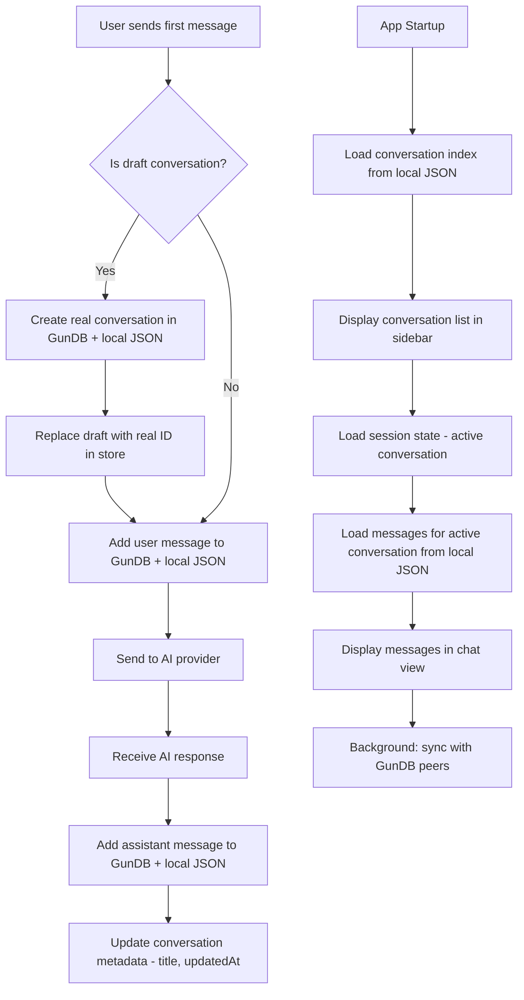
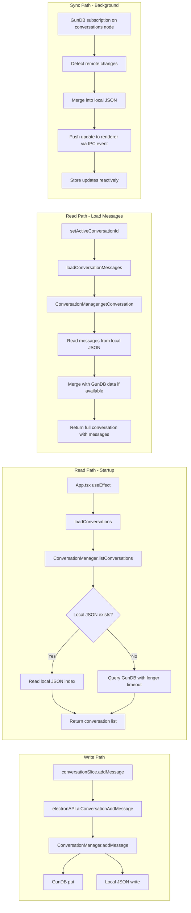
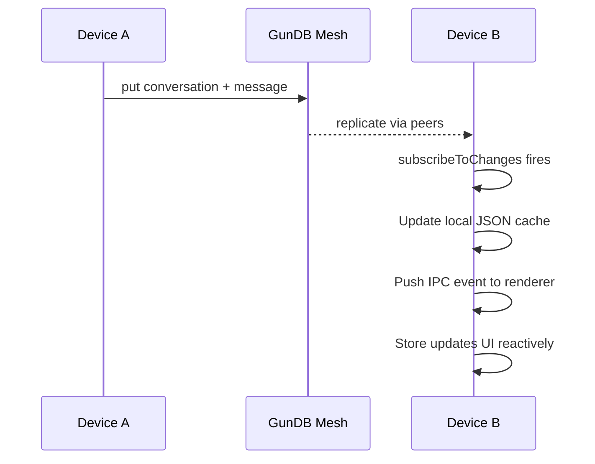

# Conversation Persistence Design

## Problem Statement

Conversations are not properly saved/reloaded to/from persistent storage. Three requirements are unmet:

1. **Immediate serialization**: When a user sends the first message, the conversation must be immediately persisted to GunDB.
2. **Progressive updates**: Messages must be saved as sent/received, and the conversation list must stay in sync.
3. **Startup restoration**: On app startup, the conversation list must be loaded and displayed in the sidebar, with the last-active conversation shown.
4. **Cross-device sync**: GunDB's peer-to-peer replication should synchronize conversations across devices.

---

## Root Cause Analysis

### Bug 1: `listConversations()` relies on a brittle 1-second timeout

In [`ConversationManager.listConversations()`](client/src/main/services/ConversationManager.ts:127), the code uses `map().once()` with a `setTimeout(1000)` to aggregate results from GunDB's eventually-consistent graph. This is fundamentally unreliable:

- If GunDB hasn't fully loaded the data within 1 second, conversations are silently dropped.
- If GunDB is slow on cold start, the list comes back empty.
- There is no retry or subscription mechanism.

### Bug 2: `getConversation()` does not load messages

In [`ConversationManager.getConversation()`](client/src/main/services/ConversationManager.ts:164), the code calls `.once()` on the conversation node and runs `gunObjectsToArrays(data)`. But GunDB stores messages as a **nested graph** under `conversations/<id>/messages/<msgId>`, and `.once()` on the parent node does NOT recursively resolve nested objects. The `messages` field comes back as either:
- An object of Gun references (not actual data)
- `undefined`

So `conv.messages` is always `[]`, meaning message history is never restored.

### Bug 3: `loadConversations()` in the store never fetches messages for each conversation

[`conversationSlice.loadConversations()`](client/src/renderer/store/app/conversationSlice.ts:57) calls `aiConversationList()` which returns conversations with empty `messages: []`. It never subsequently calls `aiConversationGet()` for each conversation to load its messages. Even if it did, `getConversation()` also doesn't load messages (Bug 2).

### Bug 4: GunDB authentication timing

In [`services-setup.ts`](client/src/main/services-setup.ts:242), GunDB authentication happens late in the initialization sequence. The `ConversationManager` is constructed earlier at line 75 with the bridge, but if `listConversations()` or any conversation operation is called before authentication completes, they fail with "User not authenticated."

### Bug 5: `restoreSessionState` depends on `loadConversations` completing first

In [`App.tsx`](client/src/renderer/App.tsx:64), the code correctly chains `loadConversations().then(() => restoreSessionState())`. But since `loadConversations()` returns empty data (Bug 1), `restoreSessionState()` tries to recover missing conversations individually via `aiConversationGet()`, which also returns empty messages (Bug 2).

### Bug 6: No local fallback storage

GunDB is the only persistence layer. If the GunDB user graph is inaccessible (auth failure, corrupted local storage, peer sync issues), all conversations are lost. There is no local filesystem backup.

### Bug 7: The draft-to-real conversation transition has a race condition

In [`conversationSlice.addMessage()`](client/src/renderer/store/app/conversationSlice.ts:210), when a draft conversation is promoted to a real one, the code creates the conversation in GunDB and then immediately adds the message. But the `addMessage` call after `createConversation` may fire before GunDB has fully acknowledged the conversation creation, leading to orphaned messages.

---

## Proposed Architecture



### Dual-Storage Strategy

We introduce a **local JSON file cache** alongside GunDB to guarantee reliability:



---

## Detailed Changes

### 1. ConversationManager: Add Local JSON Storage

**File**: [`client/src/main/services/ConversationManager.ts`](client/src/main/services/ConversationManager.ts)

Add a local file-based cache for conversation metadata and messages:

```
userData/
  conversations/
    index.json          # Array of conversation metadata (no messages)
    <conv-id>/
      metadata.json     # Single conversation metadata
      messages.json     # Ordered array of messages
```

**New methods to add:**
- `private async saveConversationLocally(conv: AIConversation): Promise<void>` — writes metadata + messages to disk
- `private async loadConversationsLocally(): Promise<AIConversation[]>` — reads index from disk
- `private async loadMessagesLocally(convId: string): Promise<AIMessage[]>` — reads messages from disk
- `private async appendMessageLocally(convId: string, msg: AIMessage): Promise<void>` — appends a message to the local messages file
- `private async deleteConversationLocally(convId: string): Promise<void>` — removes local files
- `private async rebuildLocalIndex(): Promise<void>` — rebuilds index.json from individual metadata files

**Modified methods:**
- `createConversation()` — after GunDB put, also write to local JSON immediately
- `addMessage()` — after GunDB put, also append to local messages.json
- `listConversations()` — read from local JSON first (fast), then optionally sync with GunDB in background
- `getConversation()` — read from local JSON (including messages), then optionally verify against GunDB
- `deleteConversation()` — delete from both GunDB and local JSON
- `updateTitle()` — update both GunDB and local JSON
- `updateMessage()` — update both GunDB and local JSON

### 2. Fix GunDB Message Loading

**File**: [`client/src/main/services/ConversationManager.ts`](client/src/main/services/ConversationManager.ts)

The current `getConversation()` at line 164 needs to explicitly load messages by traversing the `messages` sub-graph:

```typescript
async getConversation(id: string): Promise<AIConversation> {
    // 1. Load metadata
    const metadata = await this.loadConversationMetadata(id);
    
    // 2. Load messages from local cache (fast path)
    let messages = await this.loadMessagesLocally(id);
    
    // 3. If no local messages, try GunDB (slow path)
    if (messages.length === 0) {
        messages = await this.loadMessagesFromGun(id);
        // Cache locally for next time
        if (messages.length > 0) {
            await this.saveMessagesLocally(id, messages);
        }
    }
    
    return { ...metadata, messages };
}

private async loadMessagesFromGun(convId: string): Promise<AIMessage[]> {
    return new Promise((resolve) => {
        const messages: Record<string, AIMessage> = {};
        this.user.get('conversations').get(convId).get('messages')
            .map().once((data: any, key: string) => {
                if (data && key !== '_') {
                    messages[key] = gunObjectsToArrays(data);
                }
            });
        setTimeout(() => {
            const sorted = Object.values(messages)
                .sort((a, b) => (a.sequence || 0) - (b.sequence || 0));
            resolve(sorted);
        }, 1500);
    });
}
```

### 3. Add Message Loading to Conversation List Loading

**File**: [`client/src/renderer/store/app/conversationSlice.ts`](client/src/renderer/store/app/conversationSlice.ts)

Modify `loadConversations()` to:
1. Load the conversation list (metadata only — fast)
2. For the active conversation only, load full messages
3. For other conversations, defer message loading until they are activated

```typescript
loadConversations: async () => {
    set({ loadingConversations: true });
    try {
        const list = await window.electronAPI.aiConversationList();
        const conversations: Record<string, Conversation> = {};
        list.forEach(c => {
            conversations[c.id] = fromAIConversation(c);
        });
        set({ conversations, loadingConversations: false });
    } catch (err) {
        console.error('Failed to load conversations:', err);
        set({ loadingConversations: false });
    }
},
```

Add a new action `loadConversationMessages(id: string)`:

```typescript
loadConversationMessages: async (id: string) => {
    const conv = get().conversations[id];
    if (!conv || conv.messages.length > 0) return; // Already loaded
    
    try {
        const fullConv = await window.electronAPI.aiConversationGet({ id });
        if (fullConv && fullConv.messages?.length > 0) {
            set(state => ({
                conversations: {
                    ...state.conversations,
                    [id]: {
                        ...state.conversations[id],
                        messages: fullConv.messages.map(fromAIMessage)
                    }
                }
            }));
        }
    } catch (err) {
        console.error(`Failed to load messages for conversation ${id}:`, err);
    }
},
```

### 4. Wire up `setActiveConversationId` to load messages

**File**: [`client/src/renderer/store/app/conversationSlice.ts`](client/src/renderer/store/app/conversationSlice.ts)

Modify `setActiveConversationId()` at line 144 to trigger message loading:

```typescript
setActiveConversationId: (id) => {
    // ... existing tab/open logic ...
    
    // Load messages for the newly active conversation
    if (id) {
        get().loadConversationMessages(id);
    }
    
    get().saveSessionState();
},
```

### 5. Fix the Draft-to-Real Transition

**File**: [`client/src/renderer/store/app/conversationSlice.ts`](client/src/renderer/store/app/conversationSlice.ts)

In `addMessage()` at line 210, the draft promotion must be atomic:

```typescript
addMessage: async (msg, conversationId) => {
    let targetId = conversationId || get().activeConversationId;
    
    if (!targetId) {
        get().startDraftConversation();
        targetId = get().activeConversationId;
        if (!targetId) return;
    }

    if (targetId.startsWith('draft-')) {
        const title = msg.content.substring(0, 30) || 'Chat';
        
        try {
            // Create real conversation AND add the first message atomically
            const aiConv = await window.electronAPI.aiConversationCreate({ title });
            const realId = aiConv.id;
            
            // Immediately persist the first message
            await window.electronAPI.aiConversationAddMessage({
                conversationId: realId,
                message: toAIMessage(msg)
            });
            
            // Now update UI state
            set(state => {
                const { [targetId!]: draft, ...restConversations } = state.conversations;
                const newConversation = fromAIConversation(aiConv);
                newConversation.messages = [msg]; // Include the message
                
                return {
                    conversations: { ...restConversations, [realId]: newConversation },
                    activeConversationId: realId,
                    openConversationIds: state.openConversationIds.map(id => id === targetId ? realId : id),
                    tabs: state.tabs.map(t => t.id === targetId ? { ...t, id: realId, title: newConversation.title } : t),
                    activeTabId: realId
                };
            });
            
            get().saveSessionState();
            return; // Message already persisted above
        } catch (err) {
            console.error('Failed to create real conversation from draft:', err);
            return;
        }
    }

    // Normal message add (non-draft)
    // ... rest of existing logic
},
```

### 6. Add GunDB Subscription for Cross-Device Sync

**File**: [`client/src/main/services/ConversationManager.ts`](client/src/main/services/ConversationManager.ts)

Add a real-time subscription method that watches for remote changes:

```typescript
/**
 * Subscribe to conversation changes for cross-device sync.
 * Call this after authentication.
 */
subscribeToChanges(callback: (event: {
    type: 'conversation_updated' | 'message_added' | 'conversation_deleted';
    conversationId: string;
    data?: any;
}) => void): void {
    // Watch for new/updated conversations
    this.user.get('conversations').map().on((data: any, key: string) => {
        if (!data || key === '_') return;
        
        // Update local cache
        this.saveConversationMetadataLocally(key, data);
        
        callback({
            type: 'conversation_updated',
            conversationId: key,
            data
        });
    });
    
    // For each known conversation, watch for new messages
    // This is set up when a conversation is opened
}

/**
 * Subscribe to new messages in a specific conversation.
 */
subscribeToMessages(conversationId: string, callback: (message: AIMessage) => void): () => void {
    const handler = (data: any, key: string) => {
        if (!data || key === '_') return;
        const msg = gunObjectsToArrays(data) as AIMessage;
        
        // Append to local cache
        this.appendMessageLocally(conversationId, msg);
        
        callback(msg);
    };
    
    this.user.get('conversations').get(conversationId)
        .get('messages').map().on(handler);
    
    return () => {
        this.user.get('conversations').get(conversationId)
            .get('messages').map().off();
    };
}
```

### 7. Add IPC Events for Real-Time Sync

**File**: [`client/src/main/ipc-setup.ts`](client/src/main/ipc-setup.ts)

Add new IPC channel for subscribing to conversation changes:

```typescript
// Conversation sync subscription
ipcMain.handle('ai:conversation:subscribe', () => {
    conversationManager.subscribeToChanges((event) => {
        const mainWindow = getMainWindow();
        if (mainWindow && !mainWindow.isDestroyed()) {
            mainWindow.webContents.send('ai:conversation:changed', event);
        }
    });
});
```

**File**: [`client/src/preload/alephnet.ts`](client/src/preload/alephnet.ts)

```typescript
// Add subscription event
aiConversationSubscribe: invoke('ai:conversation:subscribe'),
onAIConversationChanged: on('ai:conversation:changed'),
```

### 8. Update App Startup Sequence

**File**: [`client/src/renderer/App.tsx`](client/src/renderer/App.tsx)

The startup sequence at line 63 should be:

```typescript
// Full setup flow
setHasIdentity(true);
setNeedsOnboarding(false);
setLoading(false);

// 1. Load conversation list (from local cache, fast)
await loadConversations();

// 2. Restore session state (active conversation, open tabs)
await restoreSessionState();

// 3. Load messages for the active conversation
const activeId = useAppStore.getState().activeConversationId;
if (activeId) {
    await useAppStore.getState().loadConversationMessages(activeId);
}

// 4. Subscribe to real-time sync changes
window.electronAPI.aiConversationSubscribe?.();

// 5. Load persisted model selection
loadSelectedModelFromSettings();
```

### 9. Update Type Definitions

**File**: [`client/src/renderer/store/app/types.ts`](client/src/renderer/store/app/types.ts)

Add the new action:

```typescript
loadConversationMessages: (id: string) => Promise<void>;
```

**File**: [`client/src/shared/types.ts`](client/src/shared/types.ts) and [`client/src/shared/alephnet-api.ts`](client/src/shared/alephnet-api.ts)

Add new API methods for subscription.

---

## Cross-Device Sync Strategy



GunDB handles cross-device sync natively through its peer mesh. The key requirements are:
1. Both devices must be authenticated with the same SEA keypair
2. Both devices must be connected to at least one common peer
3. The subscription handlers (`map().on()`) must be active

The local JSON cache ensures that data is available even when offline or when GunDB sync is slow.

---

## File Change Summary

| File | Changes |
|------|---------|
| [`ConversationManager.ts`](client/src/main/services/ConversationManager.ts) | Add local JSON storage layer; fix `getConversation()` to load messages; add `loadMessagesFromGun()`; add `subscribeToChanges()`; add `subscribeToMessages()` |
| [`conversationSlice.ts`](client/src/renderer/store/app/conversationSlice.ts) | Add `loadConversationMessages()` action; fix draft-to-real transition in `addMessage()`; wire `setActiveConversationId()` to load messages |
| [`types.ts`](client/src/renderer/store/app/types.ts) | Add `loadConversationMessages` to `AppState` interface |
| [`App.tsx`](client/src/renderer/App.tsx) | Update startup sequence to load messages for active conversation; add sync subscription |
| [`ipc-setup.ts`](client/src/main/ipc-setup.ts) | Add `ai:conversation:subscribe` handler; add `ai:conversation:changed` event forwarding |
| [`alephnet.ts`](client/src/preload/alephnet.ts) | Add `aiConversationSubscribe` and `onAIConversationChanged` |
| [`alephnet-api.ts`](client/src/shared/alephnet-api.ts) | Add types for new subscription API |
| [`types.ts`](client/src/shared/types.ts) | Add new IPC types if needed |

---

## Implementation Order

1. **ConversationManager local JSON layer** — this is the foundation
2. **Fix `getConversation()` to load messages from GunDB** — immediate reliability improvement
3. **Add `loadConversationMessages()` to the store** — enables lazy message loading
4. **Fix draft-to-real transition** — ensures first message is never lost
5. **Update startup sequence in App.tsx** — proper restore flow
6. **Add GunDB subscriptions for cross-device sync** — enables multi-device
7. **Add IPC plumbing for sync events** — connects main to renderer
8. **Update type definitions** — keep TypeScript happy

---

## Risk Mitigation

- **Local JSON corruption**: Use atomic writes (write to temp file, then rename)
- **GunDB/local drift**: Local JSON is source of truth for reads; GunDB is source of truth for sync
- **Concurrent writes**: Use a write queue/mutex for local JSON operations
- **Large conversations**: Paginate message loading; don't load all messages upfront for inactive conversations
