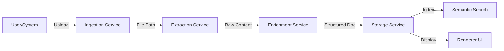

# Document Reader Design Specification

## 1. Architecture Overview

The Document Reader plugin will adopt a **Pipeline Architecture** to handle document processing efficiently and extensibly. The pipeline consists of four main stages:

1.  **Ingestion**: File acceptance, validation, and temporary storage.
2.  **Extraction**: Converting binary formats into structured text and metadata.
3.  **Enrichment**: Enhancing content with summaries, entities, and semantic embeddings.
4.  **Storage & Indexing**: Persisting structured data and updating the search index.

### Data Flow


## 2. Module Specifications

### 2.1 Extraction Service (`src/services/ExtractionService.ts`)
Responsible for parsing different file formats. It will use a strategy pattern to select the correct parser based on MIME type or file extension.

**Supported Formats & Libraries:**
-   **PDF**: `pdf-parse` (Server-side) or `pdfjs-dist` (Client-side rendering).
-   **DOCX**: `mammoth` (for HTML conversion) or `officeparser`.
-   **XLSX**: `xlsx` (SheetJS).
-   **PPTX**: `officeparser` or similar text extraction util.
-   **EPUB**: `epub-parser` or `adm-zip` based extraction.
-   **Markdown/Text**: Native Node.js `fs`.
-   **Images (OCR)**: `tesseract.js` (Wasm based, runs locally).

**Interface:**
```typescript
interface ExtractedDocument {
  content: string; // Markdown or HTML representation
  metadata: {
    title?: string;
    author?: string;
    pageCount?: number;
    createdAt?: Date;
  };
  structure: DocumentStructure; // Headings, sections
}
```

### 2.2 Enrichment Service (`src/services/EnrichmentService.ts`)
Applies intelligence to the extracted text.

-   **Summarization**: Uses the host system's LLM interface (`context.ai` or similar) to generate summaries.
-   **Entity Recognition**: Simple rule-based or NLP-based extraction (e.g., `compromise` library for lightweight NER).
-   **Metadata**: Extracted from file stats and content analysis.

### 2.3 Storage Service (`src/services/StorageService.ts`)
Manages the persistence of document data using the plugin's allowed storage (`context.store` or local file system).

-   **Document Store**: JSON-based metadata and content reference.
-   **Vector Index**: Hooks into the global Semantic Search engine (if available via API).

### 2.4 Background Processing
Large files will be processed in a non-blocking manner using Node.js `Worker` threads or by yielding the event loop, ensuring the UI remains responsive.

## 3. UI/UX Design (`renderer/`)

### 3.1 Library View
-   **Grid/List Toggle**: View documents with thumbnails or detailed metadata.
-   **Search/Filter**: Filter by type, date, or tags.
-   **Upload Dropzone**: Prominent area for drag-and-drop.

### 3.2 Document Viewer
-   **Unified Viewer**: A component that renders:
    -   **PDF**: via `react-pdf` or iframe.
    -   **HTML/Text**: Sanitized HTML renderer.
-   **Sidebar**: Displays Summary, Metadata, and Extracted Entities.
-   **Annotation Overlay**: (Future scope, foundational support added).

## 4. Implementation Plan

### Phase 1: Core Dependencies & Setup
-   Install `mammoth`, `pdf-parse`, `xlsx`, `tesseract.js`, `uuid`.
-   Set up the `ExtractionService` structure.

### Phase 2: Extractors
-   Implement specific parsers for DOCX, PDF, XLSX, MD.
-   Implement OCR fallback for images.

### Phase 3: Enrichment & Storage
-   Implement `EnrichmentService` with basic summarization logic.
-   Implement `StorageService` to save/load state.

### Phase 4: UI Overhaul
-   Build `LibraryComponent`.
-   Build `ViewerComponent`.
-   Integrate with Main process via IPC/Context tools.

### Phase 5: Testing & Polish
-   Unit tests for extractors.
-   Performance tuning for large files.

## 5. Dependencies
-   `mammoth`: .docx support
-   `pdf-parse`: .pdf text extraction
-   `xlsx`: .xlsx support
-   `tesseract.js`: OCR
-   `uuid`: Unique IDs
-   `compromise`: Lightweight NLP (optional, for entities)
